@[TOC]

# 一、问题背景

之前写文章介绍了如何实现双线的情况下，使用两条网线连接光猫和路由器，分别提供访问 `Internet` 和接入 `IPTV` 的能力。之后再通过路由器分发路由，使各类设备可以正常上网和播放 `IPTV` 直播流，和电视盒子可以正常使用 `IPTV` : [https://blog.csdn.net/TeleostNaCl/article/details/147023332](https://blog.csdn.net/TeleostNaCl/article/details/147023332)

其网络拓扑图是以下样子的：

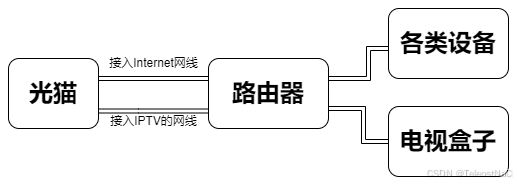

而本文将实现一种单线复用的方式，即光猫和 `OpenWrt` 路由器上只有一条线连接，拓扑图如下：

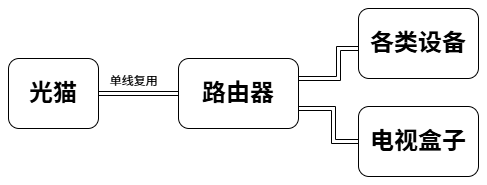

# 二、光猫 VLAN 绑定设置

首先，要实现单线复用，需要将光明的 指定 `LAN` 口设置为 `VLAN` 绑定，并填写到绑定 `VLAN` 号。

我们先在光猫的超级管理员界面，找到 `网络` > `宽带连接`，可以看到 `Internet` 和 `IPTV` 的 `VLAN`，例如如下：

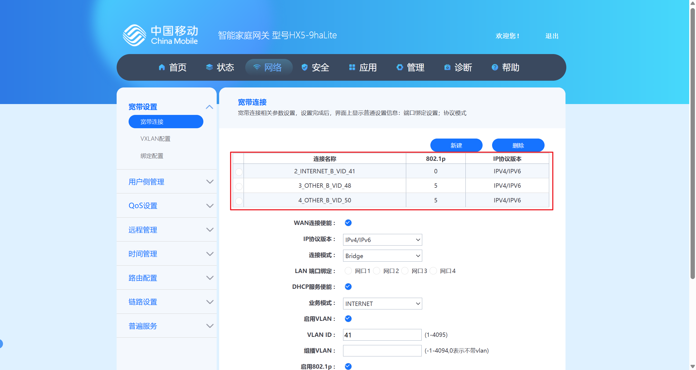

可以看到，在我的网络环境下，`Internet` 的 `VLAN ID` 为 `41`，`IPTV` 的  `VLAN ID` 为 `48`。

随后，我们在 `绑定设置` 中，将指定的 `LAN` 口设置为 `VLAN` 绑定的 `绑定方式`，并填写 `41/41,48/48`，这样就实现了绑定。

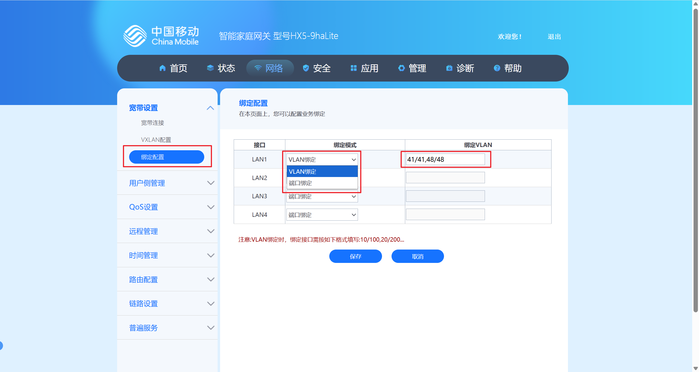

# 三、添加 wan 口的 VLAN (802.1q)

我们先确定我们 `OpenWrt` 设备的的 `wan` 口的设备，本文使用的是 `eth1`，因此我们需要给 `eth1` 添加 `VLAN (802.1q)`。

我们在 `OpenWrt` 的 `luci` > `网络` > `接口` > `设备` 的页面下，点击 `添加设备配置...`

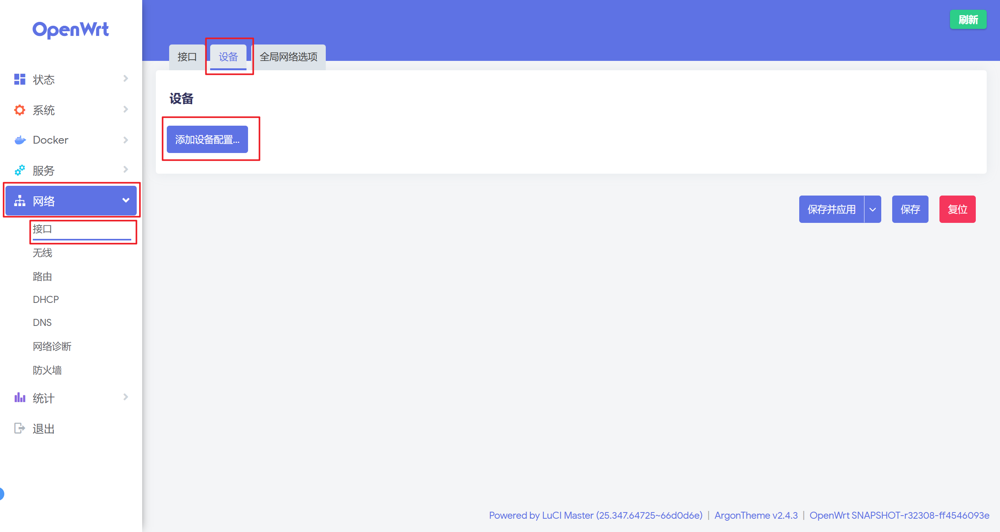

我们在 `添加设备配置` 页面下，

- `设备类型` 选择 `VLAN (802.1q)`
- `基础设备` 选择 `eth1`
- `VLAN ID` 填写 `41`

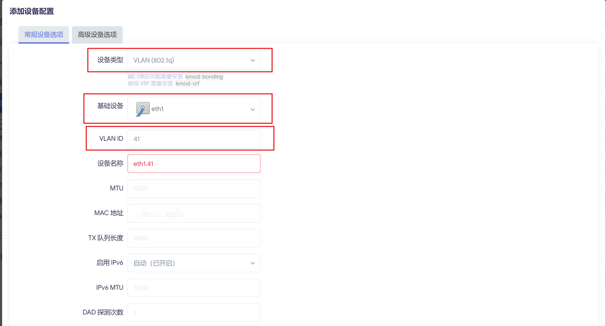

以上，我们添加了一个 `eth1.41` 的设备，则添加了一个连接 `Internet` 的软件 `VLAN`，使用相同的方式，添加一个 `VLAN ID` 为 `48` 的连接 `IPTV` 的软件 `VLAN` 的 `eth1.48` 的设备

# 四、添加 IPTV 的网桥设备

我们还要实现电视盒子接到路由器上，可以直接连接到 `IPTV`，因此需要添加一个网桥设备，将一个指定的 `LAN` 口（用于给电视盒子连接），本文以 `LAN3` 口为例。

首先，一般所有的 `LAN` 口都会默认被添加进 `br-lan` 的网桥设备中，因此首先需要将 `LAN3` 口从 `br-lan` 中先移除。

我们在 `OpenWrt` 的 `luci` > `网络` > `接口` > `设备` 的页面下，点击 `br-lan` 设备的 `配置` 按钮

随后我们在 `网桥端口` 中，取消勾选 `lan3` 即可，这样就将 `lan3` 从 `br-lan` 中移除了。

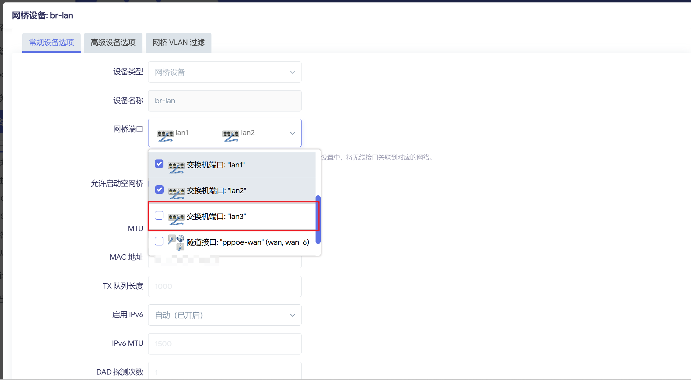

然后，我们通过点击 `添加设备配置...` 添加一个新的网桥设备：

- `设备类型` 选择 `网桥设备`
- `设备名称` 填写 `br-iptv`
- `端口` 选择 `eth1.48` 和 `lan3` 口

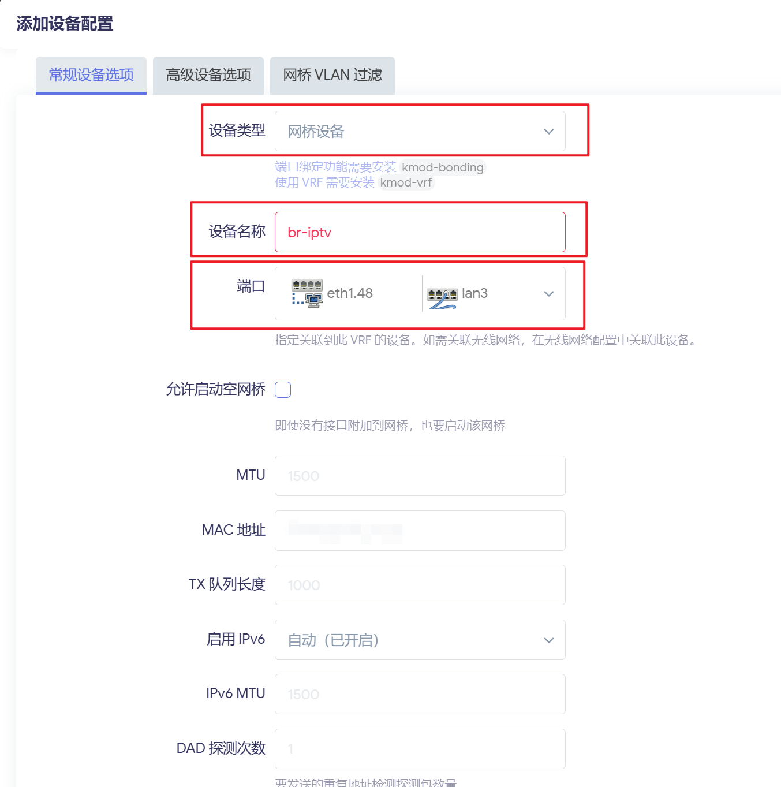

一份完整的配置的如下：

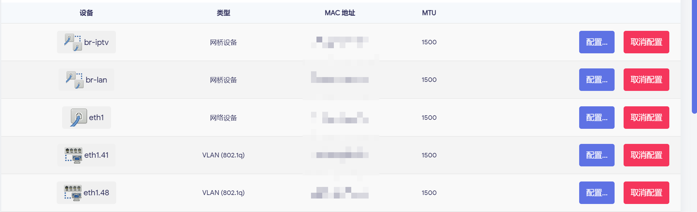

# 五、修改 wan 口的设备配置

通过以上操作之后，此时原来的 `wan` 口由原来的 `eth1` 切换到了 `eth1.41`，因此需要在接口设置中，将 `wan` 口 的设备配置修改为 `eth1.41`。

我们在 `luci` > `网络` > `接口` > `接口` 的界面下，对 `wan` 口点击 `编辑` 按钮，打开接口编辑页面。

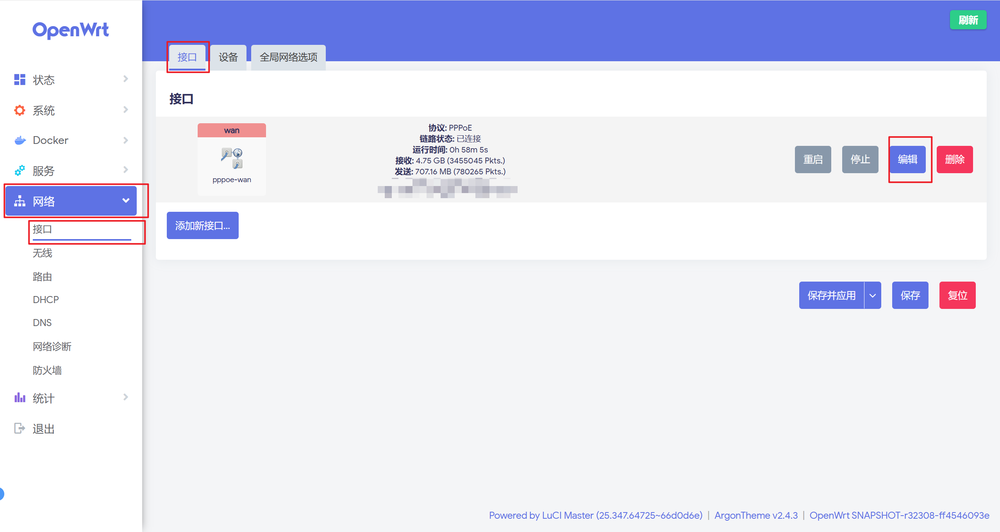

随后我们在接口设置中，将 设备从 `eth1` 修改到 `eth1.41`。

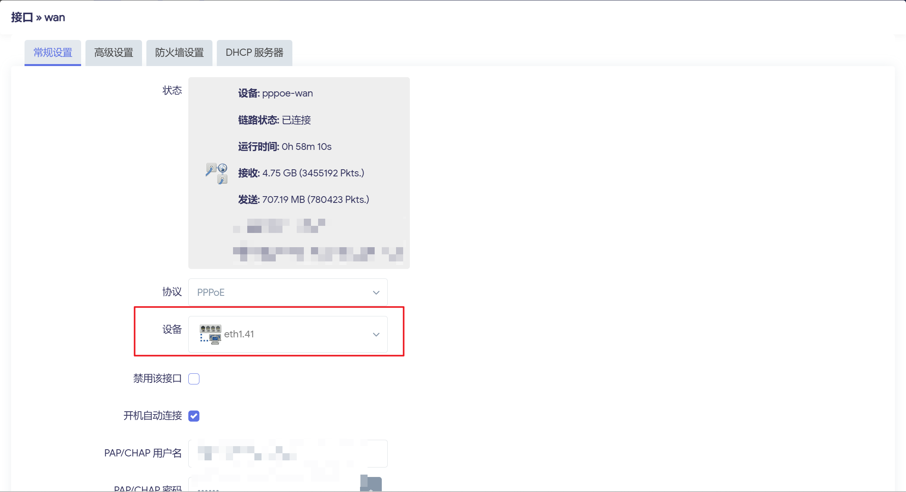

经过以上设置之后，我们的路由器 就已经正常连接到 `Internet` 了。

# 六、添加 IPTV 的接口

最后，我们需要添加一个 `IPTV` 的网络接口和防火墙，以便控制 `IPTV` 的流量正常的被发送和接受。

我们在 `luci` > `网络` > `接口` > `接口` 的界面下，点击 `添加新接口...`，添加新的 `IPTV` 的网络接口

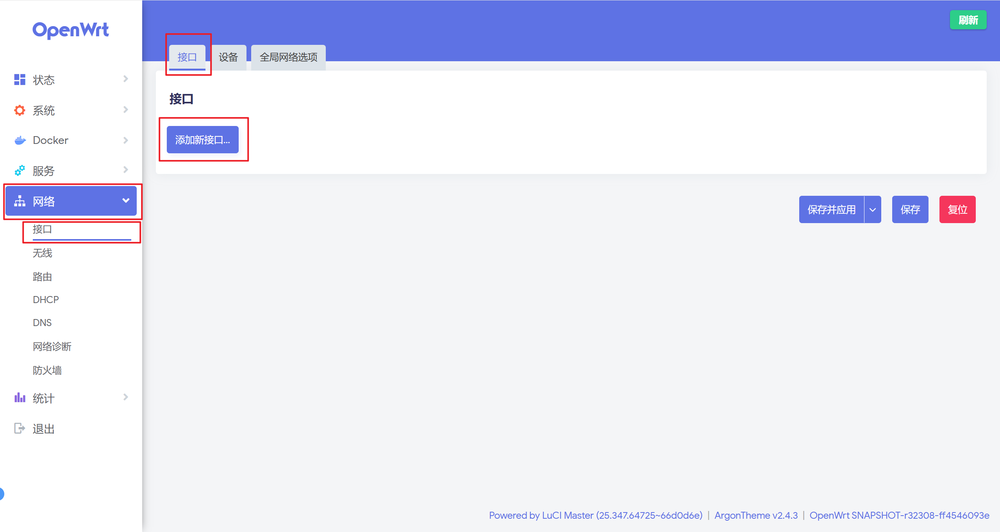

- `名称` 填写 `iptv`
- `协议` 选择 `DHCP客户端`
- `设备` 选择 `br-iptv`

当接口被添加之后，点击此接口的 `编辑`，进行防火墙配置：

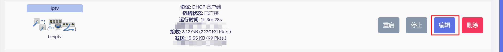

切换到 `防火墙设置`，在 `创建/分配防火墙区域` 中选择自定义，并输入 `iptv`，创建新的防火墙配置。

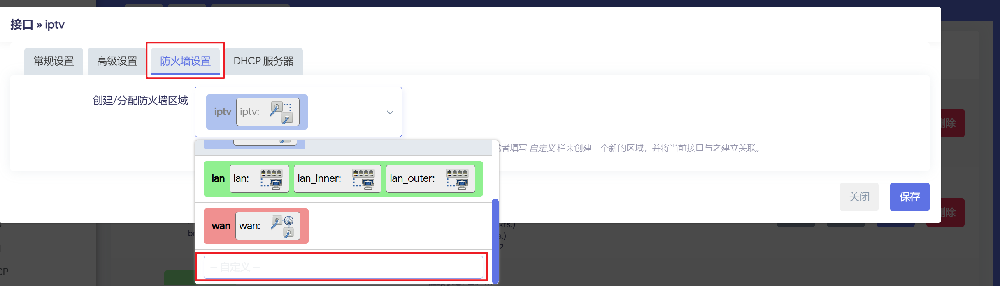

在 `DHCP 服务器` 中，为此接口禁用 `DHCP`。

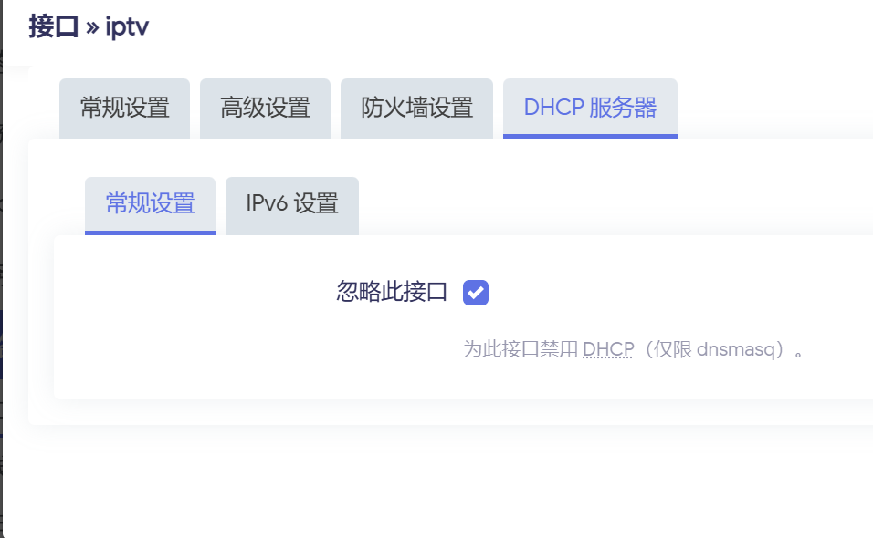

当以上配置完成之后，将电视盒子接入路由器的 `LAN3` 口之后，电视盒子就可以正常的访问和连接了。

# 七、配置udpxy

按以下文章 [https://blog.csdn.net/TeleostNaCl/article/details/147023332#2_OpenWrtudpxy_52](https://blog.csdn.net/TeleostNaCl/article/details/147023332#2_OpenWrtudpxy_52) 配置 `udpxy`，以便实现局域网下的设备都可以观看IPTV直播。这里的接口设置为 `br-iptv`。
