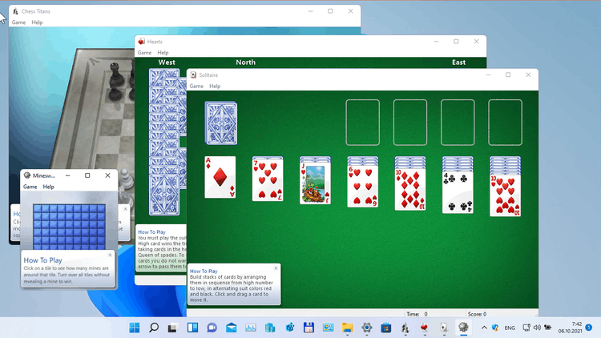
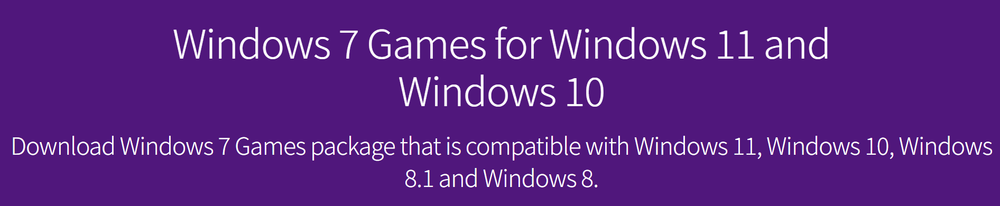
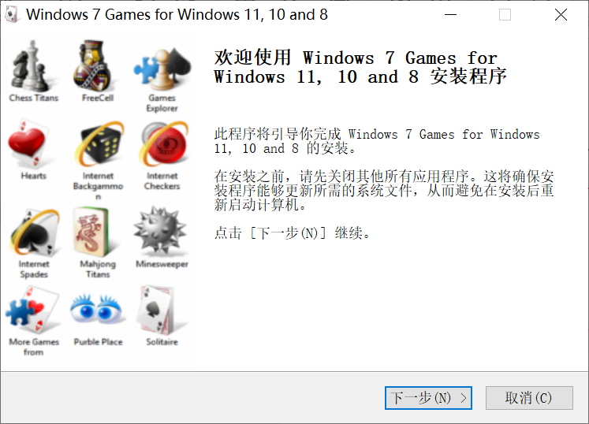
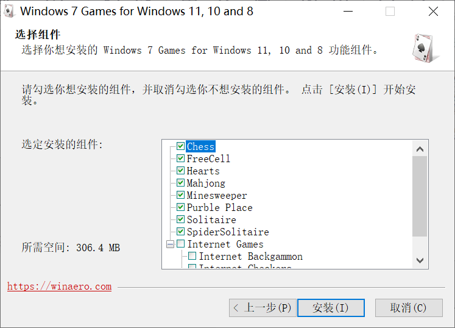
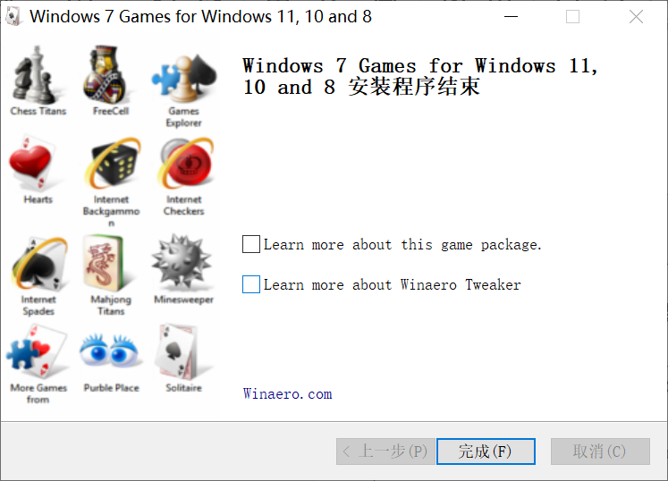
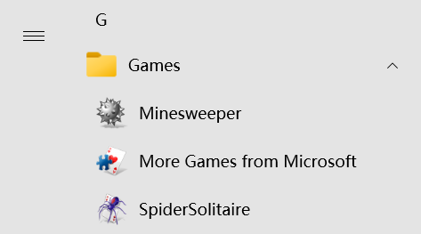

> 原文链接：https://blog.csdn.net/TeleostNaCl/article/details/147351220
> 发布时间：2025-04-19 16:10:55
> 标签：游戏、windows、电脑、经验分享

---

#### 文章目录

- [一、背景](#_1)
- [二、安装](#_28)
- [三、运行](#_52)
- [四、Windows大版本更新之后小游戏丢失的解决方案](#Windows_56)

## 一、背景

在 `Windows 7` 上有几款经典的预置小游戏，有：

- 纸牌 Solitaire
- 蜘蛛纸牌 Spider Solitaire
- 扫雷 Minesweeper
- 空当接龙 FreeCell
- 红心纸牌 Hearts
- 国际象棋 Chess Titans
- 麻将泰坦 Mahjong Titans
- 紫苑 Purble Place

尤其是 `扫雷` 和 `蜘蛛纸牌`，曾经陪伴了我们很长的时间，对其百玩不腻。

但是，随着 `Windows` 的更新，在之后的系统里，这些经典的游戏已经被移出了预置，虽然在微软商店中有替代品，但是已经不是之前的那种感觉了，因此有没有方法安装运行经典小游戏呢？

幸好，国外有大神制作了 `与 Windows 11、Windows 10、Windows 8.1 和 Windows 8 兼容的 Windows 7 游戏包`，只要安装运行之后，就可以在新系统上运行那些经典小游戏啦。其已经完美的支持 `Windows 11` 系统，且完整的支持中文语言包。

  
 项目地址：`https://win7games.com/#games`

官方下载地址：`https://win7games.com/download/Windows7Games_for_Windows_11_10_8.zip`

百度网盘下载链接：`https://pan.baidu.com/s/1EmDQ6flajks1xfhXkZXdeg?pwd=1tad`，提取码: `1tad`

## 二、安装

从下载链接下载之后，将得到一个 `.zip` 压缩包文件，对其进行解压得到一个 `Windows7Games_for_Windows_11_10_8.exe` 文件，此文件即是安装文件。  
 

双击运行解压之后的 `Windows7Games_for_Windows_11_10_8.exe` 文件，即可开始安装。  
 

在这个页面可以选择所需要安装的小游戏，可以去掉不想要的小游戏，小游戏翻译如下：  
 

- 纸牌 Solitaire
- 蜘蛛纸牌 Spider Solitaire
- 扫雷 Minesweeper
- 空当接龙 FreeCell
- 红心纸牌 Hearts
- 国际象棋 Chess Titans
- 麻将泰坦 Mahjong Titans
- 紫苑 Purble Place

**安装完成！**  
 

## 三、运行

安装完成之后，其会在开始菜单新建一个 `Games` 的文件夹，里面即是新安装的小游戏，双击即可运行。  
 

## 四、Windows大版本更新之后小游戏丢失的解决方案

重新安装`Windows7Games_for_Windows_11_10_8.exe`即可（似乎新版本已经没有这样的问题了，仅记录供参考）。
