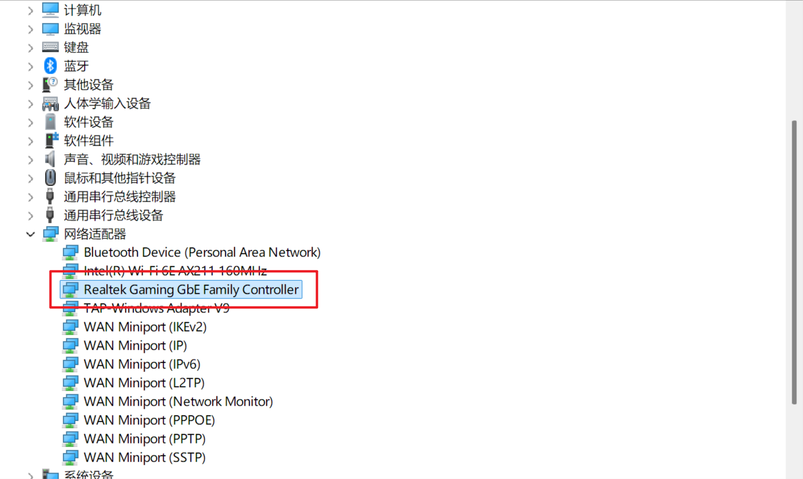
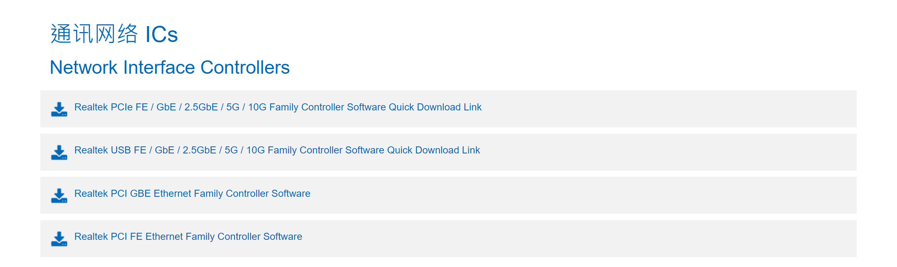
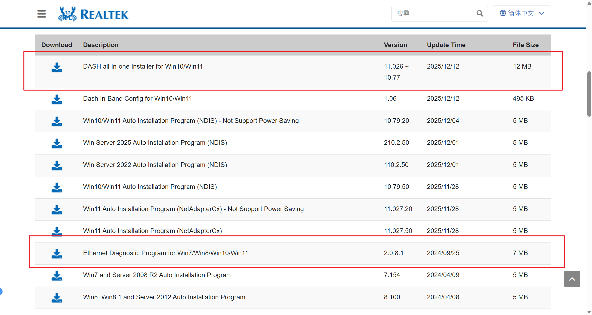
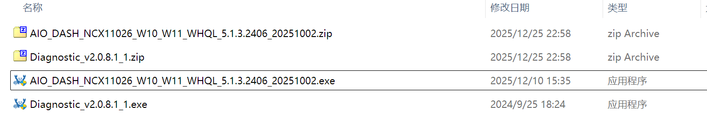
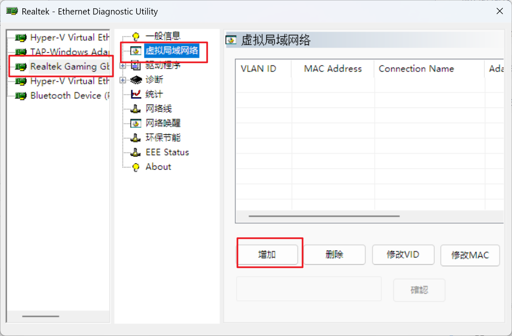
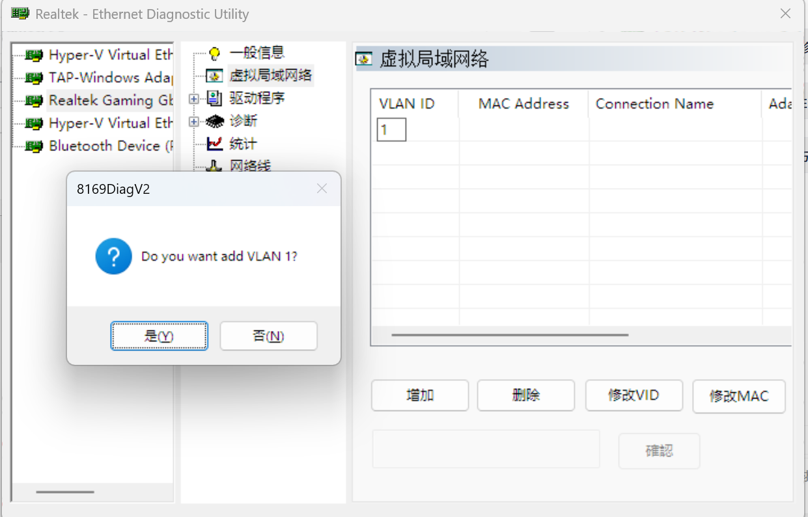
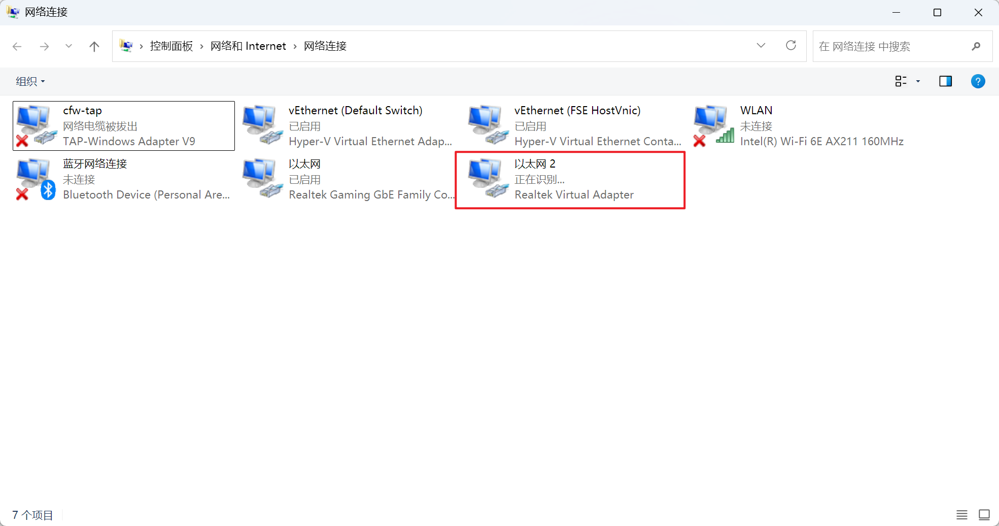
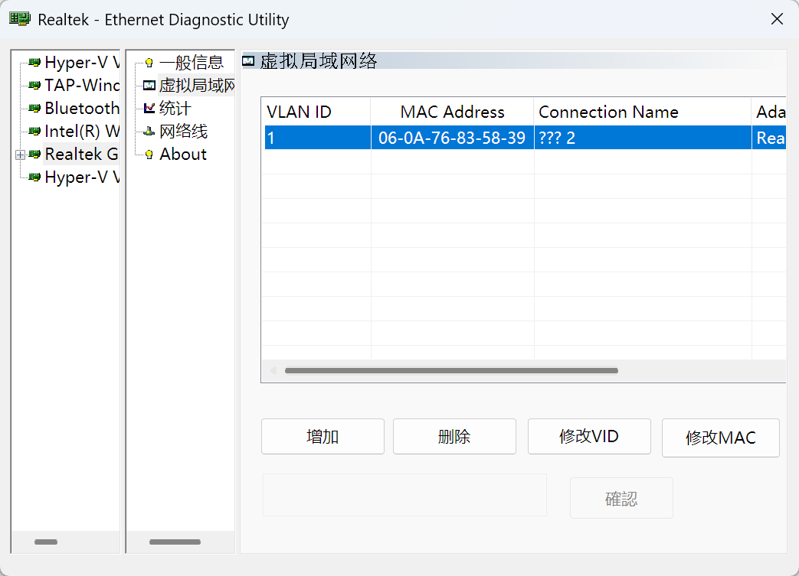

@[TOC]
# 一、背景介绍

`VLAN` 是虚拟局域网，可以设置不同的 `VLAN ID` 将数据帧打上相应的标签，然后将不同的数据流量划分到不同的网段中，实现软件层面上的单线复用，并提高网络安全与灵活性。

而为了适配上层路由器或交换机，有时候需要在客户端配置 `VLAN ID`，并配置多个虚拟网络，以便实现不同流量走不同的通路。在 `Linux` 上，`VLAN` 功能是 `Linux` 内核中原生支持的，可以很简单的实现 `VLAN` 的划分。但是在 `Windows` 上是没有原生支持的，需要网卡驱动的支持，因此不太容易实现。

本文将详细介绍在 `Windows` 上使用 `Ethernet Diagnostic Program` (`瑞昱网卡诊断程序`) 配置 `Realtek` 网卡的 `VLAN ID `

# 二、下载安装瑞昱网卡诊断程序
首先，我们打开 `设备管理器`，确认电脑中的瑞昱网卡的类型：

可以看到，我的这个网卡类型是 `Realtek Gaming GbE Family Controller`，那么我们去瑞昱官网去下载相关的驱动和网卡诊断程序。

[https://www.realtek.com/Download/Index?cate_id=194&menu_id=368](https://www.realtek.com/Download/Index?cate_id=194&menu_id=368)

这里是根据不同接口类型划分不同的设备类型，有 `PCIe`、`USB`、`PCI`，根据不同的接口选择即可。现代设备一般都是 `PCIe` 接口，我们选择 `Realtek PCIe FE / GbE / 2.5GbE / 5G / 10G Family Controller Software Quick Download Link` 。

随后我们下载 `DASH all-in-one Installer for Win10/Win11` 下载 `all in one` 驱动自动选择，和 `Ethernet Diagnostic Program for Win7/Win8/Win10/Win11` 下载瑞昱网卡诊断程序。如果是其它设备，则下载相应的即可。

下载完成之后，得到两个压缩包，解压安装即可。

> 部分设备原本的驱动可能是微软通用驱动，不支持设置 `VLAN ID`，因此此处需要先更新一下驱动。

# 三、使用瑞昱网卡诊断程序添加 VLAN ID
我们打开 `Realtek Ethernet Diagnostic Utilty`，点击 `Realtek` 的网卡，然后切换到 `虚拟局域网络` 

我们点击 `增加` ，新增一条 `VLAN ID`，并填写相应的 `VLAN ID`， 在确认框中点击 `是`，即可新增一个 `VLAN ID`。然后等待添加完成。如果需要添加更多的 `VLAN ID` 再次增加即可。

随后，我们可以到 `网络适配器设置` 中，可以找到新增加的 `Realtek Virtual Adapter` 的虚拟网卡，这个就是新增加的 `VLAN` 网络。

至此，`VLAN ID` 添加完成。

# 四、管理 VLAN
当增加完 `VLAN ID` 之后，可以使用 `删除`、`修改VID`、`修改MAC` 进行管理 `VLAN`。

> 这个软件在操作过程中容易崩溃，需要多次重新启动该应用。
