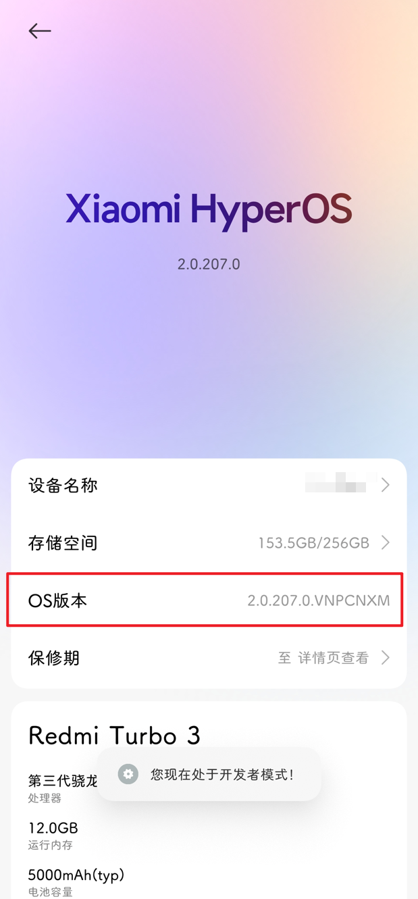
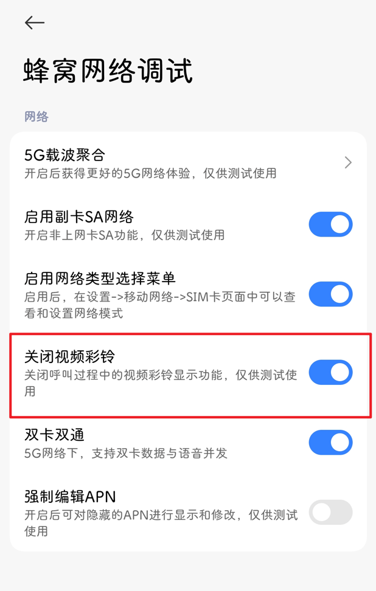

@[TOC]
## 一、问题背景
不知道从什么时候开始，视频彩铃悄然兴起，基本上在现在的手机都带了视频彩铃功能。只要被呼叫的号码开启了视频彩铃功能，那么在自己的手机上就会看到对方设置的彩铃。这个功能在主动呼叫方是没有关闭选项的，多少带来了一些困扰，而且彩铃的音质实在不敢恭维，那么这个功能是否可以被关闭呢？

在某次随意看手机的时候，在小米的 `Hyper OS 2` 系统的 `开发者选项` 里面找到了 `蜂窝网络调试` 功能，里面有一个 `关闭视频彩铃` 的功能。当将这个开关关闭之后，发现不再播放对方的视频彩铃。因此本文将详细介绍通过 `开发者选项` 关闭视频彩铃功能。

> 理论上这个功能在所有 Android 系统上通用，但是去看了 `Android` 的源码，并未发现有这个相关的选项，推测可能是由小米自己加上去的一个设置项，其它厂商的系统可以参考，寻找相关的设置项。

> 由于这个选项是在开发者选项中的，开启此功能可能存在一定的风险！

## 二、开启开发者选项
首先 `开发者选项` 为隐藏设置项，需要先点到 `设置` > `我的设备` 页面，连续点击 `7` 次 `OS版本`，开启开发者选项：

此时，会弹一个 `Toast` 提示：`您现在处于开发者模式！`

## 三、关闭视频彩铃
当开启了开发者选项之后，跳转到 `设置` > `更多设置` > `开发者选项` > `蜂窝网络调试` 界面，随后开启 `关闭视频彩铃` 的选项。

