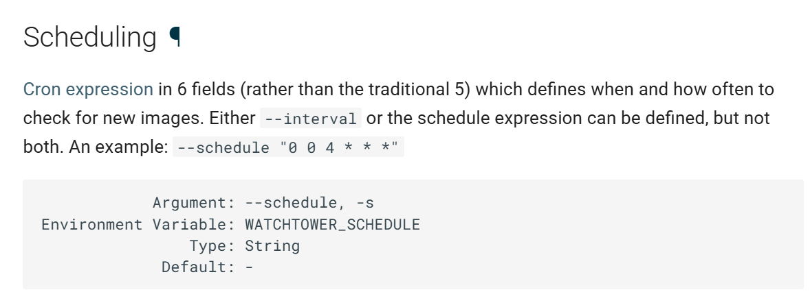
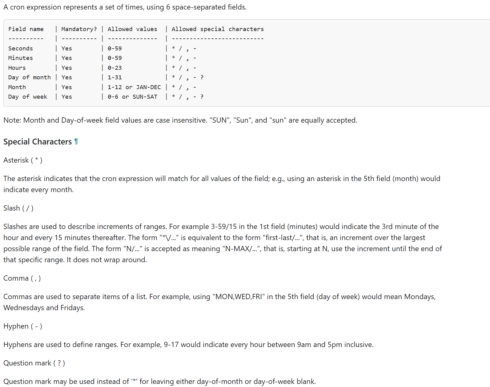

> 原文链接：https://blog.csdn.net/TeleostNaCl/article/details/150233801
> 发布时间：2025-08-12 00:07:46
> 标签：docker、容器、运维、经验分享、智能路由器、网络

---

#### 文章目录

- [一、问题背景](#_1)
- [二、Watchtower 介绍](#Watchtower__9)
- [三、标准用法](#_16)
- [四、定时运行](#_43)

## 一、问题背景

当我们使用 `Docker` 中运行了 `容器` 之后，如果我们想要更新容器所运行的 `镜像`，我们首先会停止掉当前的 `容器`，然后更新相关的 `镜像` ，最后再重新运行 `容器`。如果有多个这样的 `容器` 需要更新时，这样的工作会略显繁琐，因此我们希望有一个自动化更新的工具帮助我们完成这些过程。

而 [containrrr/watchtower](https://github.com/containrrr/watchtower) 即是为此目的而设计的 `Docker` 镜像，本文将利用 `Watchtower` 实现定时更新 `docker` 中的镜像并自动更新容，同时附上 `schedule` 的参数的详细解释。


## 二、Watchtower 介绍

- `containrrr/watchtower` Github地址：<https://github.com/containrrr/watchtower>
- `Watchtower` 官方文档：<https://containrrr.dev/watchtower/arguments/>

`Watchtower` 将自动的拉取新镜像，然后优雅的停止已经存在的 `容器`，并使用与部署时相同的参数重启此 `容器`。具体的用法可以参考 [`Watchtower` 官方文档](https://containrrr.dev/watchtower/arguments/)

> Watchtower will pull down your new image, gracefully shut down your existing container and restart it with the same options that were used when it was deployed initially.

## 三、标准用法

在 `docker` 中运行 `Watchtower` 可以使用如下命令：

```bash
docker run -d \
    --name watchtower \
    --volume /var/run/docker.sock:/var/run/docker.sock \
    containrrr/watchtower
```

此时即可在容器中创建新的容器并启动 `Watchtower`，由于默认是延迟一天之后才触发，此时查看 `Docker` 容器的日志，可以看到会有以下类似的打印，表示下次运行的时间：

```
stderr: time="2025-08-10T11:25:44+08:00" level=info msg="Scheduling first run: 2025-08-12 02:00:00 +0800 CST"
stderr: time="2025-08-10T11:25:44+08:00" level=info msg="Note that the first check will be performed in 23 hours, 59 minutes, 59 seconds"
```

将此方法修改为 `docker-compose` 样式为：

```yaml
services:
  watchtower:
    image: containrrr/watchtower
    container_name: watchtower
    hostname: watchtower
    restart: unless-stopped
    volumes:
      - /var/run/docker.sock:/var/run/docker.sock
```

## 四、定时运行

`Watchtower` 支持使用 `--schedule` 或 `-s` 参数实现定时运行，相关用法如下：  
 <https://containrrr.dev/watchtower/arguments/#scheduling>



其参数后面所接字符串的语法规则为 `go` 语法的 `cron` 表达式，用于定义匹配时间点的规则，相关用法如下：<https://pkg.go.dev/github.com/robfig/cron@v1.2.0#hdr-CRON_Expression_Format>



其参数格式如下：`Seconds Minutes Hours Day of month Month Day of week`，即 `秒 分 时 天 月 星期`， 每个值直接使用空格分隔，同时每个值的取值范围如下：

- `秒`：0 - 59
- `分`：0 - 59
- `时`：0 - 23
- `天`：1 - 31
- `月`：1 - 12
- `星期`：0 - 6 （周日为0）

同时支持使用特殊字符

- `*` ：此符号表示匹配所有该值的时间点，例如 在秒使用 `*` 则表示每秒执行。
- `/`：此符号表示该值的每增量的时间点，此语法规则为 初值-尾值/增量，例如 在秒使用 `3-59/5` 表示从3秒开始，每5秒执行一次，一直到59秒
- `,`：表示多个值可选，例如在秒使用 `1,2,3`，每逢1秒，2秒，3秒时执行一次
- `-`：表示一个范围的时间点，`[start, end)`，不包括尾值，例如在秒使用 `10-20`，则每逢10-20秒则执行一次

利用以上规则，即可以编写相关的语法。举例如下：

- 每年一月一号执行：`0 0 0 1 1 *`
- 每月一号执行一次：`0 0 0 1 * *`
- 每周日执行一次： `0 0 0 * * 0`
- 每天执行一次：`0 0 0 * * *`
- 每小时执行一次：`0 0 * * * *`

例如，我想实现每周二两点执行一次更新，即 `--schedule "* * 2 * * 2"`，同时需要指定时区为中国的时区，那么 `docker` 命令如下：

```bash
docker run -d \
	--name watchtower \
	--hostname watchtower \
	-v /var/run/docker.sock:/var/run/docker.sock \
	-e TZ=Asia/Shanghai \
	-e CRON_TZ=Asia/Shanghai \
	containrrr/watchtower \
	--schedule "* * 2 * * 2"
```

转化为 `docker-compose` 样式为：

```yaml
services:
  watchtower:
    image: containrrr/watchtower
    container_name: watchtower
    hostname: watchtower
    restart: unless-stopped
    volumes:
      - /var/run/docker.sock:/var/run/docker.sock
    environment:
      # 强制使用北京时间
      - TZ=Asia/Shanghai
      - CRON_TZ=Asia/Shanghai
    command: 
      # 每周二北京时间4点执行
      --schedule "* * 2 * * 2"
```
