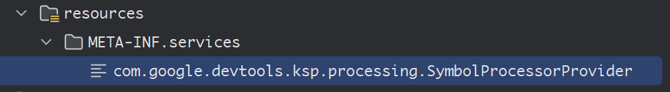

@[TOC]
# 一、什么是KSP
我们都知道可以在 `Java` 中使用 `编译时注解` ，使其在编译 `Java程序` 的时候可以生成代码，以实现不同的需求，提高代码的灵活性。
而到了使用 `Kotlin` 编写Java程序的时候，就可以使用 `kapt` 的方式，可以将 Java 注解处理器与 Kotlin 代码搭配使用，即使这些处理器没有特定的 Kotlin 支持也是如此，从而在编译时生成代码。
但是使用 `kapt` 对编译速度将会产生较大的影响。而 `KSP` （`Kotlin Symbol Processing`）是由 `Google` 推出的以 `Kotlin` 优先的 `kapt` 替代方案，可直接分析 Kotlin 代码，在编译时生成代码。`KSP` 是一套用于开发轻量级编译器插件的API，它提供了简化的编译器插件接口
> Kotlin Symbol Processing (KSP) is an API that you can use to develop lightweight compiler plugins. KSP provides a simplified compiler plugin API that leverages the power of Kotlin while keeping the learning curve at a minimum.

**参考网站：**
ksp：[https://github.com/google/ksp](https://github.com/google/ksp)
Kotlin Symbol Processing API: [https://kotlinlang.org/docs/ksp-overview.html](https://kotlinlang.org/docs/ksp-overview.html)
从 kapt 迁移到 KSP：[https://developer.android.com/build/migrate-to-ksp](https://developer.android.com/build/migrate-to-ksp)

以下是使用 `KSP` 实现编译时生成代码的一般步骤。
# 二、在顶层Gradle文件添加KSP依赖启用KSP
在顶层 `Gradle` 文件（根目录下的 `settings.gradle` 或 `build.gradle` 文件）下的 `buildscript` 包络下的 `dependencies` 包络添加 `KSP` 的依赖，代码如下：
```groovy
buildscript {
	...
    dependencies {
        classpath "com.google.devtools.ksp:com.google.devtools.ksp.gradle.plugin:$ksp_version"
        ...
    }
}
```
其中 `$ksp_version` 是与项目中 `build` 的 `Kotlin` 版本匹配的 `ksp` 版本，例如当前最新的 `2.1.21-2.0.1`，其中 `2.1.21` 是项目中的 `build` 的 `Kotlin` 版本。具体版本可以从 Github 的 release 页面查询：`https://github.com/google/ksp/releases`

# 三、新建模块用于编写自定义 KSP Compile
我们新建一个模块用来编写自定义 `KSP Compile` 的 `SymbolProcessor` 类。首先在新建的模块中引入 `com.google.devtools.ksp:symbol-processing-api` 依赖，在模块的build.gradle中添加：
```groovy
dependencies {
    implementation "com.google.devtools.ksp:symbol-processing-api:$ksp_version"
    ...
}
```
其中，`$ksp_version` 与上一节中相同，为 `ksp` 的版本。这样引入依赖之后，即可编写自定义的 `SymbolProcessor` 类
# 四、定义编译时注解
为了指定需要生成代码的位置，需要使用一个注解来告知 `SymbolProcessor` 其定义的位置，因此将定义一个编译时注解类。格式如下：
使用 `annotation class` 定义此为注解类
使用 `@Target` 定义此注解使用的位置
使用 `@Retention` 定义此注解只用于源码中
```kotlin
@Target(AnnotationTarget.CLASS)
@Retention(AnnotationRetention.SOURCE)
annotation class 类名()
```
**此注解应该定义在另外一个独立的模块，使 `自定义 KSP Compile` 的模块 和 业务代码的模块都可以通过 `implementation` 的方式引入模块，并可以使用此注解。**
# 五、编写自定义 KSP Compile
在第三节建立的模块中，定义一个继承于 `SymbolProcessor` 的处理器类，同时定义一个 继承于 `SymbolProcessorProvider` 用于找到指定 `SymbolProcessor` 的方法。因此，标准格式如下：
```kotlin
class 具体SymbolProcessor(private val environment: SymbolProcessorEnvironment) : SymbolProcessor {
	override fun process(resolver: Resolver): List<KSAnnotated> {
		// 此处实现对具体注解做处理的代码
	}
}

class 具体SymbolProcessorProvider : SymbolProcessorProvider {
    override fun create(environment: SymbolProcessorEnvironment): SymbolProcessor {
        return 具体SymbolProcessor(environment)
    }
}
```
之后，需要在模块中 `META-INF` 中声明 `SymbolProcessorProvider` ，保证其可以 `ksp` 识别到。具体是在模块的 `resources/META-INF/service` 新建一个`com.google.devtools.ksp.processing.SymbolProcessorProvider` 文件，并在文件中声明具体的 `SymbolProcessorProvider` 的类全限定名。

在 `SymbolProcessor` 的 `process` 方法中，可以通过 `Resolver` 拿到编译时的细节，如类 注解 方法等，而 通过 `SymbolProcessorEnvironment` 可以拿到编译时的环境信息，并通过其的 `codeGenerator` 方法在指定位置生成指定代码。

# 六、使用 KSP
在第五节完成之后，如果其他模块需要使用`自定义 KSP Compile`，只需要先在模块的gradle文件中定义使用 `自定义 KSP Compile 模块`，然后在指定位置使用定义好的注解即可。代码如下：
在模块的gradle文件中：
```groovy
plugins {
    id 'org.jetbrains.kotlin.jvm'
    // 首先声明需要使用 ksp插件
    id 'com.google.devtools.ksp'
    ...
}
...
dependencies {
	ksp project(":自定义 KSP Compile 模块")
}
```
# 七、实现一个自动生成版本号的KSP Compiler
业务目标：我们希望实现在编译时自动生成以时间为依据的版本号，格式如下：	`yyMMddTHHmm` 

具体实现：
## 1. 定义 AutoGenerateVersion 注解
在新建一个模块中，定义一个 AutoGenerateVersion 注解，使其可以被业务模块引用和 `KSP Compiler` 中使用。
```kotlin
/**
 * Kotlin编译时注解 自动生成版本号的注解 (yyMMddTHHmm)
 */
@Target(AnnotationTarget.CLASS)
@Retention(AnnotationRetention.SOURCE)
annotation class AutoGenerateVersion()
```
## 2. 定义 AutoGenerateVersionProcessor
在 自定义  `KSP Compiler` 模块中定义 `AutoGenerateVersionProcessor`
```kotlin
/**
 * 自动生成版本号的 SymbolProcessor
 */
class AutoGenerateVersionProcessor(private val environment: SymbolProcessorEnvironment) : SymbolProcessor {

    companion object {
    	/**
    	 * 生成的版本号的类名后缀
    	 */
        private const val GENERATED_CLASS_NAME = "VersionInfo"
    }

    override fun process(resolver: Resolver): List<KSAnnotated> {
        // 通过resolver.getSymbolsWithAnnotation方法 获取所有带有@AutoGenerateVersion注解的类
        val symbols = resolver.getSymbolsWithAnnotation(AutoGenerateVersion::class.java.canonicalName)

		// 之后对每个带有@AutoGenerateVersion注解的类 生成对应的携带版本号信息的类
        symbols.filterIsInstance<KSClassDeclaration>().forEach { classDeclaration ->
        	// 这里取出类的全限定名
            classDeclaration.qualifiedName?.asString()?.let {
                generateCode(it)
            }
        }

        return emptyList()
    }

	/**
	 * 实际生成代码的类
	 */
    private fun generateCode(className: String) {
    	// 通过传进来的全限定类名 获取包名 和 类名
        val packageName = className.substringBeforeLast(".")
        val classSimpleName = className.substringAfterLast(".")

		// 定义携带版本号信息的类名规则: 类名+GENERATED_CLASS_NAME
        val generatedClassName = classSimpleName + GENERATED_CLASS_NAME
        // 生成版本号信息
        val version = SimpleDateFormat("yyMMdd'T'HHmm").format(System.currentTimeMillis())

        try {
            // 使用KSP的Filer API来生成Kotlin源文件
            val kotlinFile = codeGenerator.createNewFile(
                Dependencies(false), packageName, generatedClassName
            )

            kotlinFile.writer().use { writer: Writer ->
                // 写入Kotlin代码
                writer.write("package $packageName\n\n")
                writer.write("object $generatedClassName {\n")
                // 此处为生成一个常量, 在代码中直接使用此常量即为版本号
                writer.write("    const val VERSION: String = \"$version\"\n")
                writer.write("}\n")
            }
        } catch (e: IOException) {
        }
    }
}
```

## 3. 在业务中使用 AutoGenerateVersion
在 模块的 `build.gradle` 确认已导入 `AutoGenerateVersion 注解` 的依赖 和 已经 导入 `自定义  KSP Compiler` 模块。假如业务中的 `Main` 类使用自动生成版本号，则有如下代码：
```kotlin
@AutoGenerateVersion
class Main {
	private const val VERSION = MainVersionInfo.VERSION
}
```
从 `AutoGenerateVersionProcessor` 可以知道 最后生成的版本号信息为 `MainVersionInfo.VERSION`
