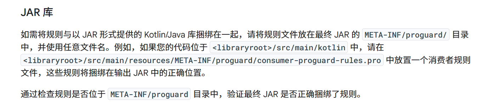
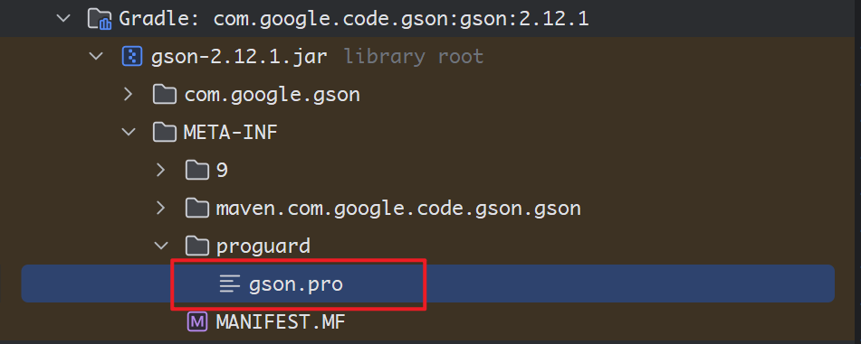
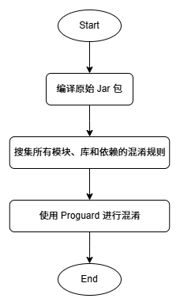
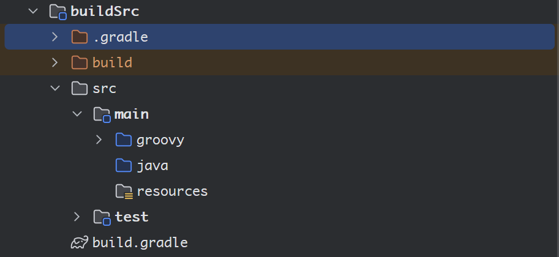
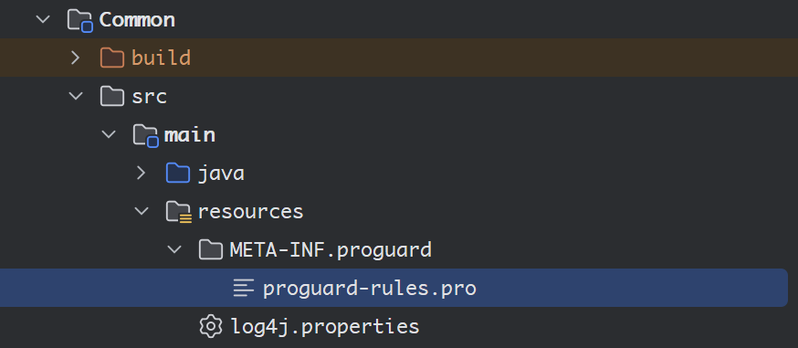

> 原文链接：https://blog.csdn.net/TeleostNaCl/article/details/152551741
> 发布时间：2025-10-05 14:43:20
> 标签：java、intellij-idea、android、经验分享、Kotlin、gradle

---

#### 文章目录

- [一、问题背景](#_1)
- [二、Android 混淆规则解析](#Android__28)
- - [1. 库模块](#1__30)
  - [2. 指定路径下的混淆规则](#2__40)
- [三、思路解析](#_51)
- [四、代码实现](#_54)
- - [1. 导入依赖](#1__55)
  - [2. 创建 Groovy 脚本](#2__Groovy__75)
  - [3. 编译 Jar 包](#3__Jar__99)
  - [4. 定义 Proguard 任务](#4__Proguard__121)
  - - [4.1 定义生成包混淆包的任务](#41__128)
    - [4.2 搜集混淆规则并传递](#42__173)
    - [4.3 完整的代码](#43__256)
- [五、使用方法](#_364)

## 一、问题背景

`Proguard` 是一个开源的用于混淆、删减 Java 代码的优秀的混淆工具，可以显著的减少 Java 程序和 Android 程序的包体积，同时重命名类目和包名，给反编译增加难度，保护程序的安全。因此，此混淆工具被广泛用于 `Java` 和 `Android` 项目中。

官方地址：<https://www.guardsquare.com/manual/home>

由于 `Android` 对 `Proguard` 支持的相当好，因此可以直接方便的使用，并利用 `Gradle` 编译脚本对各个模块的混淆规则便捷的使用并处理。参考：<https://developer.android.com/topic/performance/app-optimization/enable-app-optimization>

```groovy
android {
    buildTypes {
        release {
            // 启用混淆
            minifyEnabled true
            // 启用压缩资源
            shrinkResources true
            // 主模块 添加 混淆规则
            proguardFiles getDefaultProguardFile('proguard-android-optimize.txt'), 'proguard-rules.pro'
            // 在 library 库 添加混淆规则
            consumerProguardFiles 'consumer-proguard-rules.pro'
            ...
        }
    }
}
```

因此，为了便于在Java应用中使用混淆，本文将会参考 `Android` 中的对 `Proguard` 混淆规则的处理，编写 `Gradle` 脚本实现在编译时对 Java 程序的混淆。

## 二、Android 混淆规则解析

一个常规的混淆过程为先编译 `Android` 应用包，然后再对 `Android` 应用包进行混淆，最终生成混淆后的应用安装包。在 `Android` 混淆过程中，最重要的是用规则去指导混淆如何进行，应该保留哪些代码，保证程序可以正常运行，因此将详细解释 `Android` 中混淆规则的使用。

### 1. 库模块

参考文档：<https://developer.android.com/topic/performance/app-optimization/library-optimization>

如文档介绍，如果一个模块以库的方式导入，其会自动在 `jar` 包里面 寻找 `META-INF/proguard` 目录下的混淆规则，并将这些混淆规则运用在最终的打包中。  
 

例如，`Gson` 库：在 `META-INF/proguard` 目录下有 `gson.pro` 混淆规则文件  
 

### 2. 指定路径下的混淆规则

在每个模块下，可以在 `build.gradle` 下 添加以下语句，使其利用指定的混淆规则。

```groovy
// 主模块 添加 混淆规则
proguardFiles getDefaultProguardFile('proguard-android-optimize.txt'), 'proguard-rules.pro'
// 在 library 库 添加混淆规则
consumerProguardFiles 'consumer-proguard-rules.pro'
```

其中， `getDefaultProguardFile('proguard-android-optimize.txt')` 是 `Android` 默认的规则。

## 三、思路解析

因此，参考 `Android` 混淆过程，在混淆 `Java` 程序时可以采用相同的方式，先编译出 `jar` 包，再搜集库、模块和依赖的所有编译规则，传递给混淆程序，使其进行混淆，流程图如下：  
 

## 四、代码实现

### 1. 导入依赖

我们可以在项目中的 `buildSrc` 模块编写自己的 `Gradle` 编译逻辑，使其可以供其它模块使用自定义的编译业务需求。按照模块新建的方式，我们可以创建出 `buildSrc` 模块：  
   
 我们需要编辑 `build.gradle` 文件，导入相关的依赖：

```groovy
repositories {
		// 指定使用的 maven 仓库
    gradlePluginPortal()
    mavenCentral()
    google()
}

dependencies {
    // Proguard 插件
    implementation "com.guardsquare:proguard-gradle:7.7.0"
}
```

此时执行 `sync` 操作同步项目，即可将 `proguard` 的 `Gradle` 插件导入项目中，方便我们编写 `Proguard` 的混淆业务逻辑。

### 2. 创建 Groovy 脚本

我们采用 `groovy` 脚本的方式编写 `Proguard` 的混淆脚本。因此我们在 `buildSrc/src/main/` 文件夹下创建 `groovy` 文件夹，在此文件夹下创建包名路径和 `groovy` 脚本文件 `ProguardTask.groovy`，在此文件夹下进行编写混淆的方法。

我们在 `groovy` 脚本中定义创建编译混淆 `jar` 包的任务，以后只需要在需要编译混淆包的地方，调用此方法即可生成编译混淆包的任务，随后我们再执行此任务，即可生成混淆包。例如，定义如下：

```groovy
/**
 * 创建 BuildProject 任务，并添加 ProGuard 混淆任务，同时保护 Main-Class 不被混淆
 *
 * @param project Gradle Project 对象
 * @param baseName 生成的 JAR 文件的基本名称（不含后缀）
 * @param outputFile 生成的 JAR 文件最终存放的目录
 * @param mainClass JAR 入口的 Main-Class
 */
def static createBuildProjectTask(Project project, String baseName, File outputFile, String mainClass) {
}
```

此方法需要使用四个参数，其中

- `project`：每个模块的 `Project` 对象，用于获得相关的信息
- `baseName`：生成的JAR 文件的基本名称，此名称同时将会被用于任务的命名
- `outputFile`：存放生成的 `Jar` 包文件的最终目录。
- `mainClass`：`Java` 程序的入口 `Main-Class`，用于指定程序的主入口，并避免被混淆。

### 3. 编译 Jar 包

如前所述，我们在混淆 `jar` 包之前需要先编译生成 `jar` 包，因此我们需要先获取到项目的 `jar` 任务，编译生成 `jar` 包。

```groovy
def static createBuildProjectTask(Project project, String baseName, File outputFile, String mainClass) {
    // 获取 jar 任务 并配置 jar 任务
    def jarTask = (project.tasks.named("jar") as TaskProvider<Jar>).get()
    // 将所有依赖打包进jar包
    jarTask.from {
        project.configurations.runtimeClasspath.collect { it.isDirectory() ? it : project.zipTree(it) }
    }
    // 移除 JAR 内的签名文件（避免冲突）
    jarTask.exclude 'META-INF/*.SF', 'META-INF/*.DSA', 'META-INF/*.RSA'
    // 遇到重复文件时采用忽略策略
    jarTask.duplicatesStrategy = DuplicatesStrategy.EXCLUDE
    // 设置主类
    jarTask.manifest.attributes('Main-Class': mainClass)
}
```

使用上述代码即可获取到 `jar` 任务并配置完成

### 4. 定义 Proguard 任务

这是整个混淆的核心步骤，同时需要分几步之后才能完成。  
 首先，需要先定义输入输出文件，并定义混淆规则的临时存放路径，定义生成混淆包的任务。  
 随后，需要收集所有库、模块和依赖的混淆规则。  
 然后，在混淆规则中添加对主类的混淆规则。  
 最后，将规则传递给混淆程序。

#### 4.1 定义生成包混淆包的任务

我们在配置完成 `jar` 任务后继续编写：

```groovy
def static createBuildProjectTask(Project project, String baseName, File outputFile, String mainClass) {
    // 获取 jar 任务 并配置 jar 任务
    ...
    
    // 定义并配置 Proguard 任务
    String proguardTaskName = "proguard${baseName}"

    // 最后输出的 JAR 包文件名
    String jarName = "${baseName}.jar"
    // 未混淆的 JAR 文件
    File orginJarFile = jarTask.archiveFile.get().asFile
    // Mapping 的文件名
    String mappingName = "${baseName}-mapping.txt"

    // 临时目录用于存放中间文件
    def tempDir = Utils.createTmpFile(project, baseName)
    // 确保outputFile 的文件夹存在
    outputFile.mkdirs()

    // 创建 ProGuard 任务
    def proguardTask = project.tasks.register(proguardTaskName, ProGuardTask).get()

    // 配置 ProGuard 任务
    proguardTask.with {
        // 依赖未混淆 JAR 的生成任务
        dependsOn jarTask

        // 任务所属的 Gradle 任务组
        group = 'proguard'

        // 指定输入未混淆的 JAR 文件 (从临时目录中获取)
        injars orginJarFile

        // 指定输出混淆后的 JAR 文件 (放到最终的 outputFile 目录)
        outjars "${outputFile}/${jarName}"

        // 增加混淆映射文件
        printmapping new File(tempDir, mappingName)
    }
}
```

#### 4.2 搜集混淆规则并传递

我们需要在 `Proguard` 任务执行之前，搜集到所有的库、模块和依赖中的混淆规则，如前面所述，我们需要寻找每个模块的 `META-INF/proguard` 目录下的混淆规则。因此我们有以下代码：

```groovy
def static createBuildProjectTask(Project project, String baseName, File outputFile, String mainClass) {
    // 获取 jar 任务 并配置 jar 任务
    ...
    
    // 定义并配置 Proguard 任务
    ...

    // 搜集混淆规则 并传递给 Proguard 用于混淆
    proguardTask.doFirst {
        // 定义存放 Proguard
        def proguardDir = new File(tempDir, "proguard")
        // 定义存放 proguard 规则 的文件
        def proguardRulesFiles = new HashSet<File>()
        // 遍历 runtimeClasspath 中的依赖 （这里可以搜集到所有库 模块 和依赖）
        for (artifact in project.configurations.runtimeClasspath.resolvedConfiguration.resolvedArtifacts) {
            if (artifact.file.name.endsWith('.jar')) {
                // 只解压 JAR 文件中的 META-INF/proguard 目录 并放到临时目录下
                def jarFile = artifact.file
                def tmpDir = new File(proguardDir, "${artifact.name}")
                project.copy {
                    from project.zipTree(jarFile) // 解压 JAR 文件
                    include 'META-INF/proguard/*.pro' // 只包含 META-INF/proguard 下的 .pro 文件
                    into tmpDir
                }

                // 查找解压后的 META-INF/proguard/*.pro 文件
                def proguardFiles = project.fileTree(dir: proguardDir, include: '**/*.pro').files
                proguardRulesFiles += proguardFiles
            }
        }
        // 便于调试, 打印搜集到的混淆规则
        println("proguardRulesFiles = $proguardRulesFiles")

        // 将所有规则文件路径传递给 ProGuard
        proguardTask.configuration(proguardRulesFiles.collect { it.absolutePath })

        // 指定运行时库（Java 模块路径）
        proguardTask.libraryjars "${System.getProperty('java.home')}/jmods"

        // 创建临时文件用于存储避免混淆主类
        def mainClassRulesFile = new File(proguardDir, "main-class-rules.pro")
        // 动态生成规则，写入到临时文件中
        mainClassRulesFile.text = """
-keep public class ${mainClass} {
public static void main(java.lang.String[]);
}
		""".stripIndent()

        // 将动态生成的规则文件路径也传递给 ProGuard
        proguardTask.configuration mainClassRulesFile.absolutePath
    }
```

此方法的核心思路在于如下:

```groovy
for (artifact in project.configurations.runtimeClasspath.resolvedConfiguration.resolvedArtifacts) {
    if (artifact.file.name.endsWith('.jar')) {
        // 只解压 JAR 文件中的 META-INF/proguard 目录 并放到临时目录下
        def jarFile = artifact.file
        def tmpDir = new File(proguardDir, "${artifact.name}")
        project.copy {
            from project.zipTree(jarFile) // 解压 JAR 文件
            include 'META-INF/proguard/*.pro' // 只包含 META-INF/proguard 下的 .pro 文件
            into tmpDir
        }

        // 查找解压后的 META-INF/proguard/*.pro 文件
        def proguardFiles = project.fileTree(dir: proguardDir, include: '**/*.pro').files
        proguardRulesFiles += proguardFiles
    }
}
```

使用 `artifact in project.configurations.runtimeClasspath.resolvedConfiguration.resolvedArtifacts` 可以遍历 `Project` 中所有的依赖的 `jar` 包，并通过解压的方式，将 `jar` 包中的 `META-INF/proguard` 文件解压到临时目录中，并将 `pro` 文件留待备用。

```groovy
project.copy {
    from project.zipTree(jarFile) // 解压 JAR 文件
    include 'META-INF/proguard/*.pro' // 只包含 META-INF/proguard 下的 .pro 文件
    into tmpDir
}
```

#### 4.3 完整的代码

按照以上思路，即可定义完成一个完整的生成混淆包的方法，完整的代码如下：

```groovy
/**
 * 创建 BuildProject 任务，并添加 ProGuard 混淆任务，同时保护 Main-Class 不被混淆
 *
 * @param project Gradle Project 对象
 * @param baseName 生成的 JAR 文件的基本名称（不含后缀）
 * @param outputFile 生成的 JAR 文件最终存放的目录
 * @param mainClass JAR 入口的 Main-Class
 */
def static createBuildProjectTask(Project project, String baseName, File outputFile, String mainClass) {
    // 获取 jar 任务 并配置 jar 任务
    def jarTask = (project.tasks.named("jar") as TaskProvider<Jar>).get()
    // 将所有依赖打包进jar包
    jarTask.from {
        project.configurations.runtimeClasspath.collect { it.isDirectory() ? it : project.zipTree(it) }
    }
    // 移除 JAR 内的签名文件（避免冲突）
    jarTask.exclude 'META-INF/*.SF', 'META-INF/*.DSA', 'META-INF/*.RSA'
    // 遇到重复文件时采用忽略策略
    jarTask.duplicatesStrategy = DuplicatesStrategy.EXCLUDE
    // 设置主类
    jarTask.manifest.attributes('Main-Class': mainClass)

    // 定义并配置 Proguard 任务
    String proguardTaskName = "proguard${baseName}"

    // 最后输出的 JAR 包文件名
    String jarName = "${baseName}.jar"
    // 未混淆的 JAR 文件
    File orginJarFile = jarTask.archiveFile.get().asFile
    // Mapping 的文件名
    String mappingName = "${baseName}-mapping.txt"

    // 临时目录用于存放中间文件
    def tempDir = Utils.createTmpFile(project, baseName)
    // 确保outputFile 的文件夹存在
    outputFile.mkdirs()

    // 创建 ProGuard 任务
    def proguardTask = project.tasks.register(proguardTaskName, ProGuardTask).get()

    // 配置 ProGuard 任务
    proguardTask.with {
        // 依赖未混淆 JAR 的生成任务
        dependsOn jarTask

        // 任务所属的 Gradle 任务组
        group = 'proguard'

        // 指定输入未混淆的 JAR 文件 (从临时目录中获取)
        injars orginJarFile

        // 指定输出混淆后的 JAR 文件 (放到最终的 outputFile 目录)
        outjars "${outputFile}/${jarName}"

        // 增加混淆映射文件
        printmapping new File(tempDir, mappingName)
    }

    // 搜集混淆规则 并传递给 Proguard 用于混淆
    proguardTask.doFirst {
        // 定义存放 Proguard
        def proguardDir = new File(tempDir, "proguard")
        // 定义存放 proguard 规则 的文件
        def proguardRulesFiles = new HashSet<File>()
        // 遍历 runtimeClasspath 中的依赖 （这里可以搜集到所有库 模块 和依赖）
        for (artifact in project.configurations.runtimeClasspath.resolvedConfiguration.resolvedArtifacts) {
            if (artifact.file.name.endsWith('.jar')) {
                // 只解压 JAR 文件中的 META-INF/proguard 目录 并放到临时目录下
                def jarFile = artifact.file
                def tmpDir = new File(proguardDir, "${artifact.name}")
                project.copy {
                    from project.zipTree(jarFile) // 解压 JAR 文件
                    include 'META-INF/proguard/*.pro' // 只包含 META-INF/proguard 下的 .pro 文件
                    into tmpDir
                }

                // 查找解压后的 META-INF/proguard/*.pro 文件
                def proguardFiles = project.fileTree(dir: proguardDir, include: '**/*.pro').files
                proguardRulesFiles += proguardFiles
            }
        }
        // 便于调试, 打印搜集到的混淆规则
        println("proguardRulesFiles = $proguardRulesFiles")

        // 将所有规则文件路径传递给 ProGuard
        proguardTask.configuration(proguardRulesFiles.collect { it.absolutePath })

        // 指定运行时库（Java 模块路径）
        proguardTask.libraryjars "${System.getProperty('java.home')}/jmods"

        // 创建临时文件用于存储避免混淆主类
        def mainClassRulesFile = new File(proguardDir, "main-class-rules.pro")
        // 动态生成规则，写入到临时文件中
        mainClassRulesFile.text = """
-keep public class ${mainClass} {
public static void main(java.lang.String[]);
}
		""".stripIndent()

        // 将动态生成的规则文件路径也传递给 ProGuard
        proguardTask.configuration mainClassRulesFile.absolutePath
    }
}
```

## 五、使用方法

当定义完以上方法之后，就可以在主模块里面调用此方法定义生成混淆包的任务，并传递 `Project` 、任务名、`jar` 包输出路径 和 主类的全限定名。例如：

```groovy
BuildProjectTask.createBuildProjectTask(project, "TestProject",
        file("${rootDir}\\out\\TestProject"), 'com.teleostnacl.test.Main')
```

此时任务名为 `TestProject`，`jar` 包输出路径在 `根目录/out/TestProject` 下，主类的全限定名为 `com.teleostnacl.test.Main`。

由于我们在搜集混淆规则的文件时，使用的是 `META-INF/proguard/*.pro`，我们可以在自己编写的模块下的 `src\main\resources\META-INF\proguard\` 文件夹下定义 `.pro` 文件，例如如下：  
 

此时会在 Gradle 任务中生成 `Proguard` 的任务，运行此任务即可编译生成混淆包的 Jar 文件  
 
