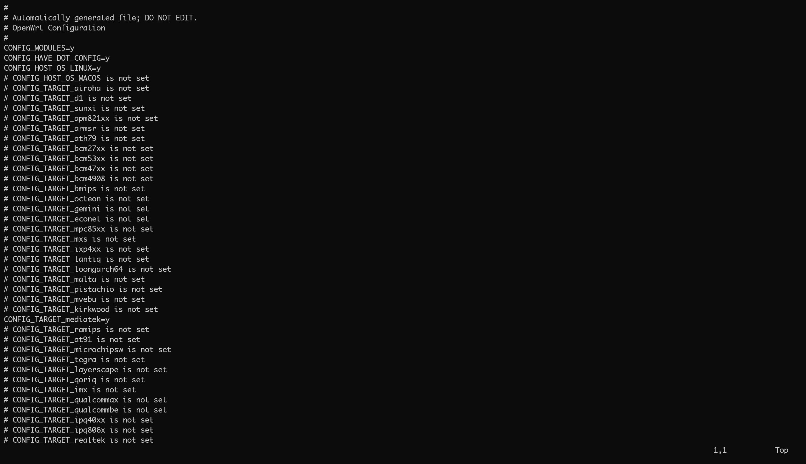
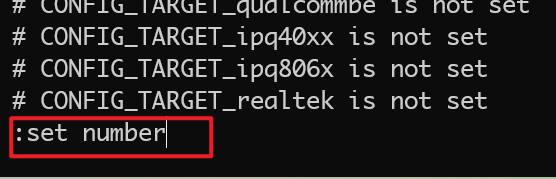
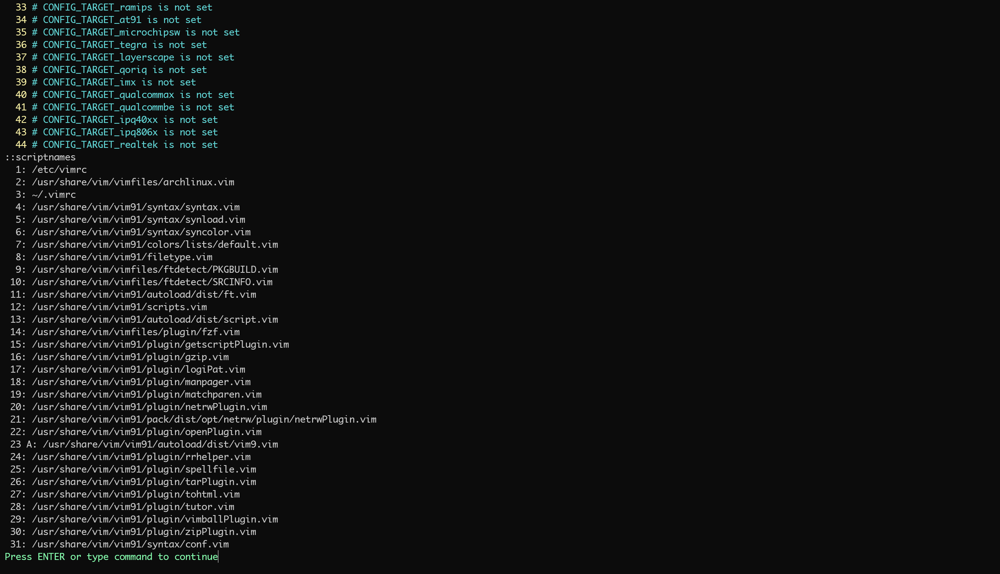

@[TOC]

`Vim` 是 `Linux` 平台上优秀的文本编辑器的开源软件，基于 `Unix` 的 `Vi` 进化而来，是一款具有高度自定义化和可拓展性的软件，也是在 `Linux` 上必备的高效工具之一。

那么当我们遇到一篇很长的文档，或具有特定语法结构的文档时，我们希望可以快速的知道行号以及使用彩色显示不同语法的文件，我们该如何设置呢？

例如这下面的原始文档，不支持行号显示和语法高亮功能：



# 检查是否支持语法高亮
`Vim` 提供了广泛的插件以便支持不同的能力，首先，我们先通过 `vim --version` 命令了解我们所安装的 `vim` 是否支持语法高亮功能，如果支持，那么将会有以下的打印
```shell
vim --version
VIM - Vi IMproved 9.1 (2024 Jan 02, compiled Dec 08 2025 14:17:41)
Included patches: 1-1918
Compiled by non-existent-hostname-compiled
Normal version without GUI.  Features included (+) or not (-):

+syntax
```

关键信息即 `+syntax`，表示支持语法高亮功能。（如果不支持语法高亮功能，则需要重新编译 vim 或者安装完整版的 `vim`。）

---
# 命令方式启用行号显示和语法高亮功能（仅对当次有效）
那么我们在编辑文档的时候，只需要在命令输入窗口的地方，输入以下两条语句，即可开启行号显示( `:set number` )和语法高亮( `:syntax on` )功能
```shell
:set number
:syntax on
```

在浏览模式下，输入 `:` 符号即可开始输入命令：


当两条命令输入完成之后，即可得到启用行号显示和语法高亮功能的 `Vim`：

如果不满意当前的配色方案，则可以去网上寻找配色方案，使用 `colorscheme` 命令即可更好不同的配色方案。

那么，如果我们希望关闭行号显示( `:set nonumber` )和语法高亮( `:syntax on` )功能，则输入以下两条命令即可：
```shell
:set nonumber
:syntax off
```

---
# 配置模式启用行号显示和语法高亮功能（永久有效）
但是每次启动 `Vim` 都要设置一下启用行号显示和语法高亮功能显得略微麻烦一点，我们有没有办法使其配置永久化呢，答案是肯定的。

首先，我们需要知道 `Vim` 使用的配置文件有哪些，我们在 `Vim` 里输入命令 `:scriptnames` 可以得到类似如下的输出：


```shell
:scriptnames
  1: /etc/vimrc
  2: /usr/share/vim/vimfiles/archlinux.vim
  3: ~/.vimrc
  4: /usr/share/vim/vim91/syntax/syntax.vim
  5: /usr/share/vim/vim91/syntax/synload.vim
  6: /usr/share/vim/vim91/syntax/syncolor.vim
  7: /usr/share/vim/vim91/colors/lists/default.vim
  8: /usr/share/vim/vim91/filetype.vim
  9: /usr/share/vim/vimfiles/ftdetect/PKGBUILD.vim
 10: /usr/share/vim/vimfiles/ftdetect/SRCINFO.vim
 11: /usr/share/vim/vim91/autoload/dist/ft.vim
 12: /usr/share/vim/vim91/scripts.vim
 13: /usr/share/vim/vim91/autoload/dist/script.vim
 14: /usr/share/vim/vimfiles/plugin/fzf.vim
 15: /usr/share/vim/vim91/plugin/getscriptPlugin.vim
 16: /usr/share/vim/vim91/plugin/gzip.vim
 17: /usr/share/vim/vim91/plugin/logiPat.vim
 18: /usr/share/vim/vim91/plugin/manpager.vim
 19: /usr/share/vim/vim91/plugin/matchparen.vim
 20: /usr/share/vim/vim91/plugin/netrwPlugin.vim
 21: /usr/share/vim/vim91/pack/dist/opt/netrw/plugin/netrwPlugin.vim
 22: /usr/share/vim/vim91/plugin/openPlugin.vim
 23 A: /usr/share/vim/vim91/autoload/dist/vim9.vim
 24: /usr/share/vim/vim91/plugin/rrhelper.vim
 25: /usr/share/vim/vim91/plugin/spellfile.vim
 26: /usr/share/vim/vim91/plugin/tarPlugin.vim
 27: /usr/share/vim/vim91/plugin/tohtml.vim
 28: /usr/share/vim/vim91/plugin/tutor.vim
 29: /usr/share/vim/vim91/plugin/vimballPlugin.vim
 30: /usr/share/vim/vim91/plugin/zipPlugin.vim
 31: /usr/share/vim/vim91/syntax/conf.vim
```
其中，`/usr/share/vim/` 和 `/etc` 目录为系统级的配置文件，对所有用都生效，如果需要修改对所有用户都生效，那么修改 `/etc/vimrc` 文件即可，如果仅需要对本地用户生效，那么修改 `~/.vimrc` 即可。

同时在 `vim --version` 里面也输出了配置文件的路径，修改一下路径文件的内容也是可以的。

```shell
   system vimrc file: "/etc/vimrc"
     user vimrc file: "$HOME/.vimrc"
 2nd user vimrc file: "~/.vim/vimrc"
 3rd user vimrc file: "~/.config/vim/vimrc"
      user exrc file: "$HOME/.exrc"
       defaults file: "$VIMRUNTIME/defaults.vim"
  fall-back for $VIM: "/usr/share/vim"
```

本文就以修改 `~/.vimrc` 为例：首先使用命令 `vim ~/.vimrc` 通过 `Vim` 编辑配置文件，在文件末尾添加一下两句即可：
```shell
set number
syntax on
```

--- 

# 总结
## 开启行号显示
```shell
set number
```

## 关闭行号显示
```shell
set nonumber
```

## 开启语法高亮
```shell
syntax on
```

## 关闭语法高亮
```shell
syntax off
```
