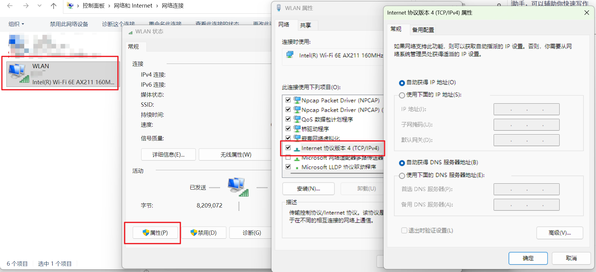
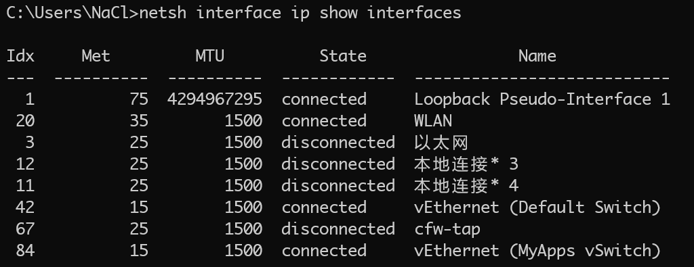
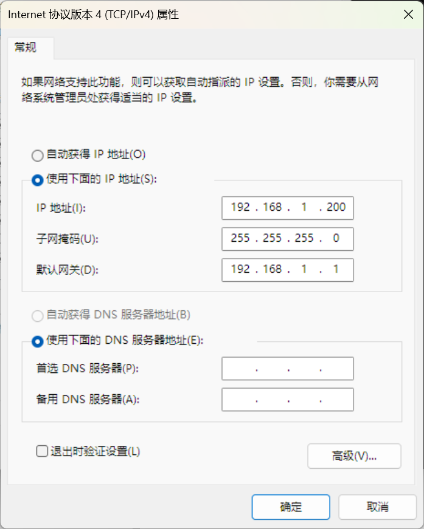
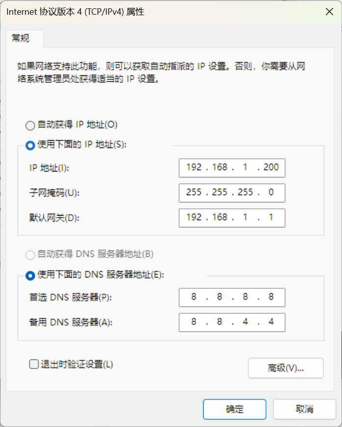

> 原文链接：https://blog.csdn.net/TeleostNaCl/article/details/152600687
> 发布时间：2025-10-06 12:03:52
> 标签：windows、tcp/ip、网络协议、经验分享、网络、ip

---

#### 文章目录

- [一、问题背景](#_1)
- [二、详细步骤](#_8)
- - [1. 获取网卡的 ID 和 名称](#1__ID___9)
  - [2. 设置静态 IP 地址](#2__IP__20)
  - [3. 设置DNS](#3_DNS_38)
  - [3. 还原动态 IP 地址](#3__IP__66)
- [三、总结](#_86)

## 一、问题背景

我们在 `Windows` 上可以在 `控制面板` > `网络和 Internet` > `网络和共享中心` > `更改适配器选项` 中，然后选择需要设置静态 `IP` 的网卡，点击 `属性`，选择 `Internet 协议版本 4 (TCP/IPv4)`，随后即可设置静态 `IP` 地址。



但如果我们需要设置自动化任务，使用 `GUI` 设置静态 `IP` 可能会带来不方便，因此我们希望可以使用命令设置静态 `IP` 。本文将详细介绍在 `Windows` 上使用命令的方式给网卡设置静态 `IP` 地址。

## 二、详细步骤

### 1. 获取网卡的 ID 和 名称

我们使用命令以下命令获取机器上所有的网络适配器的名称和 ID：

```bash
netsh interface ip show interfaces
```

例如：

  
 我们可以获得 `wifi` 网卡的 `ID` 为 `20`，网卡名为 `WLAN`，而有线连接的 `ID` 为 `3`，网卡名为 `以太网` 。

### 2. 设置静态 IP 地址

设置静态 `IP` 地址使用以下命令（需要以管理员身份运行）：

```bash
netsh interface ip set address "连接名称"/索引号 static 静态IP地址 子网掩码 默认网关
```

例如，我要给 `wifi` 网卡设置静态 `IP` 地址，静态 `IP` 地址为：`192.168.1.200`，子网掩码为 `255.255.255.0`，默认网关为 `192.168.1.1`，命令如下：

```bash
// 方案一 使用连接名称
netsh interface ip set address "WLAN" static 192.168.1.200 255.255.255.0 192.168.1.1

// 方案二 使用 索引号
netsh interface ip set address 20 static 192.168.1.200 255.255.255.0 192.168.1.1
```

此时可以去 `网络适配器` 中查看是否设置生效



### 3. 设置DNS

在设置完静态地址之后，往往需要设置 `DNS`，用以下命令进行配置即可（需要以管理员身份运行）：

```bash
// 主 DNS 地址
netsh interface ip set dns "连接名称"/索引号 static DNS地址

//备用 DNS 地址
netsh interface ip add dns "连接名称"/索引号 DNS地址 index=2
```

例如要给 `wifi` 网卡设置主 `DNS` 为 `8.8.8.8`，备用 `DNS` 地址 `8.8.4.4`：

```bash
// 方案一 使用 连接名称 设置
// 主 DNS 地址
netsh interface ip set dns "WLAN" static 8.8.8.8
//备用 DNS 地址
netsh interface ip add dns "WLAN" 8.8.4.4 index=2

// 方案二 使用 索引号 设置
// 主 DNS 地址
netsh interface ip set dns 20 static 8.8.8.8
//备用 DNS 地址
netsh interface ip add dns 20 8.8.4.4 index=2
```

同时可以使用 `网络适配器` 中查看是否设置生效  
 

### 3. 还原动态 IP 地址

当我们希望从静态 `IP` 地址还原到动态 `IP` 地址（`DHCP`）时，可以使用如下两个命令进行还原：

```bash
// 还原 IP 地址
netsh interface ip set address "连接名称"/索引号 dhcp
// 还原 DNS 地址
netsh interface ip set dns "连接名称"/索引号 dhcp
```

例如，给 `Wifi` 网卡设置动态 `IP` 地址：

```bash
// 方案一 使用 网卡名称
netsh interface ip set address "WLAN" dhcp
netsh interface ip set dns "WLAN" dhcp

// 方案二 使用 网卡 IDx
netsh interface ip set address 20 dhcp
netsh interface ip set dns 20 dhcp
```

## 三、总结

```bash
// 获取机器上所有的网络适配器的名称和 ID
netsh interface ip show interfaces

// 设置静态 IP 地址
netsh interface ip set address "连接名称"/索引号 static 静态IP地址 子网掩码 默认网关

// 设置 DNS
// 主 DNS 地址
netsh interface ip set dns "连接名称"/索引号 static DNS地址
//备用 DNS 地址
netsh interface ip add dns "连接名称"/索引号 DNS地址 index=2

// 还原动态 IP 地址 （DHCP）
netsh interface ip set address "连接名称"/索引号 dhcp
// 还原动态 DNS 地址
netsh interface ip set dns "连接名称"/索引号 dhcp
```
