> 原文链接：https://blog.csdn.net/TeleostNaCl/article/details/151317361
> 发布时间：2025-09-08 12:15:25
> 标签：adb、经验分享、android、android-studio、android studio、android runtime

---

最新的 `Google USB Driver` 的直接下载连接如下：<https://dl.google.com/android/repository/latest_usb_driver_windows.zip>

#### 文章目录

- [一、问题背景](#_4)
- [二、驱动下载](#_21)
- [三、安装驱动](#_38)
- [四、驱动验证](#_64)

## 一、问题背景

我们在调试 `Android` 设备的时候，可以在开发者选项下开启 `ADB` 调试，然后使用 `USB` 数据线连接电脑与 `Android` 设备，可以进行 `ADB` 调试或者进行 `Fastboot` 调试。

`ADB` 全称为 `Android Debug Bridge`，一般翻译为 `安卓调试桥`，其是功能非常强大的命令行工具，是 `Android SDK`（软件开发工具包）的一部分，可以用于调试 `Android` 系统和应用。

`Fastboot` 是 `Android` 设备的一个协议，也是一个用于与设备 `Bootloader`（引导程序）进行通信的命令行工具。可以把它理解为比 `ADB` 更底层的、权限更高的操作模式。其可以引导、解锁、刷写分区。

因此，对于 `Android` 开发人员来说，`ADB` 和 `Fastboot` 是非常常用的命令和工具。但是我们在使用的时候，电脑是无法直接设备 `Android` 设备 和 处于 `Bootloader` 模式 下的设备的，我们需要先安装相关驱动之后才可以使用。

由官方文档可知：

- <https://developer.android.com/studio/run/oem-usb>
- <https://developer.android.com/studio/run/win-usb>

驱动可以分为两个类别，一个是 `OEM`（设备制造商）的驱动 和 `Google` 的 `USB` 驱动。如果仅使用 ADB 调试，那么一般使用 `Google` 的 `USB` 驱动即可，而对于底层的 `Fastboot` 调试，则更多的需要 `OEM` 驱动（有些设备也可以直接使用 `Google` 的 `USB` 驱动）。

因此，本文将详细介绍 `Google` 的 `USB` 驱动的下载以及安装。

## 二、驱动下载

如 <https://developer.android.com/studio/run/win-usb> 文档所述，可以有两个方法获取到 `Google` 的 `USB` 驱动：

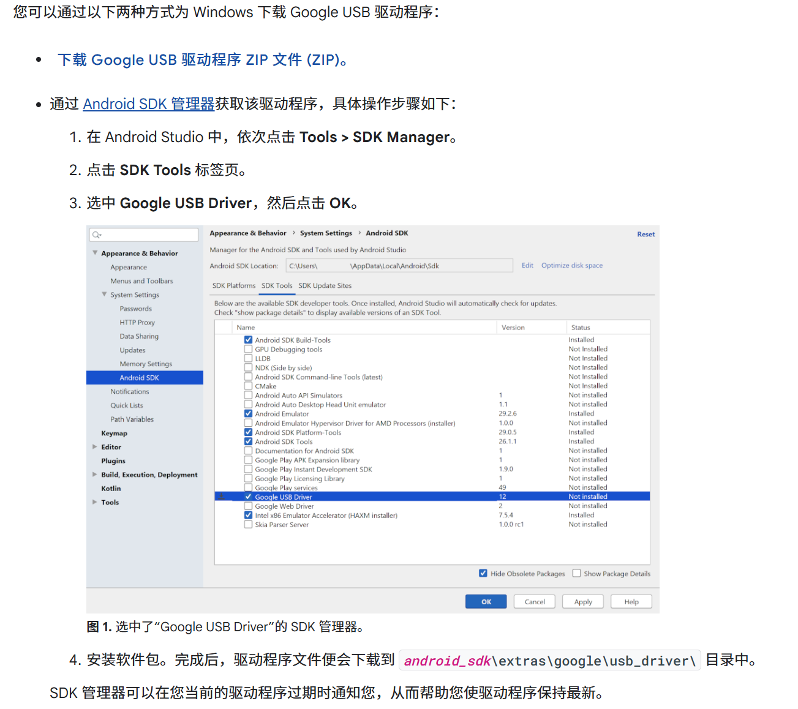

最新的 `USB Driver` 的直接下载连接如下（解压之后备用）：<https://dl.google.com/android/repository/latest_usb_driver_windows.zip>

---

也可以使用 `Android Studio` 的 `SDK` 管理器进行安装 `USB Driver` ，路径为：  
 `Settings` > `Language & Frameworks` > `Android SDK` > `SDK Tools` > `Google USB Driver` 。  
 勾选 `Google USB Driver` 点击 `OK` 之后 即可将驱动文件下载到本地。此路径为：`Android SDK 根目录/extras/google/usb_driver` 。

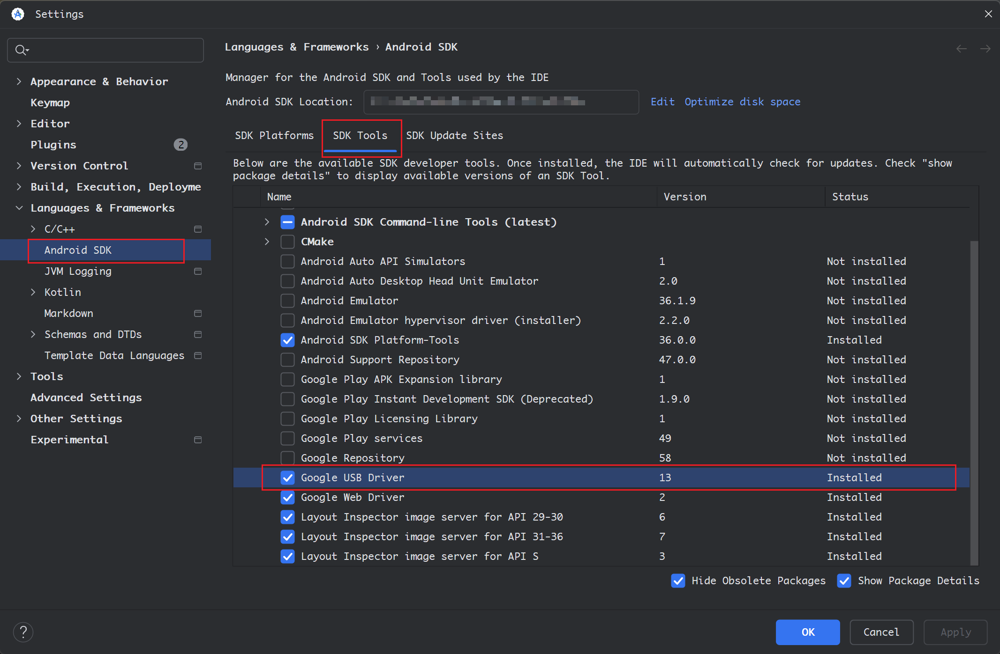

驱动文件列表如下：  
 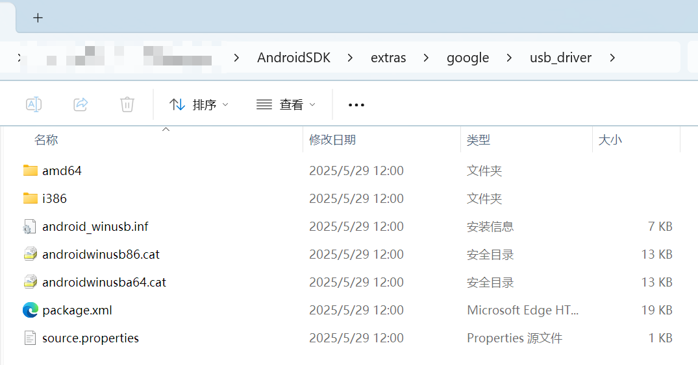

## 三、安装驱动

当把驱动文件准备完成之后，我们就需要手动安装相关的驱动了。

首先，我们先右键 `开始` 菜单，打开菜单列表，打开 `设备管理器`。  
 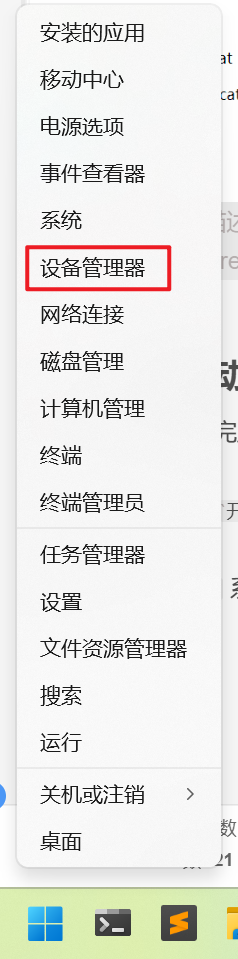

---

如果是使用 `Windows 11` 系统，则可以直接添加驱动，  
 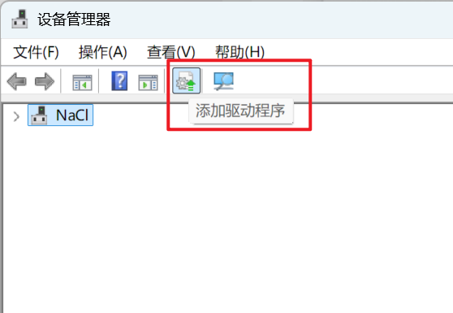

然后选择 驱动的所在目录，并勾选 `包括子文件夹` ，然后点击下一步进行安装。  
 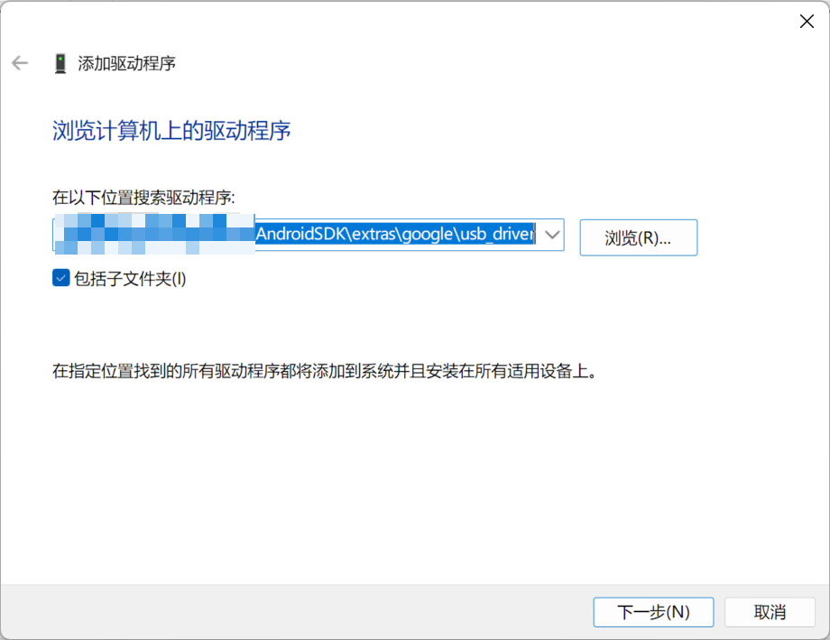

随后，驱动安装成功之后会出现以下提示：  
 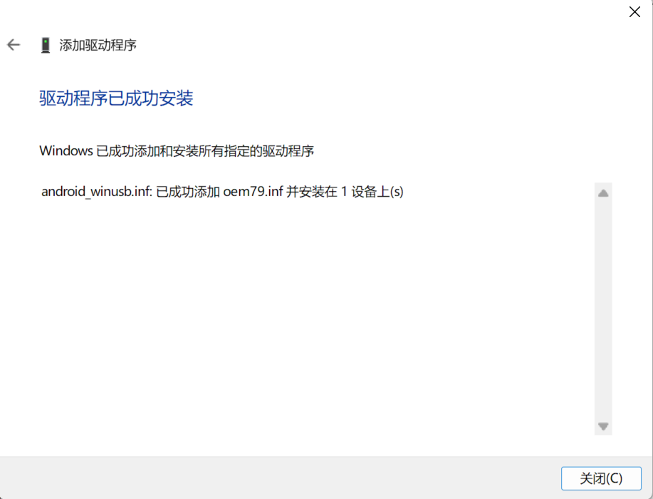

此时即可以使用 `ADB` 调试 和 `Fastboot` 调试。

---

如果使用的是 `Windows 10` 系统，由于设备管理器里面没有直接添加驱动，所以我们需要先插入 `USB` 连接设备，此时会出现未知设备，对其按右键选择更新驱动。  
 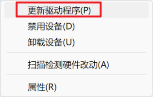

随后选择 `浏览我的电脑以查找驱动程序`，此时同 `Windows 11` 一样 选择驱动所在文件夹，并勾选 `包括子文件夹` ，然后点击下一步进行安装即可。  
 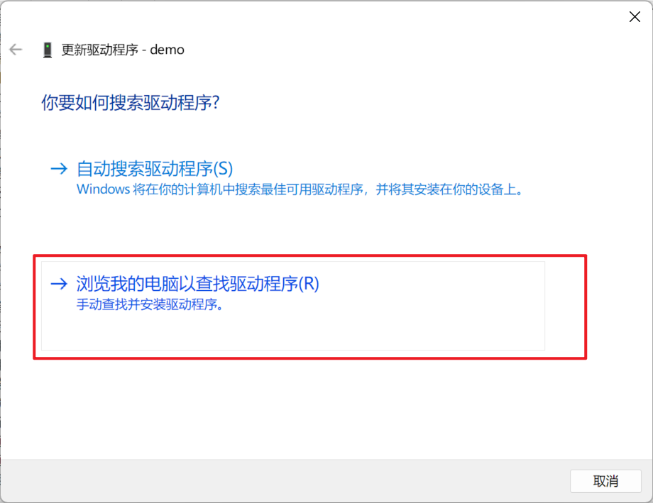

## 四、驱动验证

当驱动安装完成之后，此时设备管理器中可以看见 `Android Device` 的设备了。  
 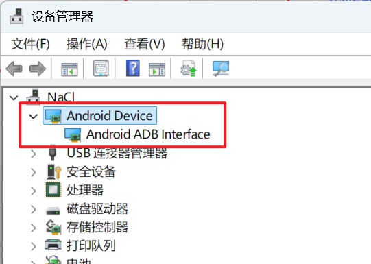

同时在终端使用 `adb devices` 或 `fastboot` 命令，也可以列出当前已连接的设备：  
 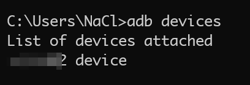
