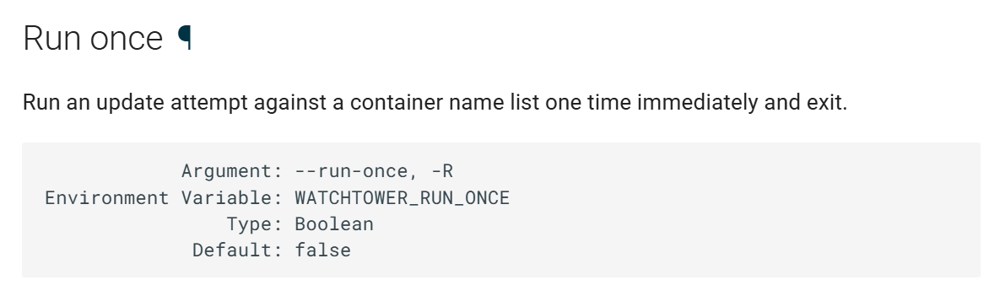
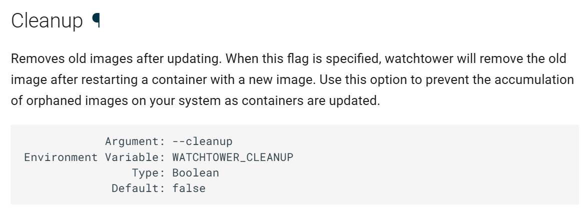

@[TOC]
## 一、问题背景
[containrrr/watchtower](https://github.com/containrrr/watchtower) 是一个被设计用来自动更新 `Docker` 的镜像并优雅的停止正在运行的容器，自动更新容器的 `Docker` 镜像。但是 `containrrr/watchtower` 给出的默认命令是添加一个新的容器，并延迟 `24h` 之后才执行。如果我们需要立即更新 `Docker` 的镜像，并自动更新容器，需要如何执行命令呢？本文将详细介绍如何立即执行 Watchtower 实现立即更新镜像并自动更新容器。
```shell
docker run --detach \
    --name watchtower \
    --volume /var/run/docker.sock:/var/run/docker.sock \
    containrrr/watchtower
```


## 二、解决方案
- `containrrr/watchtower` Github地址：[https://github.com/containrrr/watchtower](https://github.com/containrrr/watchtower)
- `Watchtower` 官方文档：[https://containrrr.dev/watchtower/arguments/](https://containrrr.dev/watchtower/arguments/)

首先，我们查看 [`Watchtower` 官方文档 run_once](https://containrrr.dev/watchtower/arguments/#run_once) ，可以知道官方提供了一个 --run-once` 参数，即可立即运行。



随后呢，我们运行完 `Watchtower` 是一次性，因此在执行命令的时候，就不需要将容器添加到 `Docker` 中，也即运行完之后就将此容器删除。对于 `Docker` 来说，使用参数 `--rm` 即可实现一次性执行命令，不添加容器。因此，一条完整的命令如下：
```shell
docker run --rm \
  -v /var/run/docker.sock:/var/run/docker.sock \
  containrrr/watchtower \
  --run-once
```

如果需要将网络模式修改为 `host`，即添加 `--network host ` 参数
```shell
docker run --rm \
  --network host \
  -v /var/run/docker.sock:/var/run/docker.sock \
  containrrr/watchtower \
  --run-once
```

如果需要在更新完成之后删除旧的镜像，则可以参考 [`Watchtower` 官方文档 cleanup](https://containrrr.dev/watchtower/arguments/#cleanup)，可以知道官方提供了一个 `--cleanup` 参数可以实现更新完成之后删除旧的镜像。



完整的运行的命令
```shell
docker run --rm \
  --network host \
  -v /var/run/docker.sock:/var/run/docker.sock \
  containrrr/watchtower \
  --run-once --cleanup
```

## 三、附加资源
实现定时运行的方案可以参考：[https://blog.csdn.net/TeleostNaCl/article/details/150233801](https://blog.csdn.net/TeleostNaCl/article/details/150233801)
