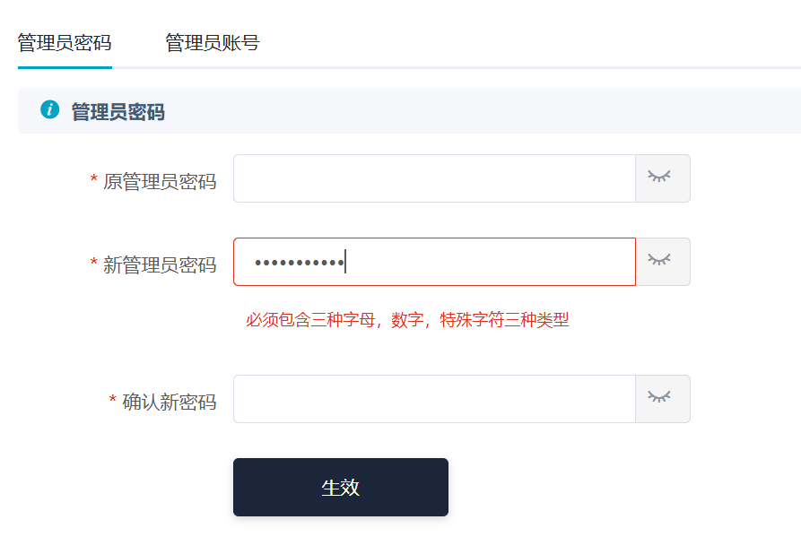
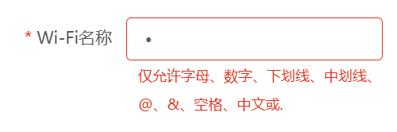
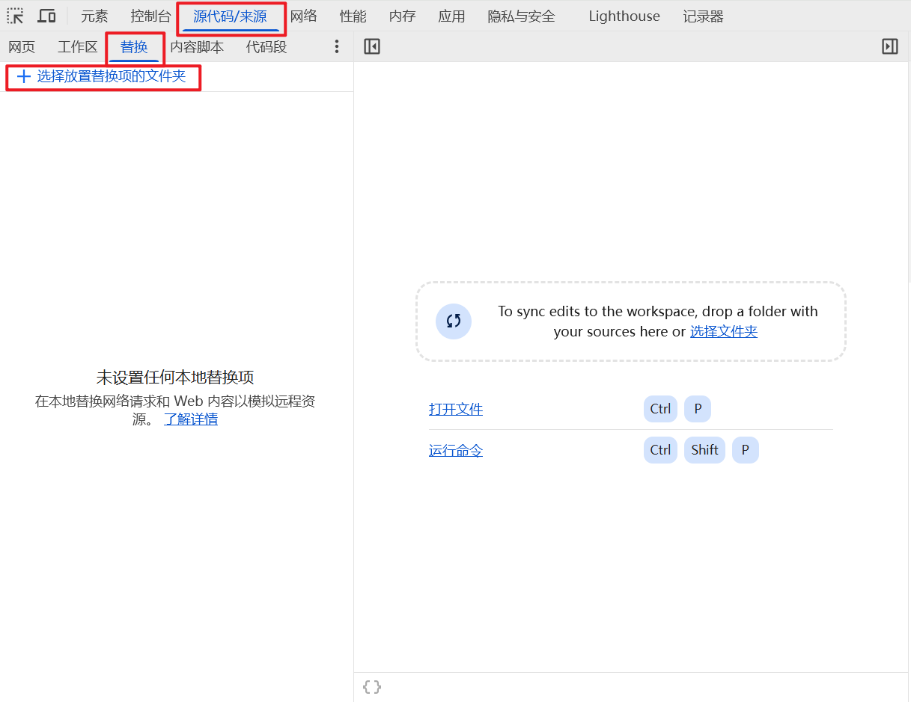
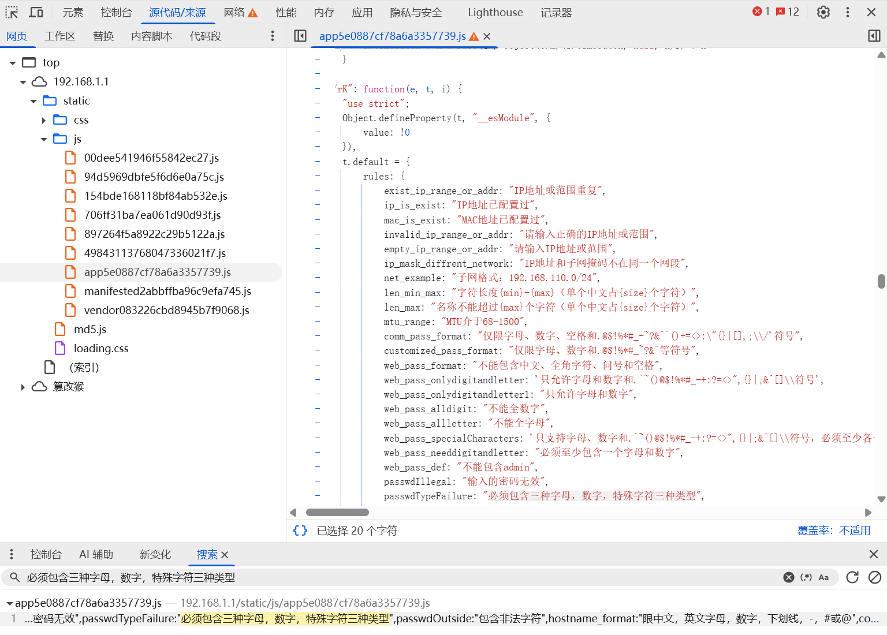
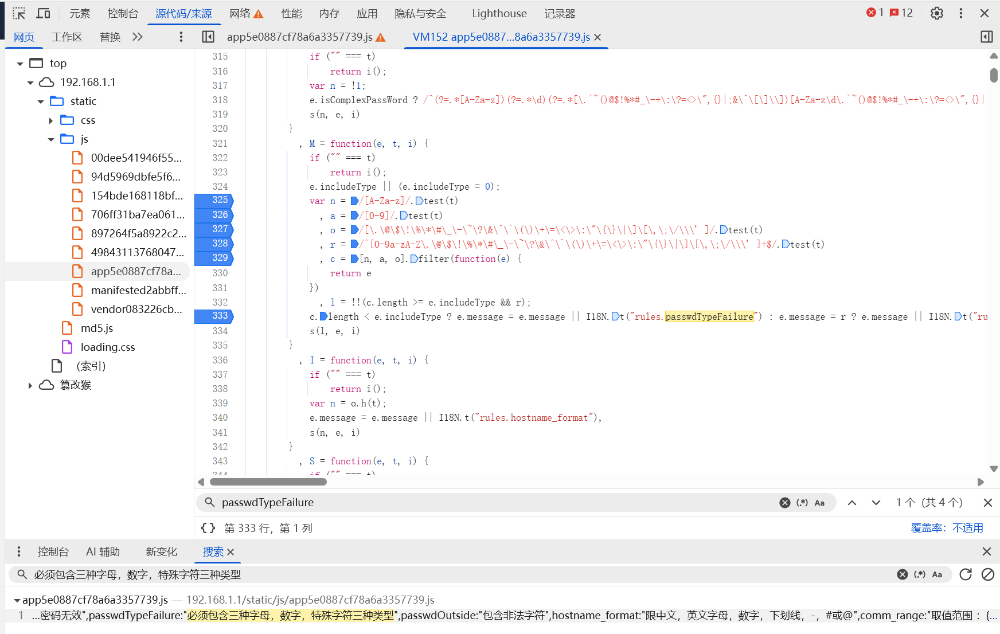
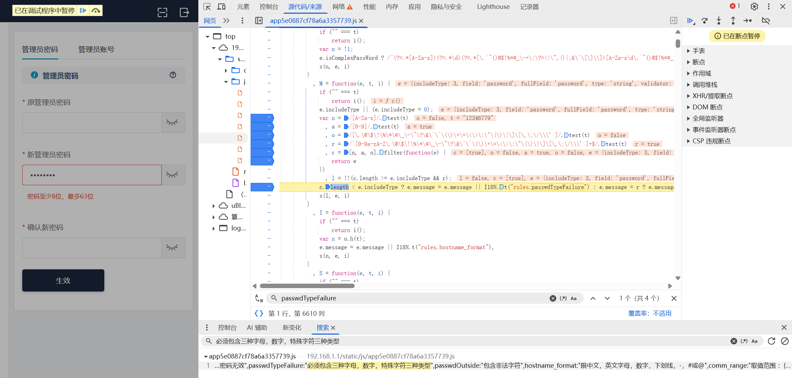
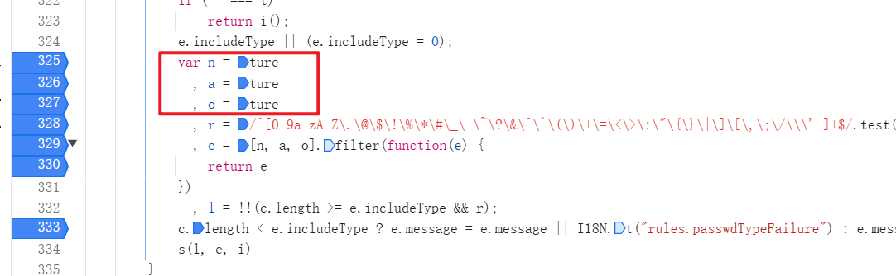
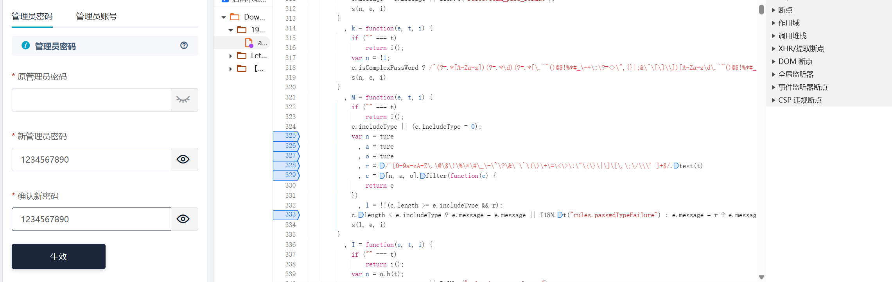
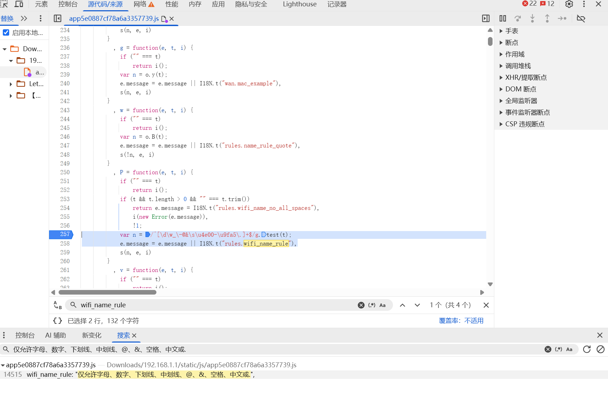

@[TOC]
# 一、问题背景
最近买了一台新路由器，但是在路由器的管理员密码设置处有强制校验：`必须包含三种字母，数字，特殊字符三种类型`


在 `wifi` 名设置的地方有校验：`仅允许字母、数字、下划线、中划线、@、&、空格、中文或.`


这给我们配置路由器带来非常不方便，因此希望寻求方法去解决这样的限制。

本文将通过一次实战，通过使用 `Chrome` 的 `开发者工具` 解除网页的前端校验，以达到解除路由器系统中对部分功能的限制。

# 二、打开开发者工具
首先，我们先在需要修改功能的网页中，按 `F12` 打开 `开发者工具`，窗口切换到 `源代码/来源`，切换到 `替换`，然后点击 `选择放置替换项的文件夹`，选择一个用于放置修改后源码的文件夹，此时即可修改网页源码，并执行修改后的源码。


# 三、定位源码
首先，我们需要解除管理员的限制，可以通过搜索出现的提示语：`必须包含三种字母，数字，特殊字符三种类型`，找到此校验出现的地方：


可以看到，这是一个在 `app5e0887cf78a6a3357739.js` 文件中定义的 `passwdTypeFailure` 常量的文件内容。我们再搜索 `passwdTypeFailure` 常量使用的地方，可以找到有一处如下的代码：
```js
var n = /[A-Za-z]/.test(t)
  , a = /[0-9]/.test(t)
  , o = /[\.\@\$\!\%\*\#\_\-\~\?\&\^\`\(\)\+\=\<\>\:\"\{\}\|\]\[\,\;\/\\\' ]/.test(t)
  , r = /^[0-9a-zA-Z\.\@\$\!\%\*\#\_\-\~\?\&\^\`\(\)\+\=\<\>\:\"\{\}\|\]\[\,\;\/\\\' ]+$/.test(t)
  , c = [n, a, o].filter(function(e) {
    return e
})
  , l = !!(c.length >= e.includeType && r);
c.length < e.includeType ? e.message = e.message || I18N.t("rules.passwdTypeFailure") : e.message = r ? e.message || I18N.t("rules.passwdIllegal") : e.message || I18N.t("rules.comm_pass_format"),
s(l, e, i)
```

我们推测这段逻辑是会有所影响的，因此我们可以点击行号添加断点，以便验证我们的推论。


此时可以看到断电正常的停下来了，变量 `t` 为即为输入到新管理员密码，此时 `t` 分别使用 字母，0-9，以及特殊符号使用 `test` 方法进行搜索，
```js
n = /[A-Za-z]/.test(t)
a = /[0-9]/.test(t)
o = /[\.\@\$\!\%\*\#\_\-\~\?\&\^\`\(\)\+\=\<\>\:\"\{\}\|\]\[\,\;\/\\\' ]/.test(t)
```
而在 `js` 中 `RegExp` 实例的 `test()` 方法使用正则表达式在指定字符串中执行搜索。如果存在匹配，则返回 true, 否则返回 false。因此，可以清晰的知道，这段代码就是对密码中是否包括三种类型的校验。



因此，为了使其跳过校验，只需要对三个类型的判断恒为true即可，即将代码修改为如下：


此时按 `ctrl` + `S` 保存源码，此时刷新重新设置密码，则会按新源码进行运行，跳过规则校，可正常写入。



---

我们再来看 `Wifi` 名的设置。我们搜索 `仅允许字母、数字、下划线、中划线、@、&、空格、中文或.`，可以找到 `wifi_name_rule` 的常量，随后可以找到使用的地方：


同上分析可以知道，

```js
var n = /^[\d\w_\-@&\s\u4e00-\u9fa5\.]+$/g.test(t);
```

这一句就是对 `wifi` 名校验的核心代码，将其修改为 
```js
var n = true
```
即可跳过 `wifi` 名的校验，存入任意字符。

# 四、总结
对于部分网页应用来说，很多都只是只有前端校验，而无后端校验，我们可以通过修改网页源码，解除前端校验的规则，实现一些特殊的业务操作。
