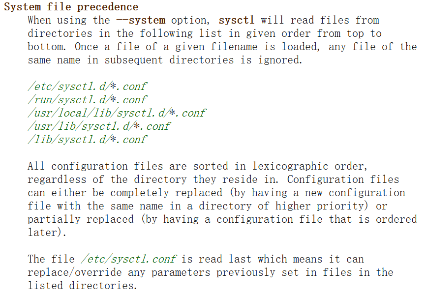

> 原文链接：https://blog.csdn.net/TeleostNaCl/article/details/150651679
> 发布时间：2025-08-23 21:19:30
> 标签：linux、经验分享、运维开发、运维

---

`sysctl` 命令是 `Linux` 系统在运行时用于配置内核参数的，其用法可以参考 `man-pages` : <https://man7.org/linux/man-pages/man8/sysctl.8.html>

```shell
sysctl - configure kernel parameters at runtime
```

在 `man-pages` 的有以下 `System file precedence` 的解释：  
   
 从 `System file precedence` 的解释可以知道，系统在启动的时候，`sysctl` 命令会自动按顺序从

- `/etc/sysctl.d/*.conf`
- `/run/sysctl.d/*.conf`
- `/usr/local/lib/sysctl.d/*.conf`
- `/usr/lib/sysctl.d/*.conf`
- `/lib/sysctl.d/*.conf`

以上的目录查找配置文件，如果多个目录下存在同名文件时，例如同时存在 `/etc/sysctl.d/10-sample.conf` 和 `/run/sysctl.d/10-sample.conf`，即 `10-sample.conf` 文件重复，则会使用 `/etc/sysctl.d/10-sample.conf`，而忽略其它目录下的 `10-sample.conf` 文件。因此，可以在高优先级的文件夹下放置重名配置文件，可以覆盖原配置文件。

在加载文件时，会按照 `字典顺序`（`lexicographic order`）进行加载，后加载的文件中的配置可以覆盖掉前面文件的配置。因此，在 `Linux` 系统中会使用数字进行排序优先级，数字越大的时候，即文件排在后面，优先级越高，会覆盖数字小的配置。同时，同一个文件内配置项冲突时，也会使用后面的配置项。

例如，有两个文件：

- `10-sample.conf`

```shell
net.bridge.bridge-nf-call-iptables=1
```

- `20-sample.conf`

```shell
net.bridge.bridge-nf-call-iptables=1
net.bridge.bridge-nf-call-iptables=0
```

则最后，会使用 `net.bridge.bridge-nf-call-iptables=0` 的配置。

使用 `sysctl -a | grep net.bridge.bridge-nf-call-iptables` 可以检查最后加载的命令：

```shell
root@OpenWrt:/etc/sysctl.d# sysctl -a | grep net.bridge.bridge-nf-call-iptables
net.bridge.bridge-nf-call-iptables = 0
```

**因此，回到标题的问题，当存在多个配置文件且配置项冲突时，系统会按照 `字母顺序` 加载这些文件，后加载的配置会覆盖先前加载的**
