**先说结论，通过抓包分析简化最后可以得出，其登录过程只是一个简单的向服务器发送`HTTP GET`请求或`HTTP POST`请求。只要在路由器启动之后自动发送一段 HTTP 请求，即可实现自动登录。**


对于 GET 请求(网页认证过程)


```bash
//请求地址为
http://172.30.255.42:801/eportal/portal/login/

//请求查询的key-value对为
user_account=$校园卡号
user_password=$密码
```


对于 POST 请求(客户端认证过程)


```bash
//请求地址为
http://172.30.255.42:801/eportal/

//请求的参数为
DDDDD=$校园卡号
upass=$密码
ver=1.3.5.201712141.P.W.A
c=ACSetting
a=Login
```


例如使用 curl 命令


```bash
#GET请求
curl -G \
    -d 'user_account=$校园卡号' \
    -d 'user_password=$密码' \
    http://172.30.255.42:801/eportal/portal/login/

#POST请求
curl -X POST \
      -d 'DDDDD=$校园卡号' \
      -d 'upass=$密码' \
      -d 'ver=1.3.5.201712141.P.W.A' \
      -d 'c=ACSetting' \
      -d 'a=Login' \
      http://172.30.255.42:801/eportal/
```

---

使用wget命令

```bash
# 参数--output-document=/dev/null表示不将请求结果写入文件中

# GET请求
wget -q -O- "http://172.30.255.42:801/eportal/portal/login/?user_account=$校园卡号&user_password=$密码"

# POST请求
wget -q -O- \
	--post-data='DDDDD=$校园卡号&upass=$密码&ver=1.3.5.201712141.P.W.A&c=ACSetting&a=Login' \
    http://172.30.255.42:801/eportal/

```


其中, `$校园卡号` 和 `$密码` 替换成登录的账号密码即可。
 

@[toc]

## 零、前言

- 如果我们想在路由器实现自动完成认证，在 2021 年 12 月 31 日以前，深大在宿舍区使用的是 D 版客户端，可以参考该教程实现自动登录: `https://www.right.com.cn/forum/thread-215978-1-1.html`。但由于宽带升级之后，认证客户端已经变为 Pt 版，过去的方式已经不再可用。本文将通过抓包，分析认证的全过程，获取实现路由器自动认证的方案。

<center><b><font size ='2'>Pt版宽带上网客户端</font></b></center></font>


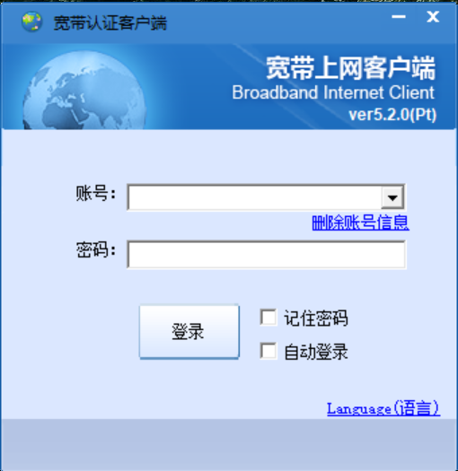


- 本文仅是提供一个在路由器实现自动认证，免去手动登录过程的方法，不含有任何破解校园网的内容，并请合理使用。
- 使用的路由器必须是已刷入支持运行自定义 Linux 命令或脚本的固件。
- 本文所提供的代码及命令不保证校园网在下次升级时还能使用。但抓包分析登录过程适用于大部分认证情况，根据自己抓包分析的结果，适当修改代码即可实现在路由器上自动认证。


## 壹、准备工作


1.  需要一台已刷入支持自定义运行 Linux 命令或脚本的固件的路由器，且固件需要支持并打开 Telnet 或 SSH 服务（一般是支持，默认关闭，具体固件可查找相关资料），比如潘多拉 pandorabox，华硕老毛子 padavan，openwrt，lede 等固件（在网络上查找相关资料尝试进行刷机）。<br>本文主要以华硕老毛子 padavan 固件和openwrt为例进行演示。


<center><b><font size ='2'>Padavan固件开启Telnet和SSH服务</font></b></center></font>


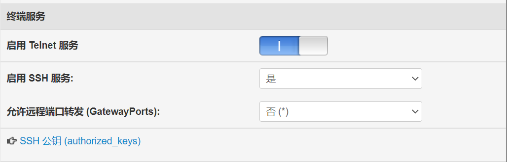

<center><b><font size ='2'>openwrt固件开启SSH服务</font></b></center></font>


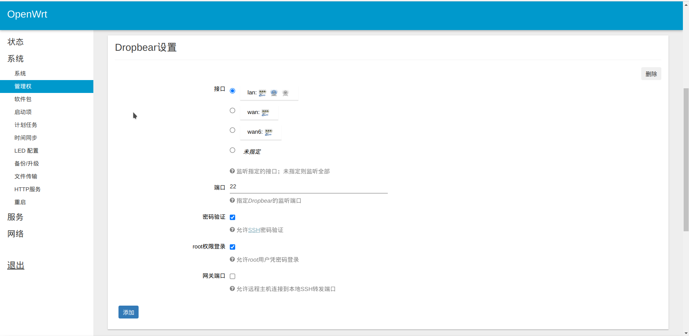


2. 准备一个抓包工具和带有 Chrome Dev Tools 的浏览器（进行抓包分析认证过程）。本文使用`Wireshark`进行客户端登录抓包分析。本文使用 `Chrome` 分析网页端登录的过程。<br>`Wireshark: https://www.wireshark.org/`


- Wireshrak 使用方法
  
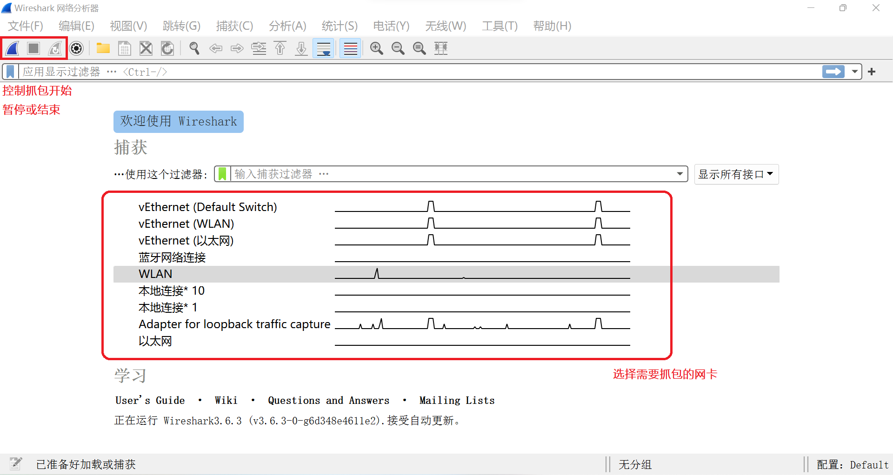


3. 在 Windows 环境下,需使用 `Putty` 登录到路由器客户端，运行 Linux 命令进行测试管理。另外可能需要使用到 `WinSCP` 进行对路由器的文件管理。<br>`Putty: https://www.chiark.greenend.org.uk/~sgtatham/putty/`<br>`WinSCP: https://winscp.net/`<br>在 Linux 环境下，可以直接使用 ssh 命令登录到路由器后台，scp命令上传文件到路由器，从而对路由器进行管理，而无需准备其它软件。

- Putty 登录
  
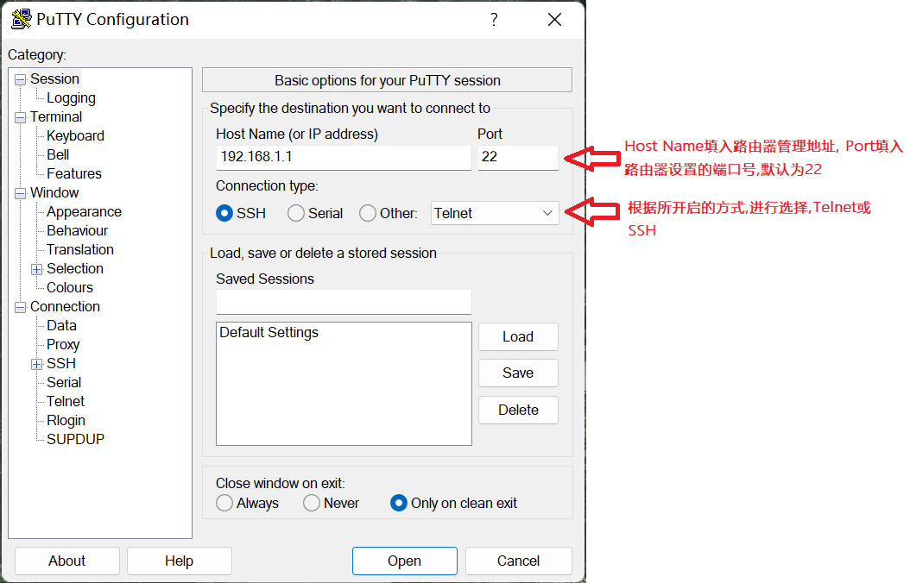
  

 <center><b><font size ='2'>输入管理员账号密码登录</font></b></center></font>
 

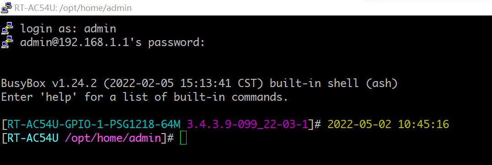

- WinSCP 登录

<center><b><font size ='2'>选择SCP模式,设置管理员地址端口输入账号密码</font></b></center></font>


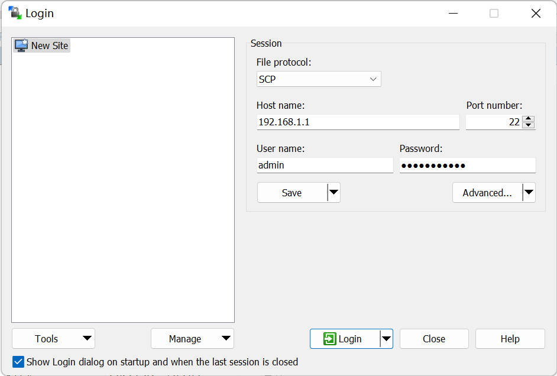

- Linux使用ssh登录

```bash
ssh [账户]@[登录地址]
```

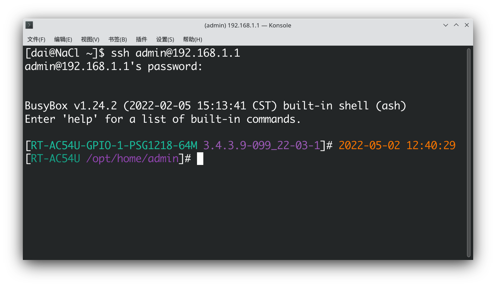

4. 测试路由器是否支持curl命令或wget命令，模拟请求会用到这两个命令，使用putty登录或者ssh登录路由器后台后，输入curl或wget命令，如果能正常输出用法则表示固件支持该命令，如果显示not found，则表示不支持。

<center><b><font size ='2'>不支持curl但支持wget</font></b></center></font>


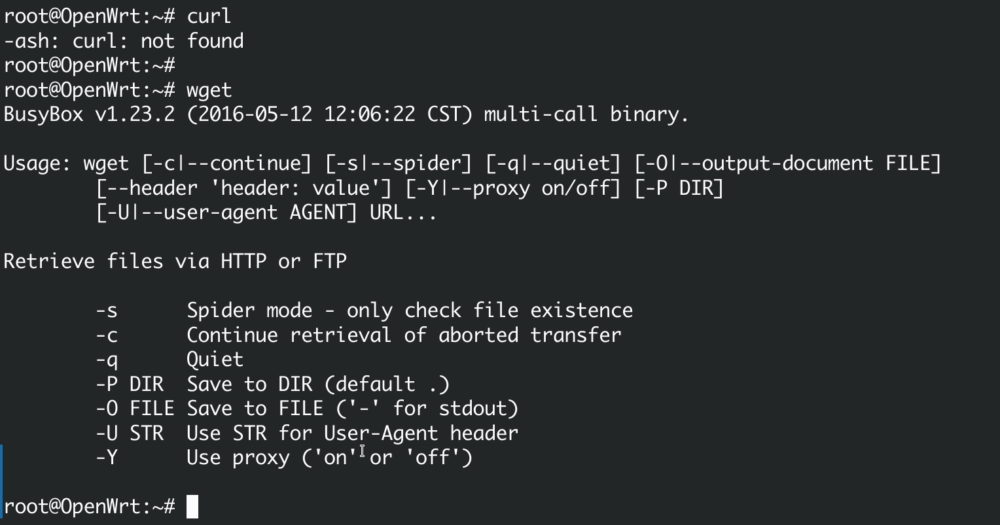

## 贰、抓包分析


这部分内容是对登录过程的分析，一步一步得到最后的 Linux 命令，如无需了解其实现细节，可直接跳过此部分内容。


### Wireshark


#### 1. 抓包

- 先运行 Wireshark 进行抓包，然后登录客户端认证，得到抓包结果。下图为此次抓包所得结果，这里面包含了登录认证的全过程。
  
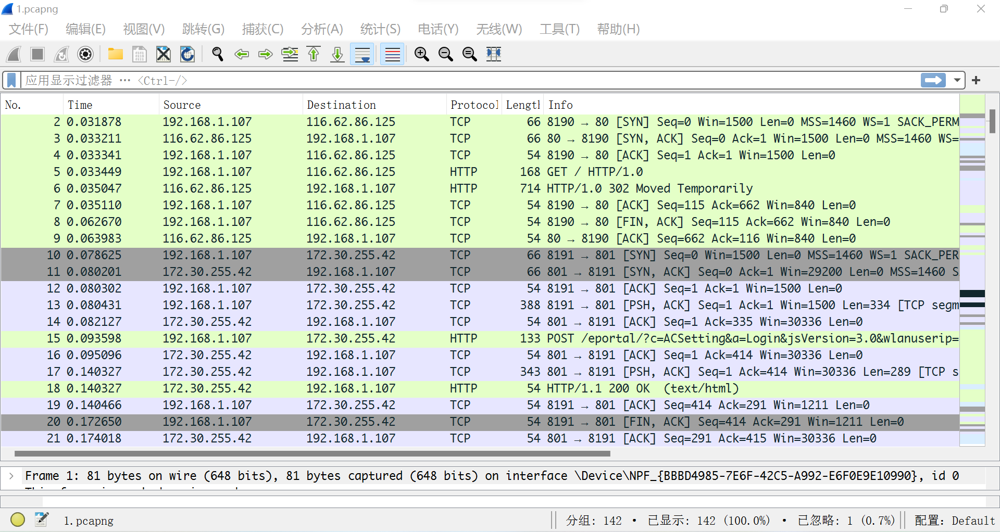


#### 2. 分析


- 首先看第 2-9 号包与 116.62.86.125 的通信过程。

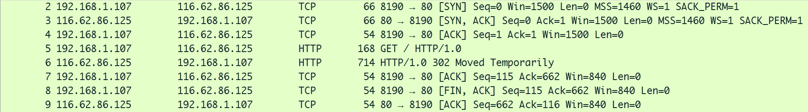
  - 前三个包（2 - 4）是典型的 TCP 三次握手的过程并建立连接（可以看到在 Info 中有三个标志位`[SYN] [SYN, ACK] [ACK]`，即对应三次握手的过程）
  - **随后（第 5 号包）我们向服务器发送了一个 GET 请求**
  - **随后（第 6 号包）服务器回应了我们，并说明了这是一个 302 请求，即重定向。**
  - 7 号包我们向服务器发送`[ACK]`标识，表示向服务器发送我方已经收到数据。
  - 随后（第 8 - 9 号包）就进入四次挥手过程断开连接（四次挥手的标识位`[FIN, ACK] [ACK] [FIN, ACK] [ACK]`，但这里的四次挥手过程被合并成了）。

- 对于 HTTP 请求，我们分析其请求头与响应头，故我们直接看 Wireshark 的应用层。

- 先看请求头（点开 5 号包，展开 Hypertext Transfer Protocol）
  
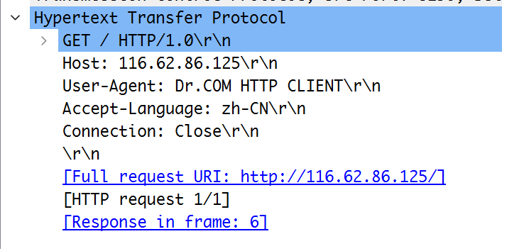

  - 从图中可以看到，这是一个简单的 GET ：我们向服务器 116.62.86.125 发送了 GET 请求。
  - `User-Agent`：服务器通过UA能识别客户使用的操作系统及版本及浏览器信息等，从而来给不同的操作系统、不同的浏览器发送不同的页面。此处用于标识请求是由认证客户端所发出，但在后续进行模拟请求过程中，发现有无 UA 并不影响最终登录结果，故我们忽略 UA。

- 我们再来看响应头(点开 6 号包，展开 Hypertext Transfer Protocol）
 
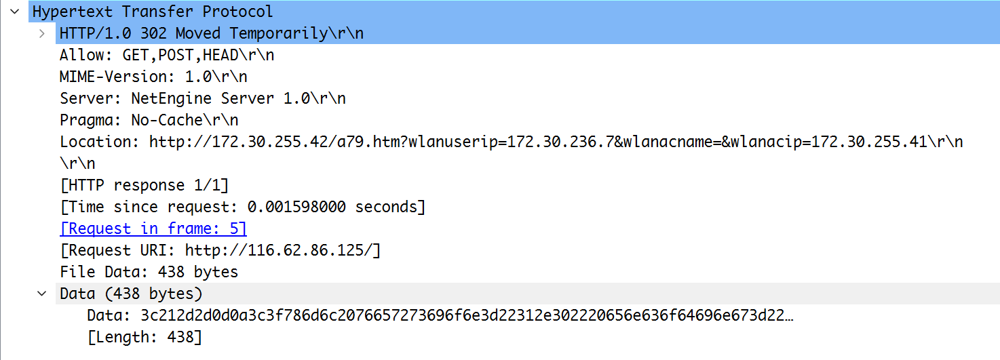

  - 从图中我们可以看到，这个响应头的响应码为 302,代表着进行了重定向，而重定向的地址由 Location 后面给出，即这里的`http://172.30.255.42/a79.htm?wlanuserip=172.30.236.7&wlanacname=&wlanacip=172.30.255.41`。这个地址携带了我们的 IP 信息，而对后续的包分析可知，正是这些 ip 信息组装成了最终的认证地址。

---

- 分析完与 116.62.86.125 的通信过程之后，来看第 10 - 21 号包与 172.30.255.42 的通信过程。

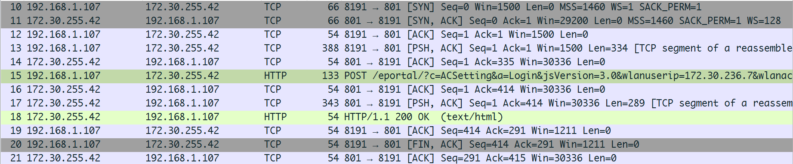
  - 第 10 - 12 号包，与 172.30.255.42 进行了三次握手，建立连接。
  - 随后第 13 号包带有标识位`[PSH]`，表示我方将有数据向服务器进行传输，随后服务器(第 14 号包)应答 ACK。
  - **第 15 号是一个关键包，它表示我们向服务器提交了一个 POST 请求，并由 16,17 号包可以看出，服务器在收到我们的 POST 之后也返回了数据给我们，即 POST 的响应（17 号包由服务器发给我们中也含有标识位`[PSH]`）。**
  - 第 18 号包即是我们所得到的响应。
  - 随后四次挥手断开连接。

- 我们依旧比较关心请求头和响应头。所以我们先来看第 18 号包的响应头。它传输了数据过来，我们先看看数据是什么。

  - 点开第 18 号包，展开`Hypertext Transfer Protocol`，展开`Line-based text data: text/html`。可以看到这返回了一个 HTML，里面的内容仅展示一句`Login succeed`。由此，可以推断该响应头对应的请求是实现认证登录的最核心部分。

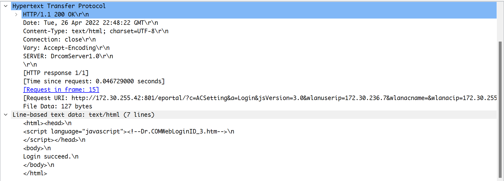
  
  - 我们对请求头进行分析，点开第 16 个包，展开`Hypertext Transfer Protocol`。

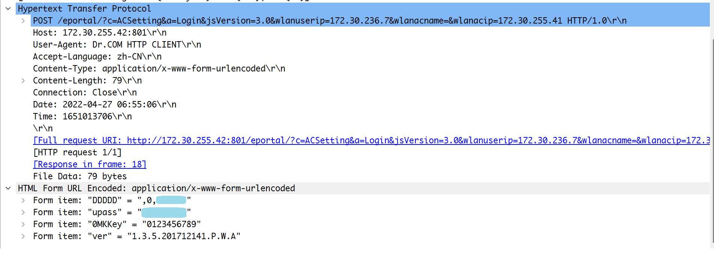

  - 我们可以看到这是对`http://172.30.255.42:801/eportal/?c=ACSetting&a=Login&jsVersion=3.0&wlanuserip=172.30.236.7&wlanacname=&wlanacip=172.30.255.41`这个网址发送了 POST 请求。
  - 可以推断地址后面的`wlanuserip=172.30.236.7&wlanacname=&wlanacip=172.30.255.41`是由重定向地址进行截取之后获取的。(这个过程是写在客户端里面的，我们没有办法知道去具体细节，如果客户端更新之后改变了这部分逻辑，所得结果有变化，那我们的命令也需要有所变化)。
  - 并且提交了由`application/x-www-form-urlencoded`编码的参数，而请求的参数为

```bash
DDDDD=,0,$账号
upass=$密码
0MKKey=0123456789
ver=1.3.5.201712141.P.W.A
```


- 至此我们已经将认证登录的过程全部分析完毕，最后可以得出登录过程是一条含有账号密码等参数的 POST 请求


#### 3. 模拟请求


- 当我们分析出结果之后，我们要做的就是使用 Linux 命令进行模拟登录。此处使用 curl 命令。
- curl 命令参数复杂，功能丰富，其基本上能实现所有网络请求。这里先简单介绍一下 curl 命令的发送 GET 和 POST 请求的一种方法。


```bash
#curl发送HTTP GET 请求
curl -G -d ‘key=value’ url
#curl加入-G参数之后就能发送GET请求,
#并且-d参数能够实现插入查询键值对。

#curl发送HTTP POST 请求
curl -X POST -d ‘key=value’ url
#curl命令默认发送POST请求
#也可以通过指定-X 参数,并指定POST方式,实现发送POST请求
#并且与GET一样,-d可以传递POST表单,
#默认编码为application/x-www-form-urlencoded.
```


- 使用命令获取重定向的网址

```bash
curl -G -Ls -w %{url_effective} -o /dev/null website
# 这条命令，-L参数指定curl跟随重定向,
# -s指定curl保持沉默,不进行输出, 
# -w %{url_effective}表示获取重定向最终的地址, 
# -o /dev/null指定结果不写入文件中.
# website 表示要访问的网站
# 执行完这条语句其输出就是我们需要的重定向之后的链接
```

那么我们使用变量url储存重定向链接的命令为

```bash
url=`curl -G -Ls -w %{url_effective} -o /dev/null 116.62.86.125`

# 符号``可以将命令的输出结果赋值给变量
```

<center><b><font size ='2'>获取重定向后的地址并使用echo命令查看变量信息</font></b></center></font>


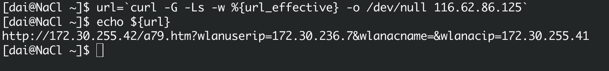

- 拆分变量并进行重组url

```bash
#对变量var从左边开始删除,直到第一个字符a,保留右边剩下的内容.
var##*a

#将两个变量进行合并
${var1}${var2}
```

我们分析我们需要发送POST指令的网址
`http://172.30.255.42:801/eportal/?c=ACSetting&a=Login&jsVersion=3.0&wlanuserip=172.30.236.7&wlanacname=&wlanacip=172.30.255.41`，可以发现后边带有ip的是重定向之后的链接里的查询参数部分，我们在问号处进行截取，然后拼接字符串，即认证网址的前半部分。
命令为(问号需要进行转义)

```bash
url=${url##*\?}
url="http://172.30.255.42:801/eportal/?c=ACSetting&a=Login&jsVersion=3.0&"${url}
```


<center><b><font size ='2'>截取并拼接变量</font></b></center></font>


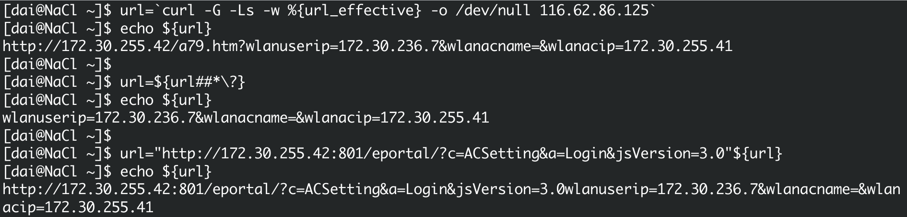


- 发送POST请求


由之前的分析，我们可以直接写出命令


```bash
curl -X POST -d 'DDDDD=,0,$校园卡号' -d 'upass=$密码' -d '0MKKey=0123456789' -d 'ver=1.3.5.201712141.P.W.A' ${url}
```


<center><b><font size ='2'>登录成功</font></b></center></font>


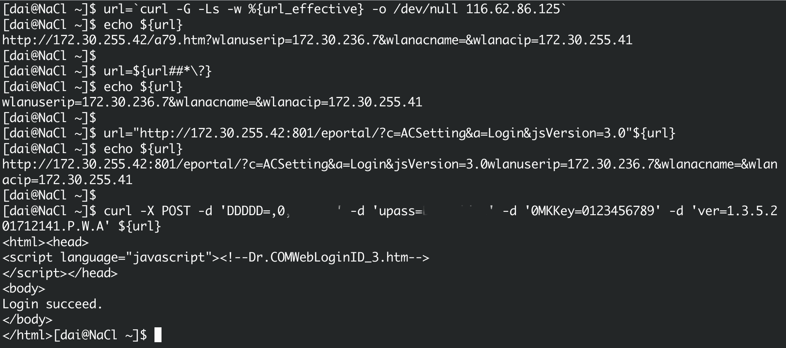


可以看到最后curl命令的输出为HTML，且仅显示Login succeed。与我们之前抓包的结果相同，认证登录成功。

```bash
#全部过程
url=`curl -G -Ls -w %{url_effective} -o /dev/null 116.62.86.125`
url=${url##*\?}
url="http://172.30.255.42:801/eportal/?c=ACSetting&a=Login&jsVersion=3.0&"${url}
curl -X POST -d 'DDDDD=,0,校园卡号' -d 'upass=密码' -d '0MKKey=0123456789' -d 'ver=1.3.5.201712141.P.W.A' ${url}
```


#### 4. 简化命令

经过多次登录，我们会发现登录主要是依靠最后一个POST命令，虽然其携带了后面一串ip地址，但我们尝试将其去除之后，会发现其实一样也能认证成功。故其实POST中的参数并不是所有都是需要的，我们进行一一检验，将查询字符串的参数(?之后的)，放到post表单中，最后可以得出一条简化的命令，即开头的结论

```bash
curl -X POST \
      -d 'DDDDD=$校园卡号' \
      -d 'upass=$密码' \
      -d 'ver=1.3.5.201712141.P.W.A' \
      -d 'c=ACSetting' \
      -d 'a=Login' \
      http://172.30.255.42:801/eportal/
```


### Chrome

由于我们在Wireshark中已经分析出，其认证登录过程是一系列的HTTP请求，同时我们也会在连接到校园网后会自动弹出认证的网页，所以我们可以使用Chrome Dev Tools进行抓包并分析。并且利用Chrome抓包，所得结果将会非常明朗直观。
我们使用支持调试模式的浏览器，按下F12打开Chrome Dev Tools，或者在工具中点击开发者工具，打开调试工具进行抓包。


<center><b><font size ='2'>开发者工具</font></b></center></font>


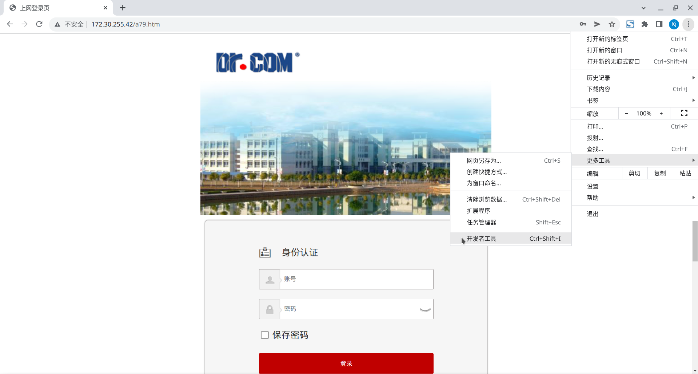


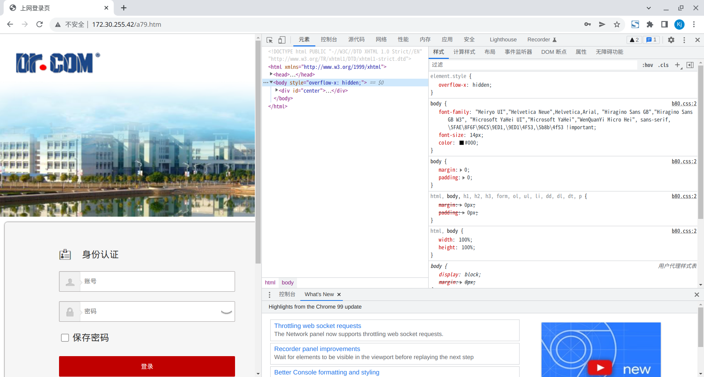

#### 1. 抓包

在开发者工具中点开网络选项卡，并勾选保留缓存选项，在地址栏中输入网址：http://172.30.255.42/a79.htm 或者是其它认证网络的网址（即当连接校园网时会自动弹出的那个登录网址），使用账号密码进行登录，进行抓包，得到网络请求内容。
由于打开网页之后会同时下载网页相关资源及js脚本，用于控制登录细节，但我们经过分析之后，会发现其认证过程是一个明文的GET，且其GET的查询参数基本保持不变，故此处不分析其他包的内容，只分析认证的GET请求。
我们可以在打开页面之后清除所有包，然后再输入账号密码进行登录，这样所抓的第一个包就是我们登录时发送的请求。

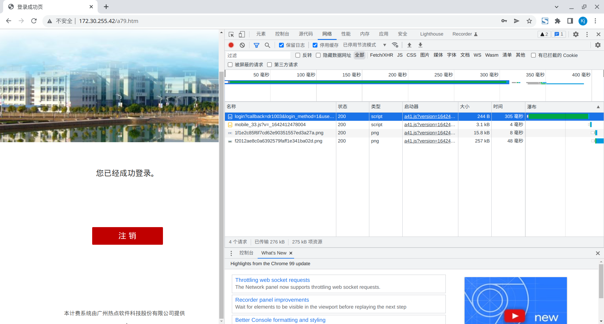


#### 2. 分析

- 正如前面所说，HTTP请求最重要的是看请求头与响应头，Chrome Dev Tools为我们查看这些内容提供了方便。双击所需分析的包，在标头选项卡下就看到了响应头与请求头。

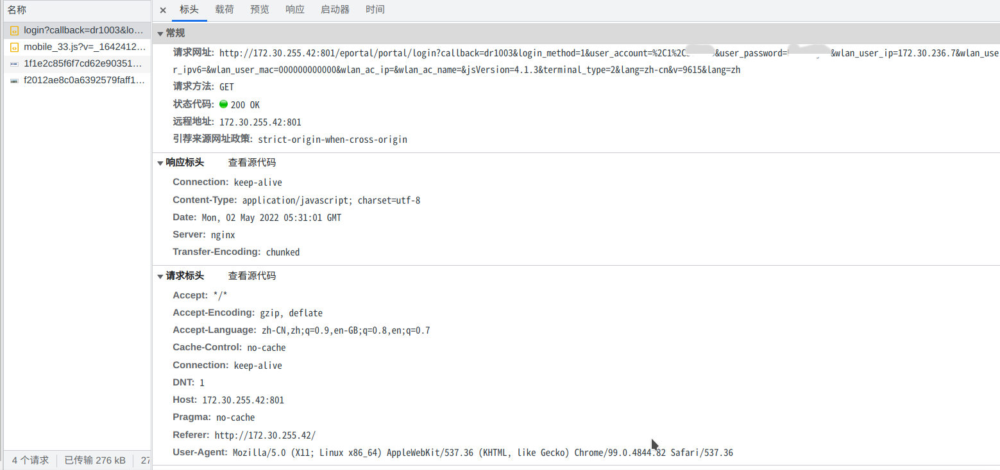
- 可以看到，这是一个GET请求，GET的地址是`http://172.30.255.42:801/eportal/portal/login`
- 问号后面即是查询参数，我们点开载荷选项卡，以表格的方式向我们清晰展示了登录所需使用的查询参数

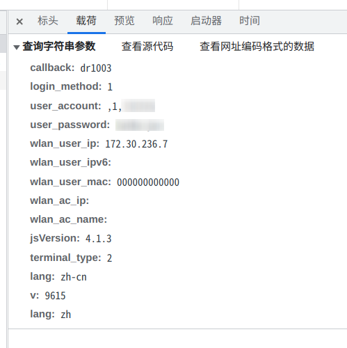
- 我们点开预览，可以看到认证登录成功的消息

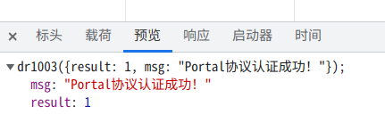
- 至此，我们知道了网页登录get请求的全部内容


#### 3. 模拟请求与简化命令

我们从wireshark的分析得到，ip信息这些参数并不影响实际登录的结果，而我们进一步简化，最后可以得到以一开始提出的命令

```bash
curl -G \
    -d 'user_account=$校园卡号' \
    -d 'user_password=$密码' \
    http://172.30.255.42:801/eportal/portal/login/
```


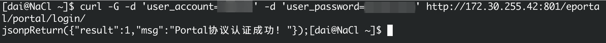

## 叁、使用方法

1. 固件支持开机启动时执行自定义脚本功能或其他类似的功能，可在里面编写GET或POST命令。

- 以老毛子padavan固件为例，其支持在WAN上行/下行启动后执行脚本，故可在这里面执行curl命令，此处用CURL GET请求。


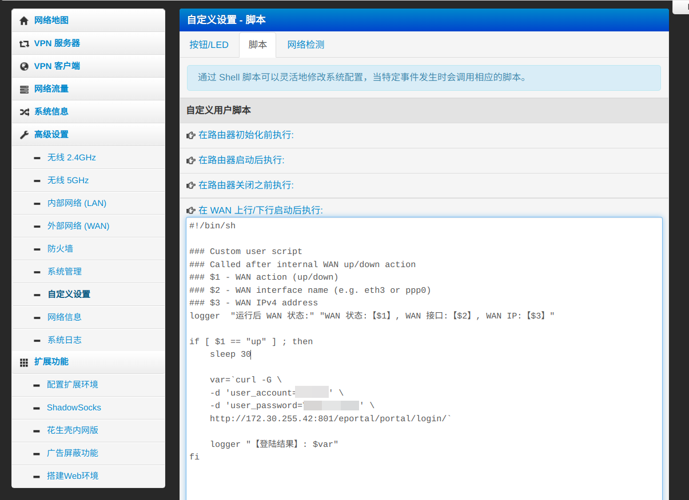


- 我们把它放进UP状态中的，并使用sleep 30，表示当WAN口启动后，即网线连接成功后。发送curl命令，并使用了var变量进行接收执行结果，并将其打印到日志上，可以看到在日志中出现了登录成功的消息。


2. 若固件没有提供类似开机启动时执行自定义脚本功能，可以通过编写脚本，存储在路由器的可写且能永久储存的目录，并赋予执行权限，修改/etc/rc.local文件（如果有的话），添加运行脚本的命令，实现开机自启动（这里只是举个例子，请自行查阅所使用的路由器固件如何做到开机自动运行脚本）。

>部分固件可写且能永久储存的目录(来源于网络)<br>
openwrt/lede/潘多拉/mtk系列官方固件: /usr<br>
padavan和不死鸟可用目录：/etc/storage (需执行“mtd_storage.sh save”命令才能保存)<br>
梅林固件/原版ASUSWRT：/jffs<br>
...


- 先在本地写好脚本，这里命名为auto_login.sh，此处以wget GET为例，写入以下脚本

```bash
#!/bin/sh

sleep 30

# wget GET方式
wget --output-document=/dev/null \
      "http://172.30.255.42:801/eportal/portal/login/?user_account=$校园卡号&user_password=$密码"
```


- 编写好脚本之后，这里介绍两种方式上传文件并添加开机自启的脚本。此处以openwrt为例，上传路径为/usr/auto_login.sh，请根据具体路由器固件进行修改。

---

### 使用WinSCP实现开机自动登录

- 使用WinSCP登录到路由器后台后，窗口左边是本地文件，窗口右边是路由器的文件，只要通过拖动，就可以将文件上传至路由器或下载到本地。


<center><b><font size ='2'>将本地的auto_login.sh上传至路由器</font></b></center></font>


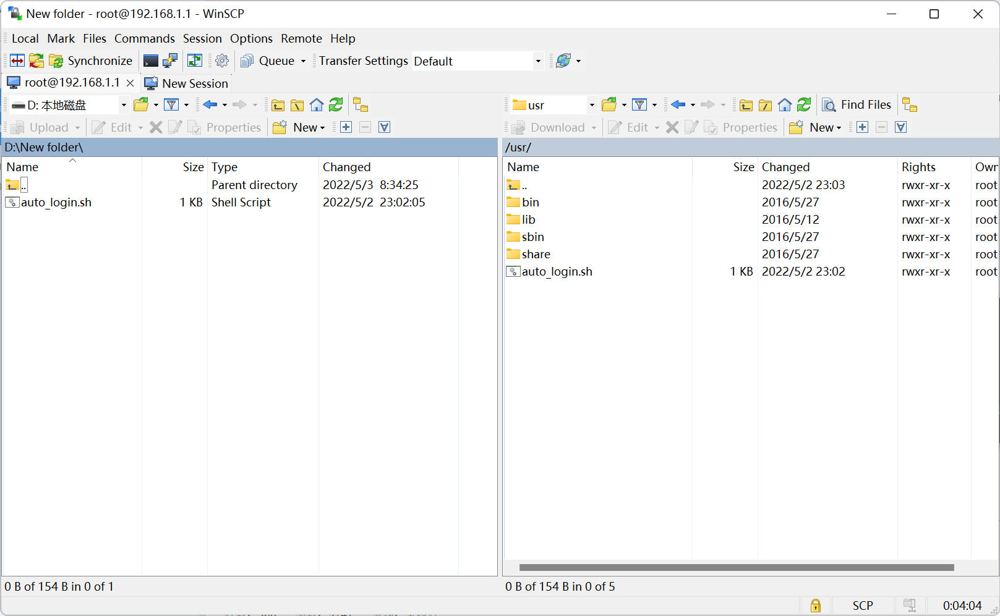


- 右键路由器的auto_login.sh文件，选择Properties，进行修改权限（修改为0755）


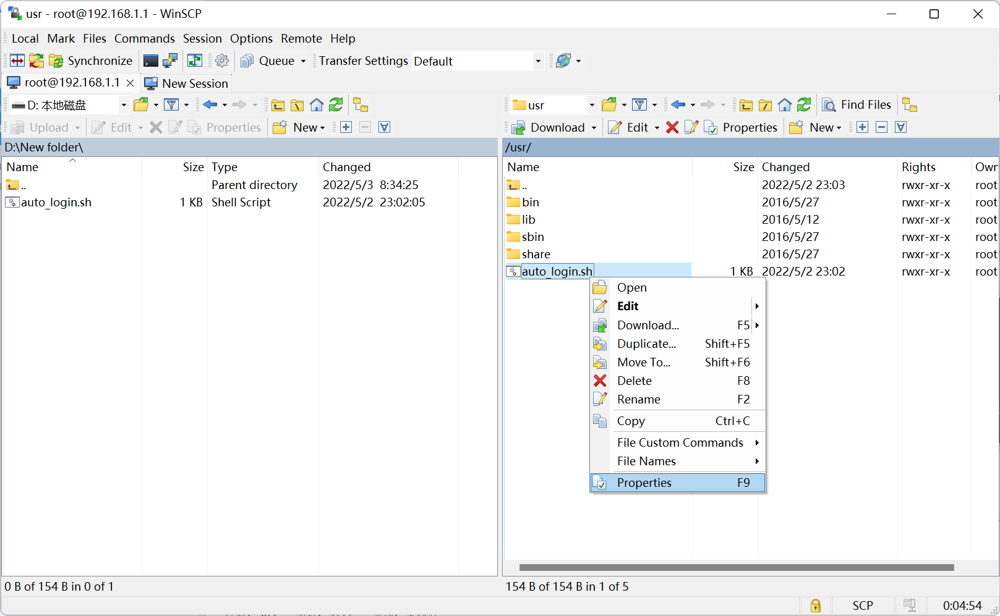


<center><b><font size ='2'>在Octal中输入0755</font></b></center></font>


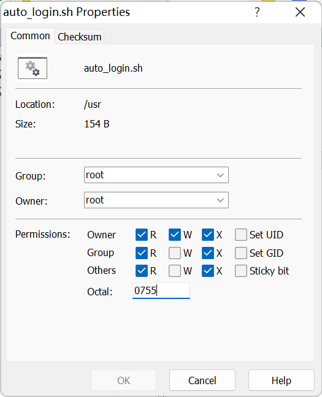


- 转到/etc目录，打开/etc/rc.local，在exit 0前添加一句`/usr/auto_login.sh &`，并保存。

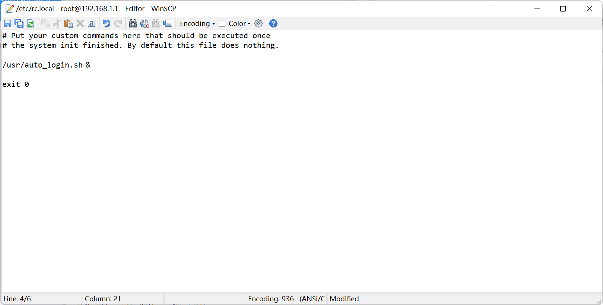

- 在网页中注销认证，并重启路由器，检查是否已经认证成功


---

### linux终端命令实现开机自动登录

  - 使用scp命令可将本地文件上传至路由器指定路径，一种简单用法如下
  `scp [本地要上传文件地址] [用户名]@[ip地址]:远程地址`
  - 修改文件权限的一种命令(mode为权限数字)
  `chmod [mode] 文件名`
  - 此处以openwrt为例，上传目录为/etc/storage，请自行根据不同路由器更改以下命令

```bash
# 将脚本上传至路由器，需要密码验证
scp /home/dai/Desktop/auto_login.sh root@192.168.1.1:/usr/auto_login.sh

# 使用ssh登录到路由器
ssh admin@192.168.1.1

# 赋予auto_login.sh执行权限
chmod 0755 /usr/auto_login.sh

# 可输入以下命令查看权限是否修改成功,如果输出含有-rwxr-xr-x，则上传且修改成功
ls -l /usr/auto_login.sh

# 使用vi等文本编辑器编辑rc.local在exit 0之前添加运行脚本
# 命令 /usr/auto_login.sh &
vi /etc/rc.local
# 按i键可进入编辑模式，编辑完毕后，按esc，输入wq可进行保存并退出。（w为仅保存，q为仅退出）


# 在网页中注销认证，并重启路由器，检查是否已经认证成功
```


<center><b><font size ='2'>SCP上传成功</font></b></center></font>


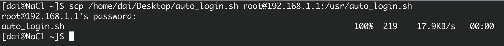


<center><b><font size ='2'>权限修改成功</font></b></center></font>


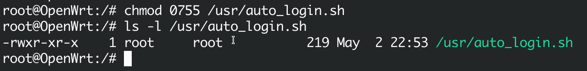


<center><b><font size ='2'>修改/etc/rc.local</font></b></center></font>


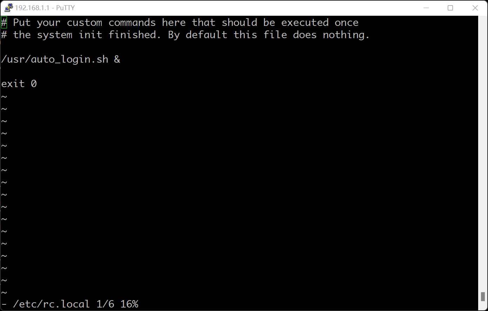

## 肆、断线重连

- 部分路由器固件支持断网检测功能，只要在断网的自定义脚本中，编写执行认证的命令，即可实现断线重连。

- 若固件没有提供类似的功能，则可以修改脚本auto_login.sh，使其成为一个死循环，每隔一段时间进行ping一个网站，检测网络的连通性，如果检测到断网，则尝试重新认证。以下为一个示例

```bash
#!/bin/sh

# 第一次执行开机自启,sleep 10s后执行
sleep 10

logger "【Auto Login】：auto login script start..."

# 写一个死循环
while [ 1 ] 
do  
  # 对8.8.8.8 进行ping,参数-q表示只输出最后结果,-c 5 表示ping5次,默认一秒一次
  # 并将所获结果赋值给变量value
  value=`ping -q -c 5 8.8.8.8`

  # 使用echo进行输出变量,并用grep进行查找,
  # 若存在0 packets received, 则表示全部丢包,断线
  result=$(echo $value | grep "0 packets received")
  # 存在即断网,执行认证命令
  if [[ "$result" != "" ]] 
  then
     # 再进行检查, ping 119.29.29.29
     value=`ping -q -c 5 119.29.29.29`

     result=$(echo $value | grep "0 packets received")

     if [[ "$result" != "" ]] 
     then
      logger "【Auto Login】：disconect... try to login..."
      # curl GET方式
      value=`curl -G \
      -d 'user_account=$账号' \
      -d 'user_password=$密码' \
      http://172.30.255.42:801/eportal/portal/login/`
      logger "【Auto Login】：result:$value"
    fi
  fi

  # sleep 60s,即间隔一分钟检测一次
  sleep 60

done
```

- 修改脚本之前要确保脚本停止运行，否则会修改失败，修改成功后，重新运行脚本即可。


## 伍、后记

- 首先通过抓包分析客户端和网页端的认证过程，得出其分别为POST请求和GET请求，则根据抓包结果分析其所携带参数，通过Linux命令模拟请求，从而实现在路由器端的认证。
- 再根据Linux和路由器的特性，介绍设置脚本自动启动运行的方法。
- 最后再编写脚本，依靠ping命令检测连通性实现断网检测，并在断网的时候能够重新发起认证请求。
