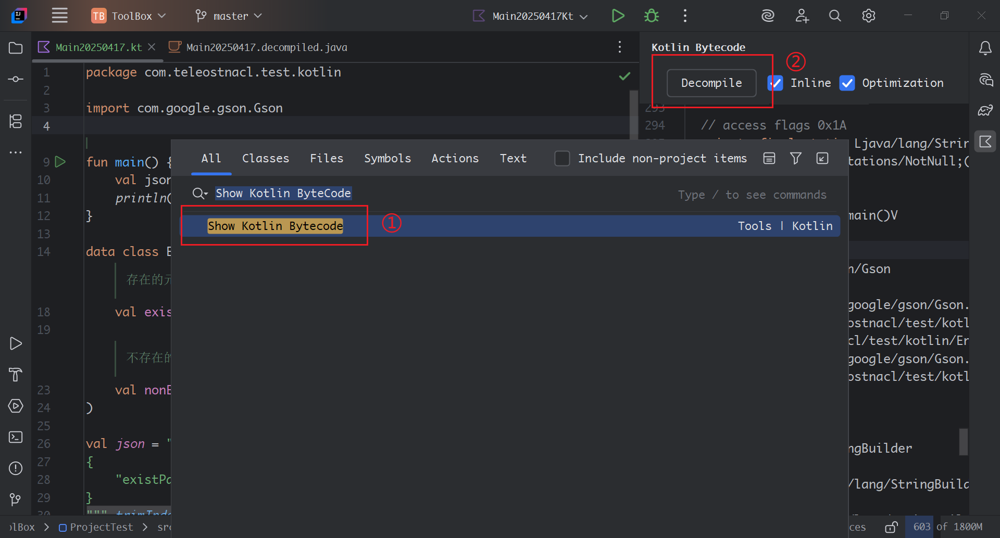

@[toc]

## 一、问题背景

在一次开发过程中，由于在 `Kotlin` 定义的实体类多了一个 `json` 不存在的 `键` 时，即使是对象类型是不可空的对象且指定了默认值，使用 `Gson` 库解析出来的实体对象中的那个变量是`null`，导致后面使用的此变量的时候导致出现空指针异常。比如：
实体类对象定义如下

```kotlin
data class Entity(
    /**
     * 存在的元素
     */
    val existParam: String,

    /**
     * 不存在的元素
     */
    val nonExistParam: String = ""
)
```

`nonExistParam` 是 `json` 结构中不存在的 `key`，`json` 如下

```json
{
    "existParam" : "exist"
}
```

使用 `Gson` 进行解析 `json`

```kotlin
val jsonEntity = Gson().fromJson(json, Entity::class.java)
println("entity = $jsonEntity")
```

最后得到的输出为：
`entity = Entity(existParam=exist, nonExistParam=null)`


此时可以发现，`nonExistParam` 已经被指定为不可空的`String` 类型，且使用了默认值 `""`，但解析出来的实体类中`nonExistParam=null`，如果此时不注意直接使用 `nonExistParam`，可能引发空指针异常。


## 二、问题原因

此问题的原因是，`Gson` 在解析实体类的时候会使用**反射**构造方法创建对象，在通过反射的方式设置对象的值。因此，**如果实体类的成员在`json`中不存在，则不会有机会被赋值，其会保持一个默认值（对于对象来说即为空）**。而在 `Kotlin` 中，只要在调用实际方法的时候，会触发`Kotlin`的空校验，从而抛出`空指针异常`，提早发现问题。但是Gson的反射的方式避开了这个空校验，所以成员的值为 `null`，直到使用时可能会出现`空指针异常`。


## 三、问题探析

我们需要探寻 `Gson` 在解析 `json` 的时候，究竟发生了什么，导致会出现解析出来的对象出现了 `null`


### Kotlin空指针校验

但是，我们知道`Kotlin`是对可空非常敏感的，已经指定了成员是不可空的，为什么会把 `null` 赋值给了不可空成员呢。


我们可以看 `Kotlin` 的字节码，并反编译成`java`源码，可以看到最后由`Kotlin`生成的java源码是怎样的。



我们可以得到如下的两个方法。

```java
public Entity(@NotNull String existParam, @NotNull String nonExistParam) {
   Intrinsics.checkNotNullParameter(existParam, "existParam");
   Intrinsics.checkNotNullParameter(nonExistParam, "nonExistParam");
   super();
   this.existParam = existParam;
   this.nonExistParam = nonExistParam;
}

// $FF: synthetic method
public Entity(String var1, String var2, int var3, DefaultConstructorMarker var4) {
   if ((var3 & 2) != 0) {
      var2 = "";
   }

   this(var1, var2);
}
```

第一个即为构造方法，传递了两个参数，且有 `Intrinsics.checkNotNullParameter` 可空检查。如果这里有空，则会抛出异常。而下一个则是因为对	`nonExistParam` 的变量设置了默认值生成的构造方法，默认值为 ""
因此，只有正常调用构造方法的时候，才会触发可空的检查。


### Gson.fromJson(String json, Class<T> classOfT)

首先，我们使用的方法是 `Gson.fromJson(String json, Class<T> classOfT)`，这个方法是传进一个 `json` 的字符串和实体对象的 `Class` 类型，随后的返回值就是一个实体对象。方法如下：

```java
public <T> T fromJson(String json, Class<T> classOfT) throws JsonSyntaxException {
  T object = fromJson(json, TypeToken.get(classOfT));
  return Primitives.wrap(classOfT).cast(object);
}
```


我们先看 `Primitives.wrap(classOfT).cast(object);` 这句的作用，点进去看 `Primitives.wrap()`方法：

```java
/**
 * Returns the corresponding wrapper type of {@code type} if it is a primitive type; otherwise
 * returns {@code type} itself. Idempotent.
 *
 * <pre>
 *     wrap(int.class) == Integer.class
 *     wrap(Integer.class) == Integer.class
 *     wrap(String.class) == String.class
 * </pre>
 */
@SuppressWarnings({"unchecked", "MissingBraces"})
public static <T> Class<T> wrap(Class<T> type) {
  if (type == int.class) return (Class<T>) Integer.class;
  if (type == float.class) return (Class<T>) Float.class;
  if (type == byte.class) return (Class<T>) Byte.class;
  if (type == double.class) return (Class<T>) Double.class;
  if (type == long.class) return (Class<T>) Long.class;
  if (type == char.class) return (Class<T>) Character.class;
  if (type == boolean.class) return (Class<T>) Boolean.class;
  if (type == short.class) return (Class<T>) Short.class;
  if (type == void.class) return (Class<T>) Void.class;
  return type;
}
```

从代码中可以看出，这个方法的作用就是将基本数据类型转换成包装类，即将 `int` 转换成 `Integer`，将 `float` 转换成 `Float` 等。如果非基本数据类，则直接返回类的本身。而随后接的 `.cast(object)` 则是强制数据类型转换的的Class类接口，即是 `(T) object`。


因此最后一句的作用只是用来强制转换对象的，与解析 `json` 无关。我们回到第一句 `T object = fromJson(json, TypeToken.get(classOfT));`，这句代码调用了 `Gson.fromJson(String json, TypeToken<T> typeOfT)`，并使用 `TypeToken` 包装了 `class`。


### TypeToken

我们先看 `TypeToken` 的官方文档解释：

> Represents a generic type T. Java doesn't yet provide a way to represent generic types, so this class does. Forces clients to create a subclass of this class which enables retrieval the type information even at runtime.


这是一个代表`泛型T`(`generic type T`)的类，在 `Java` 运行时会进行`泛型擦除`，因此在运行过程中是无法拿到`泛型`的准确类型，因此 `TypeToken ` 被创建出来，可以在运行时创建基于此类的子类并拿到泛型的信息。也即这个类通过包装泛型类，提供了在运行时获取泛型对象的类信息的能力。


### Gson.fromJson(JsonReader reader, TypeToken<T> typeOfT)

从 `Gson.fromJson(String json, TypeToken<T> typeOfT)` 方法开始，层次往下只是将 String 或 其他类型的来源封装成 `JsonReader`类，代码如下：

```java
public <T> T fromJson(String json, TypeToken<T> typeOfT) throws JsonSyntaxException {
  if (json == null) {
    return null;
  }
  StringReader reader = new StringReader(json);
  return fromJson(reader, typeOfT);
}

public <T> T fromJson(Reader json, TypeToken<T> typeOfT)
    throws JsonIOException, JsonSyntaxException {
  JsonReader jsonReader = newJsonReader(json);
  T object = fromJson(jsonReader, typeOfT);
  assertFullConsumption(object, jsonReader);
  return object;
}
```

首先使用 `StringReader` 包装 `json` 字符串，随后使用 `JsonReader` 包装 `StringReader`，随后再调用 `Gson.fromJson(JsonReader reader, TypeToken<T> typeOfT)` 进行解析 `json`，得到 `<T>` 对象。因此我们来看 `Gson.fromJson(String json, TypeToken<T> typeOfT)` 方法。

```java
public <T> T fromJson(JsonReader reader, TypeToken<T> typeOfT)
    throws JsonIOException, JsonSyntaxException {
  boolean isEmpty = true;
  Strictness oldStrictness = reader.getStrictness();

  if (this.strictness != null) {
    reader.setStrictness(this.strictness);
  } else if (reader.getStrictness() == Strictness.LEGACY_STRICT) {
    // For backward compatibility change to LENIENT if reader has default strictness LEGACY_STRICT
    reader.setStrictness(Strictness.LENIENT);
  }

  try {
    JsonToken unused = reader.peek();
    isEmpty = false;
    TypeAdapter<T> typeAdapter = getAdapter(typeOfT);
    return typeAdapter.read(reader);
  } catch (EOFException e) {
    /*
     * For compatibility with JSON 1.5 and earlier, we return null for empty
     * documents instead of throwing.
     */
    if (isEmpty) {
      return null;
    }
    throw new JsonSyntaxException(e);
  } catch (IllegalStateException e) {
    throw new JsonSyntaxException(e);
  } catch (IOException e) {
    // TODO(inder): Figure out whether it is indeed right to rethrow this as JsonSyntaxException
    throw new JsonSyntaxException(e);
  } catch (AssertionError e) {
    throw new AssertionError(
        "AssertionError (GSON " + GsonBuildConfig.VERSION + "): " + e.getMessage(), e);
  } finally {
    reader.setStrictness(oldStrictness);
  }
}
```

这个方法的一开始是将Gson的 `Strictness`设置给 `JsonReader`。随后再获取 类型的 `TypeAdapter`，使用`TypeAdapterread.read(JsonReader in)`，进行解析 `json`得到实体对象。


### TypeAdapter 和 TypeAdapterFactory

`TypeAdapter` 是一个抽象类，其有两个抽象方法

```java
/**
 * Writes one JSON value (an array, object, string, number, boolean or null) for {@code value}.
 *
 * @param value the Java object to write. May be null.
 */
public abstract void write(JsonWriter out, T value) throws IOException;

/**
 * Reads one JSON value (an array, object, string, number, boolean or null) and converts it to a
 * Java object. Returns the converted object.
 *
 * @return the converted Java object. May be {@code null}.
 */
public abstract T read(JsonReader in) throws IOException;
```

也就是 `write()` 方法定义如何把 `实体对象` 转换成 `json字符串` 的实现，和 `read()` 方法定义如何把 `json字符串` 转换成 `实体对象` 的实现。默认已经有部分实现了 `Java` 常用类的转换方式，如基础数据类 `int，float，boolean等 和 map 、set、list` 提供转换方式。


`TypeAdapterFactory`是一个接口，只有一个 `creat()` 的方法

```java
/**
 * Returns a type adapter for {@code type}, or null if this factory doesn't support {@code type}.
 */
<T> TypeAdapter<T> create(Gson gson, TypeToken<T> type);
```

此接口将支持的类型 `type` 返回一个 `TypeAdapter`，支持的 `type` 可以是多种类型。如果不支持的话就返回null。因此 `TypeAdapterFactory` 和 `TypeAdapter` 互相配合，可以生成解析和生成json的具体实现方法。


通过一个类型获取 `TypeAdapter` 的 `Gson.getAdapter()` 方法如下

```java
public <T> TypeAdapter<T> getAdapter(TypeToken<T> type) {
  Objects.requireNonNull(type, "type must not be null");
  TypeAdapter<?> cached = typeTokenCache.get(type);
  if (cached != null) {
    @SuppressWarnings("unchecked")
    TypeAdapter<T> adapter = (TypeAdapter<T>) cached;
    return adapter;
  }

  
  Map<TypeToken<?>, TypeAdapter<?>> threadCalls = threadLocalAdapterResults.get();
  boolean isInitialAdapterRequest = false;
  if (threadCalls == null) {
    threadCalls = new HashMap<>();
    threadLocalAdapterResults.set(threadCalls);
    isInitialAdapterRequest = true;
  } else {
    // the key and value type parameters always agree
    @SuppressWarnings("unchecked")
    TypeAdapter<T> ongoingCall = (TypeAdapter<T>) threadCalls.get(type);
    if (ongoingCall != null) {
      return ongoingCall;
    }
  }

  TypeAdapter<T> candidate = null;
  try {
    FutureTypeAdapter<T> call = new FutureTypeAdapter<>();
    threadCalls.put(type, call);

    for (TypeAdapterFactory factory : factories) {
      candidate = factory.create(this, type);
      if (candidate != null) {
        call.setDelegate(candidate);
        // Replace future adapter with actual adapter
        threadCalls.put(type, candidate);
        break;
      }
    }
  } finally {
    if (isInitialAdapterRequest) {
      threadLocalAdapterResults.remove();
    }
  }

  if (candidate == null) {
    throw new IllegalArgumentException(
        "GSON (" + GsonBuildConfig.VERSION + ") cannot handle " + type);
  }

  if (isInitialAdapterRequest) {
    /*
     * Publish resolved adapters to all threads
     * Can only do this for the initial request because cyclic dependency TypeA -> TypeB -> TypeA
     * would otherwise publish adapter for TypeB which uses not yet resolved adapter for TypeA
     * See https://github.com/google/gson/issues/625
     */
    typeTokenCache.putAll(threadCalls);
  }
  return candidate;
}
```


首先，从缓存Map 的 `typeTokenCache` 中取出 `TypeAdapter`，如果有的话，则直接返回此 `TypeAdapter` 进行使用。

```java
Objects.requireNonNull(type, "type must not be null");
TypeAdapter<?> cached = typeTokenCache.get(type);
if (cached != null) {
  @SuppressWarnings("unchecked")
  TypeAdapter<T> adapter = (TypeAdapter<T>) cached;
  return adapter;
}
```


随后从 `ThreadLocal` 中去取出 `TypeAdapter`，如果有的话，则直接返回此 `TypeAdapter` 进行使用。如果没有当前线程的 `threadCalls` `Map`，则直接创建新的`threadCalls`。

```java
Map<TypeToken<?>, TypeAdapter<?>> threadCalls = threadLocalAdapterResults.get();
boolean isInitialAdapterRequest = false;
if (threadCalls == null) {
  threadCalls = new HashMap<>();
  threadLocalAdapterResults.set(threadCalls);
  isInitialAdapterRequest = true;
} else {
  // the key and value type parameters always agree
  @SuppressWarnings("unchecked")
  TypeAdapter<T> ongoingCall = (TypeAdapter<T>) threadCalls.get(type);
  if (ongoingCall != null) {
    return ongoingCall;
  }
}
```


随后遍历 `Gson` 对象的 `TypeAdapterFactory` `List`，如果是适合的对象，即通过 `TypeAdapterFactory.create()` 方法可以创建 `TypeAdapter`，则直接返回此对象。如果找不到，则会抛出异常。

```java
TypeAdapter<T> candidate = null;
try {
  FutureTypeAdapter<T> call = new FutureTypeAdapter<>();
  threadCalls.put(type, call);

  for (TypeAdapterFactory factory : factories) {
    candidate = factory.create(this, type);
    if (candidate != null) {
      call.setDelegate(candidate);
      // Replace future adapter with actual adapter
      threadCalls.put(type, candidate);
      break;
    }
  }
} finally {
  if (isInitialAdapterRequest) {
    threadLocalAdapterResults.remove();
  }
}

if (candidate == null) {
  throw new IllegalArgumentException(
      "GSON (" + GsonBuildConfig.VERSION + ") cannot handle " + type);
}
```


因此需要去研究不同类型的 `TypeAdapter` 的做了什么。


### ReflectiveTypeAdapterFactory

在 `Gson` 的构造方法中，会将支持的 `TypeAdapterFactory` 添加进 Gson 类的 `fatories` 中，有以下语句：

```java
List<TypeAdapterFactory> factories = new ArrayList<>();

// built-in type adapters that cannot be overridden
factories.add(TypeAdapters.JSON_ELEMENT_FACTORY);
factories.add(ObjectTypeAdapter.getFactory(objectToNumberStrategy));

// the excluder must precede all adapters that handle user-defined types
factories.add(excluder);

// users' type adapters
factories.addAll(factoriesToBeAdded);

// type adapters for basic platform types
factories.add(TypeAdapters.STRING_FACTORY);
factories.add(TypeAdapters.INTEGER_FACTORY);
factories.add(TypeAdapters.BOOLEAN_FACTORY);
factories.add(TypeAdapters.BYTE_FACTORY);
factories.add(TypeAdapters.SHORT_FACTORY);
TypeAdapter<Number> longAdapter = longAdapter(longSerializationPolicy);
factories.add(TypeAdapters.newFactory(long.class, Long.class, longAdapter));
factories.add(
 TypeAdapters.newFactory(
     double.class, Double.class, doubleAdapter(serializeSpecialFloatingPointValues)));
factories.add(
 TypeAdapters.newFactory(
     float.class, Float.class, floatAdapter(serializeSpecialFloatingPointValues)));
factories.add(NumberTypeAdapter.getFactory(numberToNumberStrategy));
factories.add(TypeAdapters.ATOMIC_INTEGER_FACTORY);
factories.add(TypeAdapters.ATOMIC_BOOLEAN_FACTORY);
factories.add(TypeAdapters.newFactory(AtomicLong.class, atomicLongAdapter(longAdapter)));
factories.add(
 TypeAdapters.newFactory(AtomicLongArray.class, atomicLongArrayAdapter(longAdapter)));
factories.add(TypeAdapters.ATOMIC_INTEGER_ARRAY_FACTORY);
factories.add(TypeAdapters.CHARACTER_FACTORY);
factories.add(TypeAdapters.STRING_BUILDER_FACTORY);
factories.add(TypeAdapters.STRING_BUFFER_FACTORY);
factories.add(TypeAdapters.newFactory(BigDecimal.class, TypeAdapters.BIG_DECIMAL));
factories.add(TypeAdapters.newFactory(BigInteger.class, TypeAdapters.BIG_INTEGER));
// Add adapter for LazilyParsedNumber because user can obtain it from Gson and then try to
// serialize it again
factories.add(
 TypeAdapters.newFactory(LazilyParsedNumber.class, TypeAdapters.LAZILY_PARSED_NUMBER));
factories.add(TypeAdapters.URL_FACTORY);
factories.add(TypeAdapters.URI_FACTORY);
factories.add(TypeAdapters.UUID_FACTORY);
factories.add(TypeAdapters.CURRENCY_FACTORY);
factories.add(TypeAdapters.LOCALE_FACTORY);
factories.add(TypeAdapters.INET_ADDRESS_FACTORY);
factories.add(TypeAdapters.BIT_SET_FACTORY);
factories.add(DefaultDateTypeAdapter.DEFAULT_STYLE_FACTORY);
factories.add(TypeAdapters.CALENDAR_FACTORY);

if (SqlTypesSupport.SUPPORTS_SQL_TYPES) {
factories.add(SqlTypesSupport.TIME_FACTORY);
factories.add(SqlTypesSupport.DATE_FACTORY);
factories.add(SqlTypesSupport.TIMESTAMP_FACTORY);
}

factories.add(ArrayTypeAdapter.FACTORY);
factories.add(TypeAdapters.CLASS_FACTORY);

// type adapters for composite and user-defined types
factories.add(new CollectionTypeAdapterFactory(constructorConstructor));
factories.add(new MapTypeAdapterFactory(constructorConstructor, complexMapKeySerialization));
this.jsonAdapterFactory = new JsonAdapterAnnotationTypeAdapterFactory(constructorConstructor);
factories.add(jsonAdapterFactory);
factories.add(TypeAdapters.ENUM_FACTORY);
factories.add(
 new ReflectiveTypeAdapterFactory(
     constructorConstructor,
     fieldNamingStrategy,
     excluder,
     jsonAdapterFactory,
     reflectionFilters));

this.factories = Collections.unmodifiableList(factories);
```


首先我们根据这个列表顺序，结合 `for (TypeAdapterFactory factory : factories)` 分析得到，对于自己定义的实体类，使用的 `TypeAdapterFactory` 为 `ReflectiveTypeAdapterFactory`，即是反射型的 `TypeAdapterFactory`。


我们先来看 `ReflectiveTypeAdapterFactory.create()` 方法创建 `TypeAdapter`，这段代码的作用是根据 class的类型生成不同的`TypeAdapter`

```java
public <T> TypeAdapter<T> create(Gson gson, TypeToken<T> type) {
  Class<? super T> raw = type.getRawType();

  if (!Object.class.isAssignableFrom(raw)) {
    return null; // it's a primitive!
  }

  // Don't allow using reflection on anonymous and local classes because synthetic fields for
  // captured enclosing values make this unreliable
  if (ReflectionHelper.isAnonymousOrNonStaticLocal(raw)) {
    // This adapter just serializes and deserializes null, ignoring the actual values
    // This is done for backward compatibility; troubleshooting-wise it might be better to throw
    // exceptions
    return new TypeAdapter<T>() {
      @Override
      public T read(JsonReader in) throws IOException {
        in.skipValue();
        return null;
      }

      @Override
      public void write(JsonWriter out, T value) throws IOException {
        out.nullValue();
      }

      @Override
      public String toString() {
        return "AnonymousOrNonStaticLocalClassAdapter";
      }
    };
  }

  FilterResult filterResult =
      ReflectionAccessFilterHelper.getFilterResult(reflectionFilters, raw);
  if (filterResult == FilterResult.BLOCK_ALL) {
    throw new JsonIOException(
        "ReflectionAccessFilter does not permit using reflection for "
            + raw
            + ". Register a TypeAdapter for this type or adjust the access filter.");
  }
  boolean blockInaccessible = filterResult == FilterResult.BLOCK_INACCESSIBLE;

  // If the type is actually a Java Record, we need to use the RecordAdapter instead. This will
  // always be false on JVMs that do not support records.
  if (ReflectionHelper.isRecord(raw)) {
    @SuppressWarnings("unchecked")
    TypeAdapter<T> adapter =
        (TypeAdapter<T>)
            new RecordAdapter<>(
                raw, getBoundFields(gson, type, raw, blockInaccessible, true), blockInaccessible);
    return adapter;
  }

  ObjectConstructor<T> constructor = constructorConstructor.get(type);
  return new FieldReflectionAdapter<>(
      constructor, getBoundFields(gson, type, raw, blockInaccessible, false));
}
```


首先，对于 私有类 、 匿名内部类 、非静态内部类是不支持生成json的，此时会返回 `null` 的 `TypeAdapter` 或者 不生成 `json` 的 `TypeAdapter`

```java
Class<? super T> raw = type.getRawType();

if (!Object.class.isAssignableFrom(raw)) {
  return null; // it's a primitive!
}

// Don't allow using reflection on anonymous and local classes because synthetic fields for
// captured enclosing values make this unreliable
if (ReflectionHelper.isAnonymousOrNonStaticLocal(raw)) {
  // This adapter just serializes and deserializes null, ignoring the actual values
  // This is done for backward compatibility; troubleshooting-wise it might be better to throw
  // exceptions
  return new TypeAdapter<T>() {
    @Override
    public T read(JsonReader in) throws IOException {
      in.skipValue();
      return null;
    }

    @Override
    public void write(JsonWriter out, T value) throws IOException {
      out.nullValue();
    }

    @Override
    public String toString() {
      return "AnonymousOrNonStaticLocalClassAdapter";
    }
  };
}
```


如果是 `Java 14` 之后 `Record`类，则使用 `RecordAdapter` 的 `TypeAdapter`

```java
// If the type is actually a Java Record, we need to use the RecordAdapter instead. This will
// always be false on JVMs that do not support records.
if (ReflectionHelper.isRecord(raw)) {
  @SuppressWarnings("unchecked")
  TypeAdapter<T> adapter =
      (TypeAdapter<T>)
          new RecordAdapter<>(
              raw, getBoundFields(gson, type, raw, blockInaccessible, true), blockInaccessible);
  return adapter;
}
```


而如果是普通的类型，则使用 `FieldReflectionAdapter` 的 `TypeAdapter`

```java
ObjectConstructor<T> constructor = constructorConstructor.get(type);
return new FieldReflectionAdapter<>(
    constructor, getBoundFields(gson, type, raw, blockInaccessible, false));
```


### RecordAdapter 和 FieldReflectionAdapter

`RecordAdapter` 和 `FieldReflectionAdapter` 都是 `Adapter` 的子类，其都没有覆写 `write` 和 `read` 的方法，因此我们直接看  `Adapter` 的的 `read` 方法。

```java
@Override
public T read(JsonReader in) throws IOException {
  if (in.peek() == JsonToken.NULL) {
    in.nextNull();
    return null;
  }

  A accumulator = createAccumulator();
  Map<String, BoundField> deserializedFields = fieldsData.deserializedFields;

  try {
    in.beginObject();
    while (in.hasNext()) {
      String name = in.nextName();
      BoundField field = deserializedFields.get(name);
      if (field == null) {
        in.skipValue();
      } else {
        readField(accumulator, in, field);
      }
    }
  } catch (IllegalStateException e) {
    throw new JsonSyntaxException(e);
  } catch (IllegalAccessException e) {
    throw ReflectionHelper.createExceptionForUnexpectedIllegalAccess(e);
  }
  in.endObject();
  return finalize(accumulator);
}
```


首先，会通过 ` A accumulator = createAccumulator();` 方法获取到一个指定类型的对象，从方法中可以看到，其实是调用 `constructor.construct();` 反射调用构造方法生成指定类型的对象。

```java
// FieldReflectionAdapter.java
@Override
T createAccumulator() {
  return constructor.construct();
}

// RecordAdapter.java
@Override
Object[] createAccumulator() {
  return constructorArgsDefaults.clone();
}
```


在初始化的时候，会先调用 `getBoundFields()` 方法，通过反射的方式，获取指定类型已经声明了的成员。因此通过`get` 方法，去判断 `json` 的 `key` 是否存在，

```java
BoundField field = deserializedFields.get(name);
if (field == null) {
  in.skipValue();
} else {
  readField(accumulator, in, field);
}
```


可以看 `FieldReflectionAdapter` 的 `readField` 方法 （`Kotlin`对象未使用`Recond`）

```java
@Override
void readField(T accumulator, JsonReader in, BoundField field)
    throws IllegalAccessException, IOException {
  field.readIntoField(in, accumulator);
}
```

继续往下看 `BoundField.readIntoField()`

```java
@Override
void readIntoField(JsonReader reader, Object target)
    throws IOException, IllegalAccessException {
  Object fieldValue = typeAdapter.read(reader);
  if (fieldValue != null || !isPrimitive) {
    if (blockInaccessible) {
      checkAccessible(target, field);
    } else if (isStaticFinalField) {
      // Reflection does not permit setting value of `static final` field, even after calling
      // `setAccessible`
      // Handle this here to avoid causing IllegalAccessException when calling `Field.set`
      String fieldDescription = ReflectionHelper.getAccessibleObjectDescription(field, false);
      throw new JsonIOException("Cannot set value of 'static final' " + fieldDescription);
    }
    field.set(target, fieldValue);
  }
}
```

最后是通过反射的方式，`field.set(target, fieldValue);` 将 `json` 中的 `value` 设置到指定对象中具体的成员中。


因此，**如果实体类的成员在`json`中不存在，则不会有机会被赋值，其会保持一个默认值（对于对象来说即为空）**


## 四、解决方法

从 `Gson` 解析 `json` 的源码中可以得出，由于使用了反射的方式，所以最后生成对象中可能会出现`null`，尤其是实体类中存在 `json` 没有的 `key` ，或者虽然 `key` 存在时但 `value` 就是null。因此，在设计`json`的实体类的时候，需要考虑成员是可空的情况，尽量使用可空类型，避免出现空指针异常。或者使用`kotlinx.serialization` 进行`Kotlin JSON序列化`，保证数据的可空安全性。
