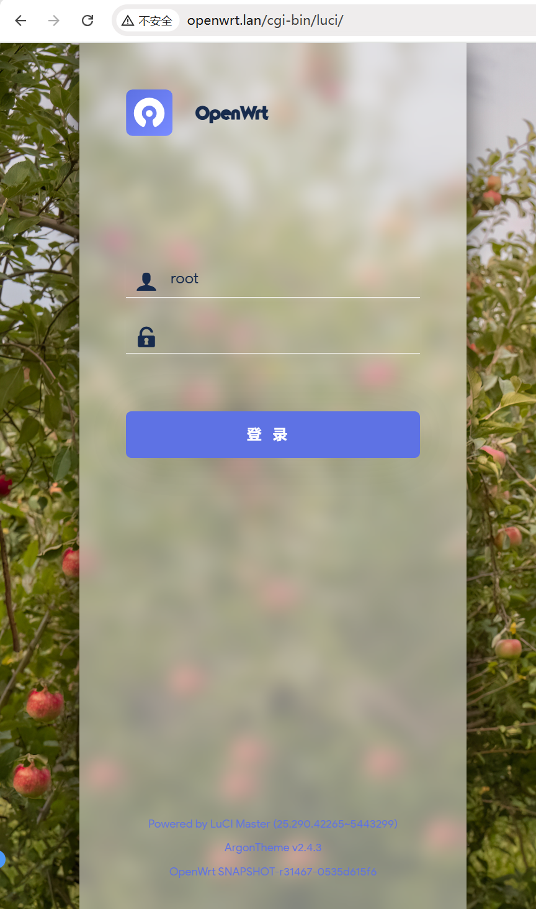
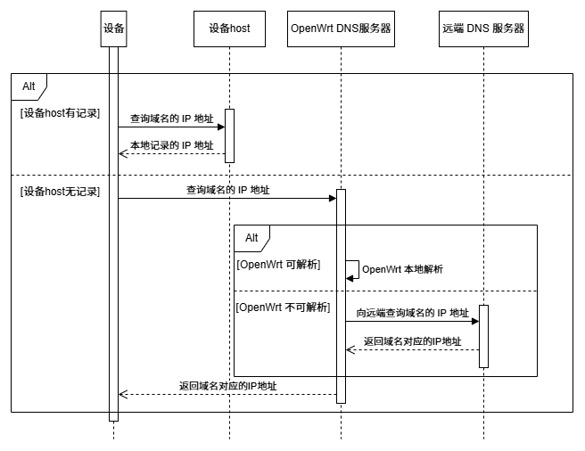
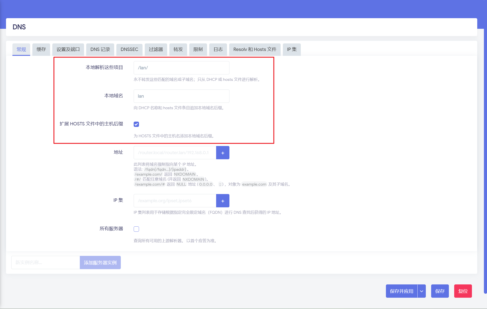
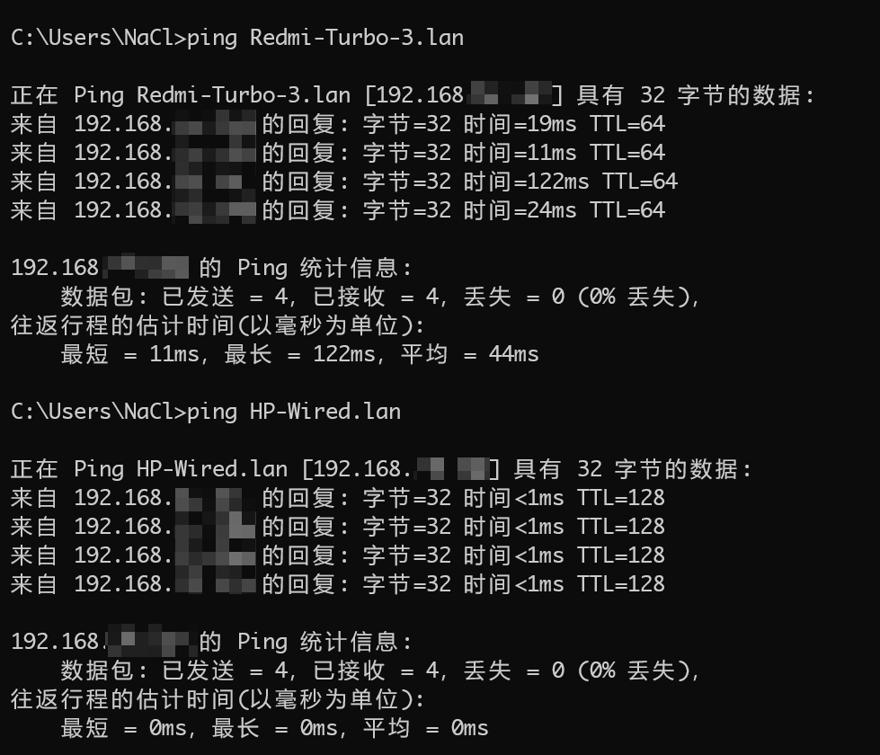
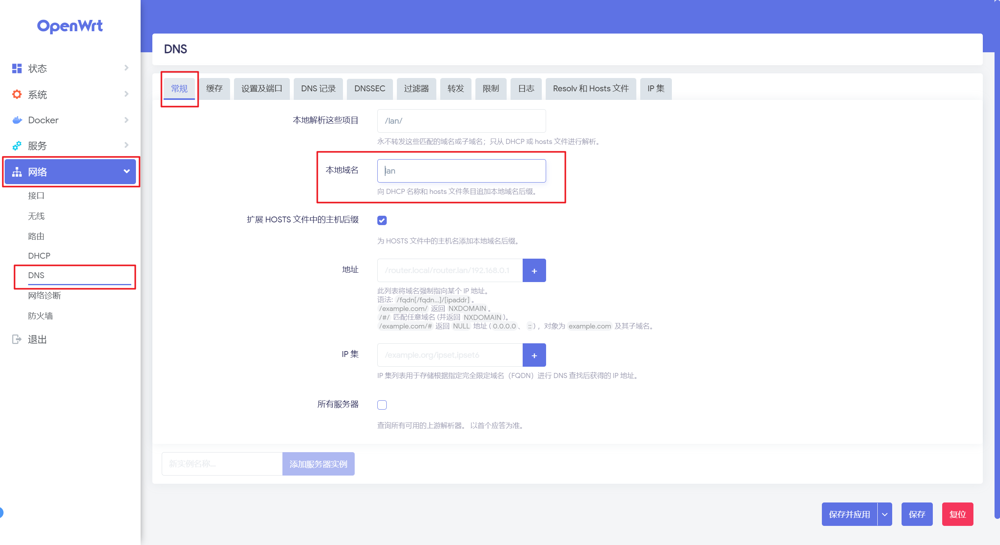
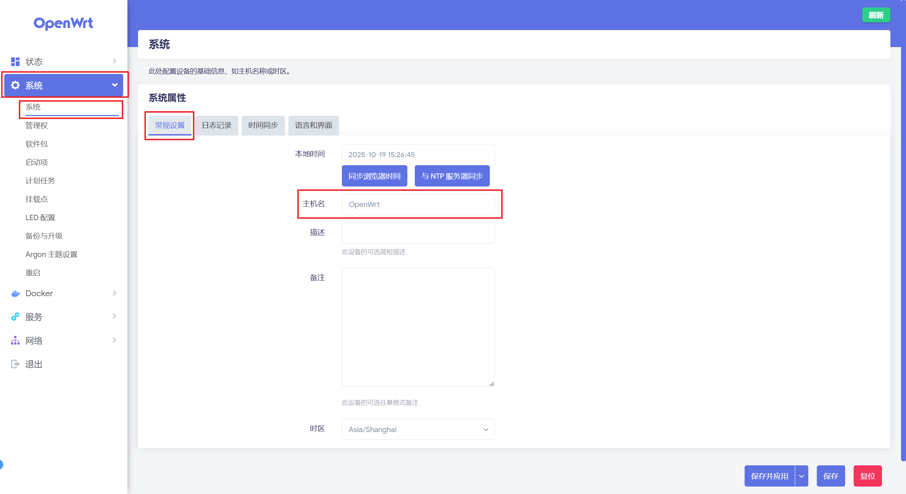

@[TOC]
## 一、背景
当我们在更新 `OpenWrt` 系统之后，会自动跳转到 `openwrt.lan` 的网站，在这个界面可以登录用户名和密码进入 `luci` 界面，也即这个域名可以解析到 `OpenWrt` 的 `IP` 地址。

那么，为什么 `openwrt.lan` 的域名可以解析到 `OpenWrt` 的 `IP` 地址上呢？这个过程是如何进行的，我们是否可以自定义域名，使用另一个域名来代替 `OpenWrt` 的设备呢？

本文将探寻 `openwrt.lan` 解析的过程，并详细介绍修改此域名的方式。

## 二、原理解析
我们都知道，我们为了访问一个站点是通过 `IP` 地址访问的，而我们在浏览器输入某个域名进行访问的时候，其实是向 `DNS` 服务器发送请求，查询指定域名对应的 `IP` 地址。

因此，像 `openwrt.lan` 其实也是经过 `DNS` 服务器查询到了 `OpenWrt` 系统的 `IP` 地址，所以我们能访问到 `OpenWrt` 系统 `luci`。但很显然，`openwrt.lan` 是一个私域的域名，只能解析到自己的 `OpenWrt` 系统，而不会访问到别人，因此这个 `DNS` 服务器是 `OpenWrt` 系统提供的。

对于直接连接在 OpenWrt 上的设备，解析一个域名的流程如下：

而在 `OpenWrt` 上，通常使用的是 `Dnsmasq` 作为 `DNS` 服务器，因此 `openwrt.lan` 解析为 `OpenWrt` 的 `IP` 地址的服务是由 `Dnsmasq` 提供的。而这个是 `Dnsmasq` 的 `本地域名` 的功能提供的：

参考：[https://openwrt.org/docs/guide-user/base-system/dhcp](https://openwrt.org/docs/guide-user/base-system/dhcp)

首先，此功能的核心开关为 `扩展 HOSTS 文件中的主机后缀`，其可以通过 `hosts` 文件下 记录的设备信息，并配合 `本地域名` 的内容，可以构建出 `主机名.本地域名` 的域名与 `IP` 地址的关联关系，因此可以通过使用 `Dnsmasq` 服务将 `主机名.本地域名` 的域名解析到 `IP` 地址。

而在 OpenWrt 的系统中，默认的主机名为 `OpenWrt`， `本地域名` 默认值为 `lan`，因此就出现了 `openwrt.lan` 对应的就是 `OpenWrt` 的 `IP` 地址，访问其就可以访问到管理后台 `luci` 了。

**同时，除了 `OpenWrt` 本身，可以使用 `主机名.本地域名` 访问到其它已连接的设备，从而不仅可以只通过设备的 `IP` 地址访问设备了。** 

例如：

## 三、修改域名
那么我们是否可以修改此域名呢？答案是完全可以的。由前文可以知道，这是 `主机名.本地域名` 的一个组合，而主机名和本地域名都是可以修改的，因此整个域名都是修改。

按一下步骤即可进行修改，请注意修改每一项都需要**重启**之后才能生效。

### 修改本地域名
在 `luci` 管理员界面，修改 `网络` > `DNS` > `常规` > `本地域名` 即可:

> 注意避免使用常用的 `.com` `.cn` 等域名，否则可能引起冲突。
> 可以使用例如：`.lan`，`.local`，`.home`

### 修改主机名
在 `luci` 管理员界面，修改 `系统` > `系统` > `常规设置` > `主机名` 即可:

