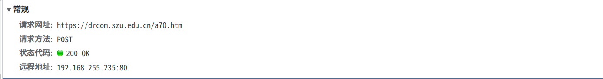
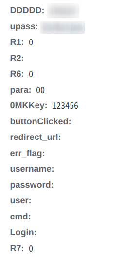

> 原文链接：https://blog.csdn.net/TeleostNaCl/article/details/125145618
> 发布时间：2022-06-06 14:09:59
> 标签：linux、bash、自动化

---

- 经过对教学区登录认证过程进行抓包分析可得，登录是对  
  `https://drcom.szu.edu.cn/a70.htm`  
  发送了POST请求，请求表单如下图所示，且传递了cookies，cookies由js脚本生成设置。  
     
   



- 对其进行减少参数尝试发送post命令可以发现，cookies信息并不影响最后的登录的结果，故可以写出其登录发送的请求如下

```
//请求地址为
https://drcom.szu.edu.cn/a70.htm/

//请求的参数为
DDDDD=$校园卡号
upass=$密码
0MKKey=123456
R7=0
```

- 对于在路由器或其它linux相关设备，可以使用wget或者curl命令进行登录

```bash
#curl命令
curl -d 'DDDDD=$校园卡号' \
  					-d 'upass=$密码' \
  					-d '0MKKey=123456' \
  					-d 'R7=0' \
  					https://drcom.szu.edu.cn/a70.htm

wget --output-document=/dev/null \
      --post-data='DDDDD=$校园卡号&upass=$密码&0MKKey=123456&R7=0' \
    		https://drcom.szu.edu.cn/a70.htm
```

> `$校园卡号` 与 `$密码` 全部替换为登录用的账号密码

抓包具体过程与如何在路由器上使用自动登录，断线重连参考该文章：[抓包分析,一条Linux命令实现路由器自动登录深大校园网认证(Drcom Pt版)](https://blog.csdn.net/TeleostNaCl/article/details/124553119)
