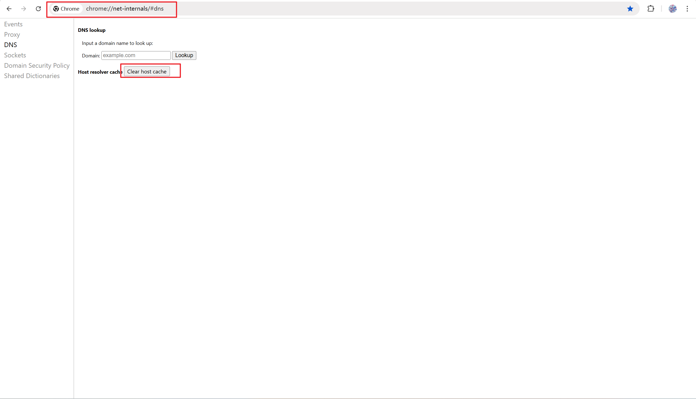

@[TOC]
# 一、问题背景
有时候，我们在 `Chrome` 浏览器访问某个网页的时候，明明网页是可用，且电脑网络也是正常的，但就是无法访问那个网页，而当使用无痕模式的时候，却可以正常访问。很显然，这是与浏览器自身的问题。那么我们该如何解决呢？

# 二、问题原因
这个问题是因为 `Chrome` 浏览器的 `DNS` 缓存的错误记录导致的，也即浏览器将指定域名映射到了错误的 `IP` 上，导致访问该网页的时候，访问了错误的 `IP` 地址，从而导致无法访问该网页。

# 三、解决方案
既然是 `DNS` 缓存记录有错误，那么为了解决这个问题，则可以通过直接清除错误的`DNS` 记录即可。方法如下：

首先在浏览器地址输入 `chrome://net-internals/#dns`，打开浏览器 `DNS` 管理界面，随后点击 `Clear host cache` 即可

