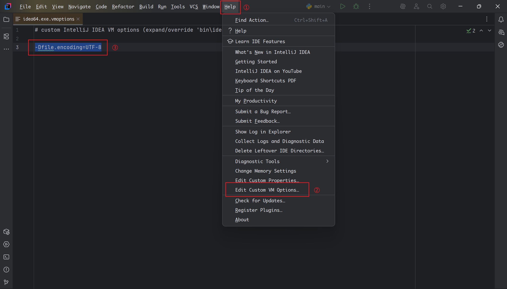

> 原文链接：https://blog.csdn.net/TeleostNaCl/article/details/148372024
> 发布时间：2025-06-02 00:03:23
> 标签：intellij-idea

---

**直接说解决办法**  
编译 `IDEA` 所在目录的启动的 `.vmoptions` 文件，添加以下`JVM` 参数即可

```
-Dfile.encoding=UTF-8
```

如下图所示，`Help` > `Edit Custom VM Options`，随后在编辑框中添加`-Dfile.encoding=UTF-8` 的 `JVM` 参数


