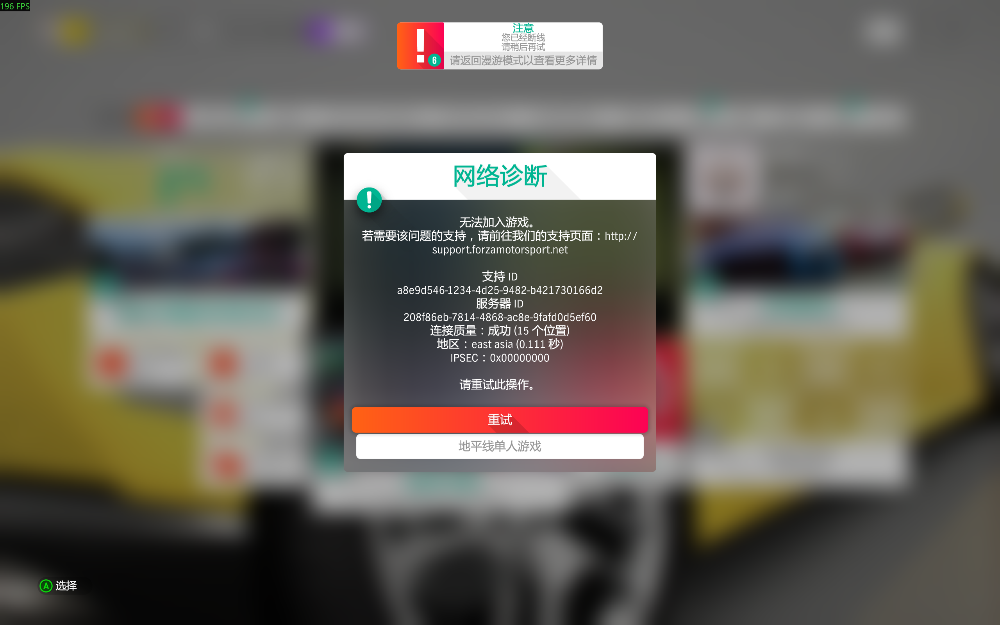
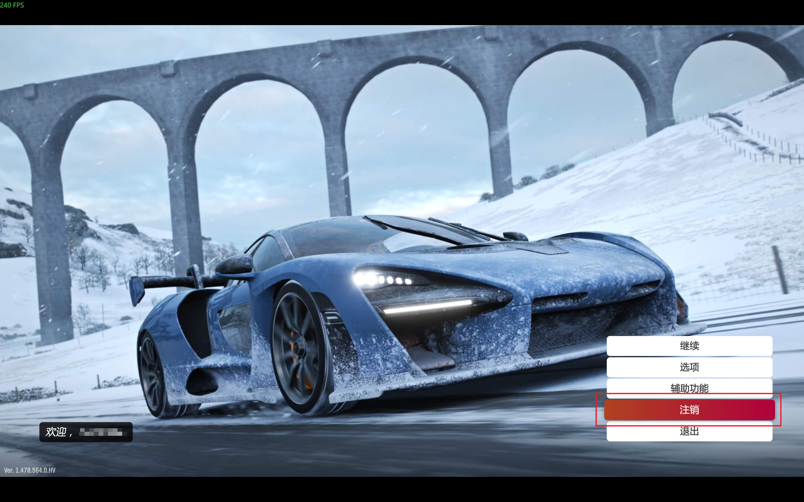
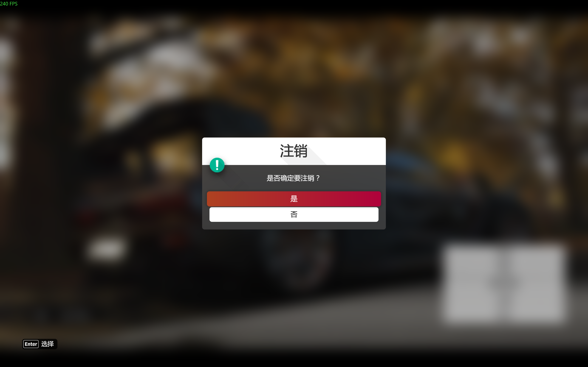
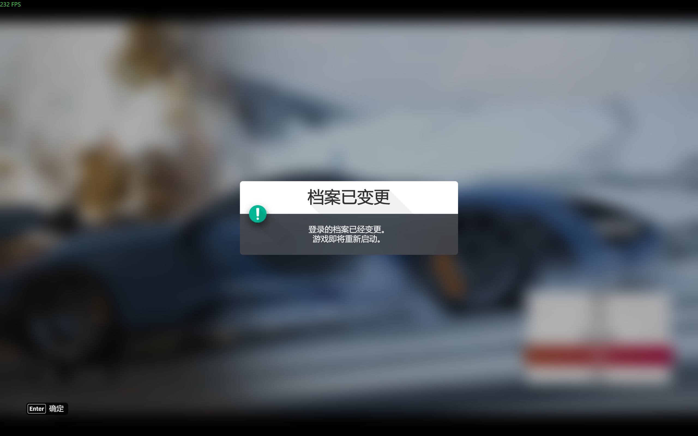

> 原文链接：https://blog.csdn.net/TeleostNaCl/article/details/154617061
> 发布时间：2025-11-09 20:43:19
> 标签：生活、游戏、经验分享

---

参考方法：<https://www.bilibili.com/video/BV1Rz421z797>

偶尔在玩 地平线4 的时候会突然抽风，连不上地平线生活，无法进行在线游戏，从而也无法和朋友一起玩。一开始以为 地平线4 停服了，导致连接不了，随后查找资料发现需要注销登录，再重新登录账户即可，遂做一个记录。（此方法需要先保证能连接上 XBOX ）

首先需要重启地平线4，在启动 地平线4 之后，我们不着急进入游戏，点击 `注销` （注意是注销登录，而不是注销游戏账户。千万不要注销错了。）

注销登录之后，会自动重启 地平线4 ，随后再次登录 `XBOX` 账户就可以了  
 

