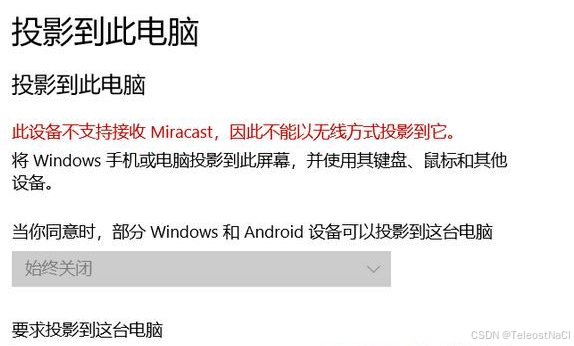
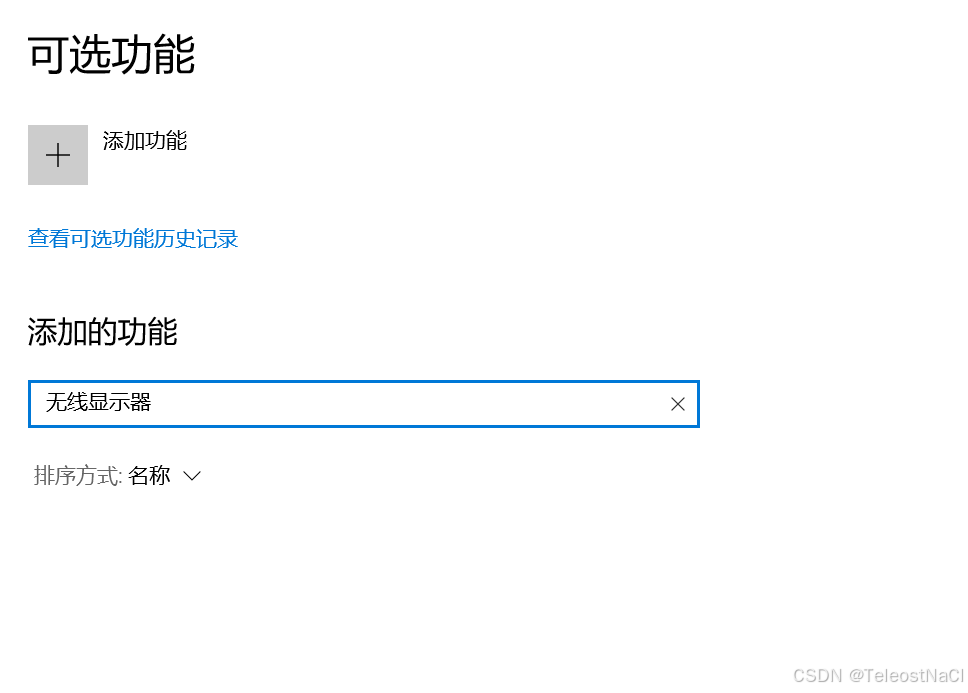
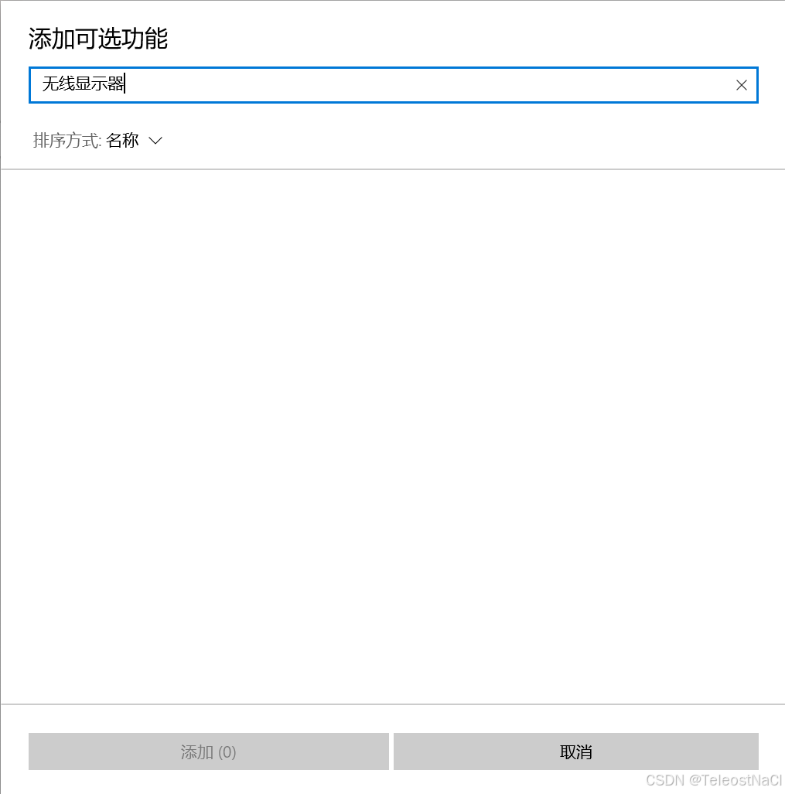
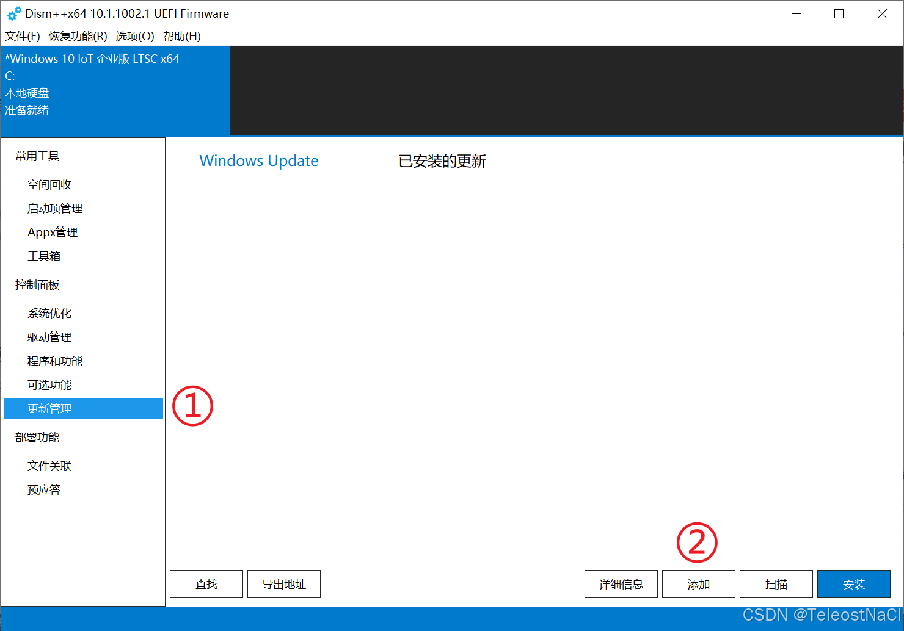
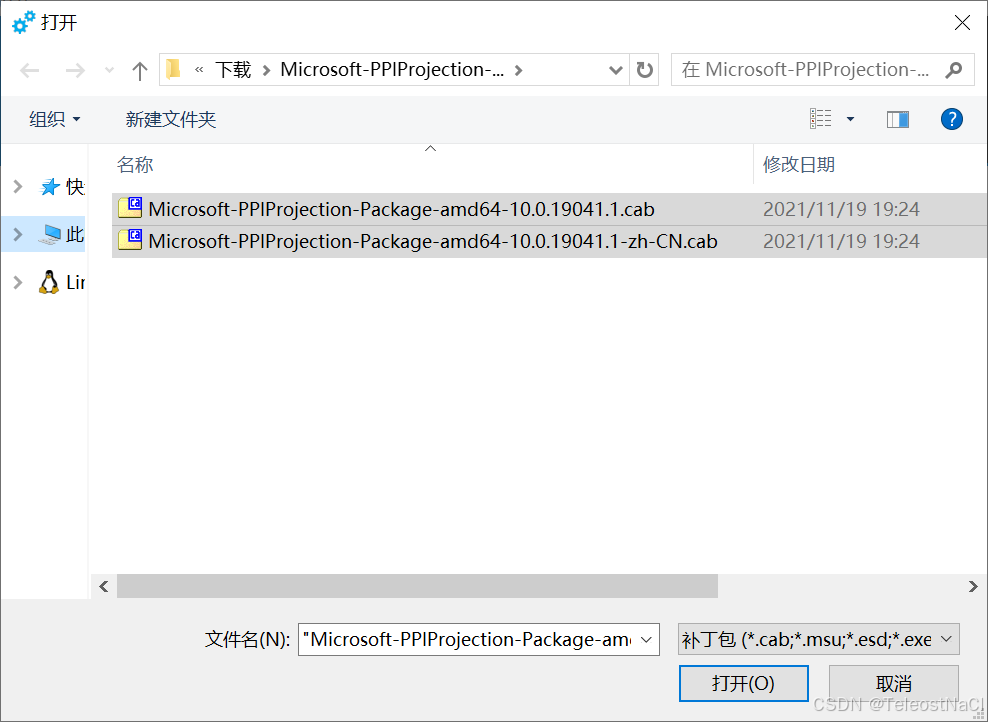
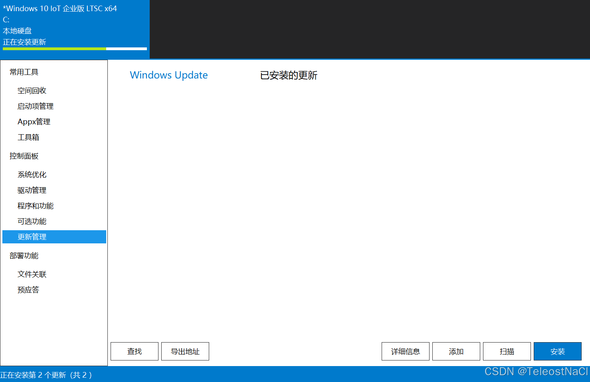
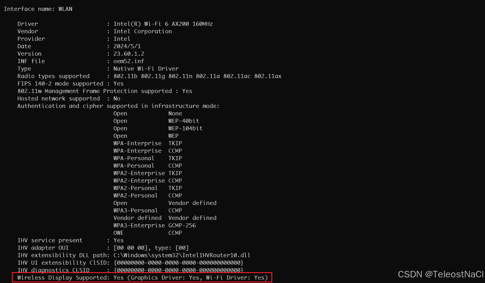

> 原文链接：https://blog.csdn.net/TeleostNaCl/article/details/143267742
> 发布时间：2024-10-27 14:58:29
> 标签：电脑、windows、经验分享

---

参考链接：`https://bbs.pcbeta.com/viewthread-1912839-1-1.html`

#### 文章目录

- [一、问题背景](#_3)
- [二、解决方法](#_14)
- - [1. 根据对应的系统选择提取包并解压](#1__20)
  - [2. 在Dism++更新管理中以此添加主包和语言包的更新包](#2_Dism_28)
  - [3. 如为当前正在运行系统添加，PowerShell 管理员身份执行包注册命令](#3_PowerShell__36)
- [三、必要环境](#_43)

## 一、问题背景

在使用Windows LTSC 2021的系统的时候，当在设置打开投影到此电脑功能时，会提示**此设备不支持接收Miracast，因此不能以无线方式投影到它**。  
   
 而根据网上所能找到的解决方案的描述，一般是通过在可选功能中需要安装`无线显示器`功能才可以使用Miracast投屏功能。原因是该功能随着Windows的更新已经变成了可选功能，可以手动启用它或禁用他。参考：`https://www.landiannews.com/archives/79500.html`

但是在Windows LTSC 2021的系统中，可选功能中是没有`无线显示器`这个功能，因此以上方法并不适用。如下两张图，在可选功能中没有`无线显示器`功能。  
   
   
 解决方法参考此链接：`https://bbs.pcbeta.com/viewthread-1912839-1-1.html`  
 问题的根因是系统没有该系统组件，通过部署相应的系统更新包，即可添加投屏组件，即`无线显示器`功能

## 二、解决方法

安装下列提取包即可(来自21H2 19044.1288 普通版本安装可选功能中 无线显示器 组件后导出)。

链接: https://pan.baidu.com/s/1Fjc4F\_govEi40SuiiBPZ7Q  
 提取码:zyt0

### 1. 根据对应的系统选择提取包并解压

64位系统使用 `Microsoft-PPIProjection-Package-amd64.rar`  
 32位系统使用 `Microsoft-PPIProjection-Package-x86.rar`  
 以64位系统为例，解压rar压缩包之后，将得到两个文件，  
   
 `Microsoft-PPIProjection-Package-amd64-10.0.19041.1.cab` 为主包  
 `Microsoft-PPIProjection-Package-amd64-10.0.19041.1-zh-CN.cab` 为语言包

### 2. 在Dism++更新管理中以此添加主包和语言包的更新包

Dism++工具下载地址: `https://github.com/Chuyu-Team/Dism-Multi-language`

1. 在Dism++主界面依次点击`更新管理` - `添加`
2. 在弹窗中依次选择主包和语言包，并点击打开。  
    
3. 等待更新完成  
    

### 3. 如为当前正在运行系统添加，PowerShell 管理员身份执行包注册命令

上述步骤安装完成之后，需要在PowerShell以`管理员身份`执行包注册命令

```powershell
Add-appxpackage -register "C:\Windows\SystemApps\Microsoft.PPIProjection_cw5n1h2txyewy\AppxManifest.xml" -disabledevelopmentmode
```

执行完成之后，即可在开始菜单中，看到新添加的连接应用  
 

## 三、必要环境

使用Miracast需要满足两点必须的环境，一个是无线网卡驱动支持 Miracast 功能，显卡驱动支持 Miracast。  
 最简单的方式，在终端中输入以下命令，查看最后一行`Wireless Display Supported`是否支持即可。

```cmd
netsh wlan show drivers
```


