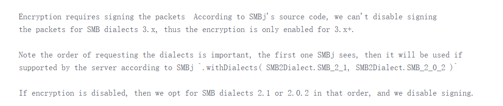
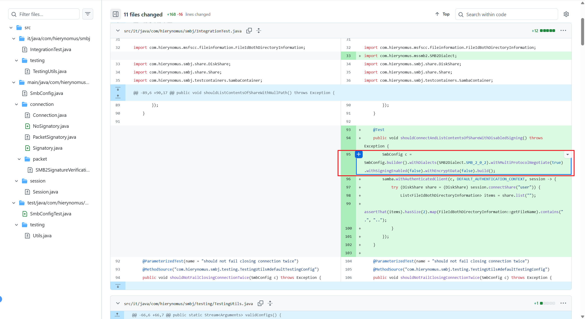

在使用  `hierynomus/smbj` 库[https://github.com/hierynomus/smbj](https://github.com/hierynomus/smbj) 时，可以很方便的从 `SMB` 中下载文件和 上传文件到 `SMB` 中，使用方法可参考：[https://blog.csdn.net/TeleostNaCl/article/details/151998648](https://blog.csdn.net/TeleostNaCl/article/details/151998648)。

但是使用的时候，发现其上传速度比较慢，平均只有 `10MB/s`，而在相同网络环境下（相同 `wifi` 访问相同 `SMB` 服务）时，使用 `Windows` 可以轻松达到 `100MB/s`，因此传输速度慢的问题可以排除是因为网络和服务器的原因，那就只能是使用 `hierynomus/smbj`  库作为客户端自身的问题了。

搜索 `Github` 可以找到以下的 `issue`：
[https://github.com/hierynomus/smbj/issues/817](https://github.com/hierynomus/smbj/issues/817)
[https://github.com/hierynomus/smbj/issues/862](https://github.com/hierynomus/smbj/issues/862)
[https://github.com/wa2c/cifs-documents-provider/pull/100](https://github.com/wa2c/cifs-documents-provider/pull/100)

可以看到，`hierynomus/smbj` 库在 `Android` 传输速率较慢的问题已经有人反馈了，同时也给出了解决方案，从讨论中可以看到，是因为启用了 `Safe Data Transfer` 的数据加密功能引起的。





而参考 [https://github.com/JozefDropco/smbj/commit/9df23a1eedd04ae7f3362efd15e29f2f3dfce0aa](https://github.com/JozefDropco/smbj/commit/9df23a1eedd04ae7f3362efd15e29f2f3dfce0aa) 的提交可以知道，在 `SMBJ` 中 `SMB3` 无法禁用加密选项，否则会报以下错误：
```text
Signing cannot be disabled when using SMB3.x dialects
```

因此需要在实例化 `SMBClient` 的时候，指定使用 `SMB2` 的版本，并且禁用加密选项，代码如下：
```kt
val client = SMBClient(SmbConfig.builder()
				// 指定 SMB2 版本
        .withDialects(SMB2Dialect.SMB_2_1, SMB2Dialect.SMB_2_0_2)
        .withMultiProtocolNegotiate(true)
        // 禁用 加密
        .withSigningEnabled(false)
        .withEncryptData(false)
        // 配合提高Buffer（这里设置为50MB, 根据可用空间手动调整）
        .withBufferSize(50 * 1024 * 1024)
        .build())
```

这样修改之后，传输速度达到了 `50MB/s `，比原来提高了 `5` 倍左右。
