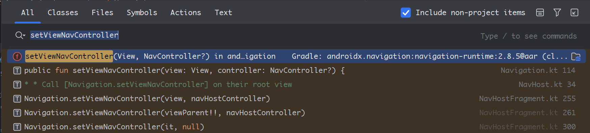
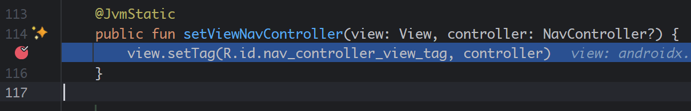
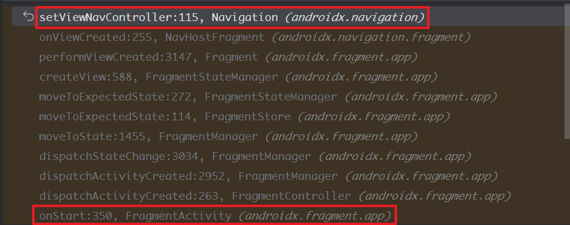

> 原文链接：https://blog.csdn.net/TeleostNaCl/article/details/155188539
> 发布时间：2025-11-24 14:40:42
> 标签：android、经验分享、android runtime、android jetpack、jetpack android、java、kotlin

---

#### 文章目录

- [一、问题背景](#_1)
- [二、源码分析](#_38)
- - [（一）androidx.navigation.Navigation 类](#androidxnavigationNavigation__39)
  - [（二）androidx.navigation.fragment.NavHostFragment 类](#androidxnavigationfragmentNavHostFragment__96)
  - [（三）androidx.fragment.app.FragmentContainerView 类](#androidxfragmentappFragmentContainerView__136)
- [三、解决方案](#_281)
- - [（一）在 Activity 的 onStart 方法之后获取 NavController](#_Activity___onStart__NavController_284)
  - [（二）直接通过 NavHostFragment 拿到 NavController](#_NavHostFragment__NavController_293)

## 一、问题背景

当我们在使用 `Navigation` 组件用于管理导航多个 `Fragment` 的时候，我们经常会先拿到其 `NavController`，一种标准的用法如下：

首先，在 `Activity` 的布局中，添加 `FragmentContainerView`，用于展示各 `Fragment`，并指定 `android:name` 为 `androidx.navigation.fragment.NavHostFragment`，同时指定 `navGraph`

```xml
<androidx.fragment.app.FragmentContainerView xmlns:android="http://schemas.android.com/apk/res/android"
    xmlns:app="http://schemas.android.com/apk/res-auto"
    android:id="@+id/fragment_container_view"
    android:name="androidx.navigation.fragment.NavHostFragment"
    android:layout_width="match_parent"
    android:layout_height="match_parent"
    android:keepScreenOn="true"
    app:navGraph="@navigation/nav" />
```

随后在 `Activity` 中，使用 `Navigation.findNavController` 方法拿到对应的 `NavController`

```kt
val navController = Navigation.findNavController(this, R.id.fragment_container_view)
```

但是，如果上面的方法在 `Activity` 的 `onCreate` 方法中调用，会抛出以下的异常：

```text
java.lang.IllegalStateException: Activity * does not have a NavController set on *
```

即使我们通过 `post` 方法在主线程延迟执行，在占用较高的时候，也有概率会触发以上的异常

```kt
view.post {
	val navController = Navigation.findNavController(this, R.id.fragment_container_view)
}
```

本文将通过探寻源码，追踪此异常抛出的原因，通过根因分析，给出解决此问题的方案。

参考文献：

- <https://developer.android.com/guide/navigation/navcontroller>
- <https://blog.csdn.net/linminghuo/article/details/119000601>
- <https://blog.csdn.net/qq_45436365/article/details/119853537>

## 二、源码分析

### （一）androidx.navigation.Navigation 类

首先，我们先来看 `androidx.navigation.Navigation.findNavController()` 方法，其源码如下：

```kt
@JvmStatic
public fun findNavController(activity: Activity, @IdRes viewId: Int): NavController {
    val view = ActivityCompat.requireViewById<View>(activity, viewId)
    return findViewNavController(view)
        ?: throw IllegalStateException(
            "Activity $activity does not have a NavController set on $viewId"
        )
}
```

可以看到，首先通过 `viewId` 拿到具体的 `View`，然后再通过 `View` 拿到 `NavController`。这里如果拿到的是空，则会抛出 `IllegalStateException` 的异常，其异常内容正是我们遇到的 `java.lang.IllegalStateException: Activity * does not have a NavController set on *`，因此可以知道，是 `findViewNavController(View)` 方法拿到了空的。

---

我们继续看 `androidx.navigation.Navigation.findViewNavController(view)` 方法，其源码如下：

```kt
private fun findViewNavController(view: View): NavController? =
    generateSequence(view) { it.parent as? View? }
        .mapNotNull { getViewNavController(it) }
        .firstOrNull()

@Suppress("UNCHECKED_CAST")
private fun getViewNavController(view: View): NavController? {
    val tag = view.getTag(R.id.nav_controller_view_tag)
    var controller: NavController? = null
    if (tag is WeakReference<*>) {
        controller = (tag as WeakReference<NavController>).get()
    } else if (tag is NavController) {
        controller = tag
    }
    return controller
}
```

首先，利用 `generateSequence` 方法，将 `View` 树转换成一个序列，从 子 `View` 开始，逐渐向上拿到 父 `View`，随后对每个 `View` 都使用 `getViewNavController` 方法尝试拿到 `NavController`，最后返回拿到的第一个 `NavController` 。

从这个算法可以看出，这是从子 `View` 开始逐渐向父 `View` 找 `NavController`，直到根布局为止。因此，只要 `View` 是位于 `Fragment` 中的，通过此方法都可以找到`NavController`。

我们再看 `getViewNavController(View)` 方法，其通过 `view.getTag(R.id.nav_controller_view_tag)` 方法，拿到了 `NavController`。我们知道，`View` 的 `tag` 是用于在 `View` 上携带数据的一种方式，其需要先在适当的位置进行赋值，否则拿到的就是空的。因此，我们可以知道，这是因为 `View` 的 `tag` 为 `R.id.nav_controller_view_tag` 还未被赋值的时候，拿到了空的 `NavController`

综上所说，我们需要查找 `View` 的 `tag` 为 `R.id.nav_controller_view_tag` 被赋值的地方。

---

通过全局查找 `R.id.nav_controller_view_tag`，其设置 `View.setTag()` 的源码在`androidx.navigation.Navigation.setViewNavController` 如下：

```kt
@JvmStatic
public fun setViewNavController(view: View, controller: NavController?) {
    view.setTag(R.id.nav_controller_view_tag, controller)
}
```

查找此方法的使用地方，可以知道其是在 `androidx.navigation.fragment.NavHostFragment` 中被调用的，我们随后去看 `NavHostFragment` 类。  
 

### （二）androidx.navigation.fragment.NavHostFragment 类

在 `NavHostFragment` 类中调用 `Navigation.setViewNavController` 总共有三处地方，具体源码如下：

```kt
internal val navHostController: NavHostController by lazy {
	...
}

public override fun onViewCreated(view: View, savedInstanceState: Bundle?) {
    super.onViewCreated(view, savedInstanceState)
    check(view is ViewGroup) { "created host view $view is not a ViewGroup" }
    Navigation.setViewNavController(view, navHostController)
    // When added programmatically, we need to set the NavController on the parent - i.e.,
    // the View that has the ID matching this NavHostFragment.
    if (view.getParent() != null) {
        viewParent = view.getParent() as View
        if (viewParent!!.id == id) {
            Navigation.setViewNavController(viewParent!!, navHostController)
        }
    }
}

public override fun onDestroyView() {
    super.onDestroyView()
    viewParent?.let { it ->
        if (Navigation.findNavController(it) === navHostController) {
            Navigation.setViewNavController(it, null)
        }
    }
    viewParent = null
}
```

我们可以看到，在 `NavHostFragment` 的 `onViewCreated` 方法，先给自身设置了 `NavHostController`，随后给其相同 `ID` 的父布局设置 `NavHostController`。而在 `onDestroyView`，给已经设置了 `NavHostController` 的父布局置空 `NavHostController`。

而 `NavHostController` 是通过 `by lazy` 延迟初始化出来的，可以知道，其实 `NavHostFragment` 一直都有 `NavHostController`。

因此，我们可以从这里知道，`NavHostController` 被设置到父布局的时机是在 `onViewCreated` 的时候，其可以被正常获取的时机是在 `NavHostFragment` 的 `onViewCreated()` 到 `onDestroyView()` 的生命周期之间。那么这个 `Fragment` 的生命周期需要如何与 `Activity` 的生命周期关联上呢？

我们先来看 `FragmentContainerView` 与 `NavHostFragment` 之间的关系。

### （三）androidx.fragment.app.FragmentContainerView 类

我们在使用 `FragmentContainerView` 的时候，会设置 `android:name="androidx.navigation.fragment.NavHostFragment"`，而对于 `FragmentContainerView` 的创建，与一般的 `View` 是有所不同的，其使用的是传递了 `FragmentManager` 方法的 `internal constructor(context: Context, attrs: AttributeSet, fm: FragmentManager) : super(context, attrs)`，我们追寻相关源码做一个简短的分析：

```java
// 我们知道 使用 FragmentContainerView 需要使用 FragmentActivity，我们先来看 androidx.fragment.app.FragmentActivity  类
---------------------------------------------------------------------------------------------
/**
 * androidx.fragment.app.FragmentActivity
 */
// 成员变量 androidx.fragment.app.FragmentController
final FragmentController mFragments = FragmentController.createController(new HostCallbacks());

@Override
protected void onCreate(@Nullable Bundle savedInstanceState) {
    super.onCreate(savedInstanceState);

    mFragmentLifecycleRegistry.handleLifecycleEvent(Lifecycle.Event.ON_CREATE);
    // 在 onCreate 方法中调用创建 Fragment
    mFragments.dispatchCreate();
}

@Override 
@Nullable
public View onCreateView(@Nullable View parent, @NonNull String name, @NonNull Context context, @NonNull AttributeSet attrs) {
		// 在 onCreateView 方法中分发 Fragment 的 OnCreateView 方法
    final View v = dispatchFragmentsOnCreateView(parent, name, context, attrs);
    if (v == null) {
        return super.onCreateView(parent, name, context, attrs);
    }
    return v;
}

@Nullable
final View dispatchFragmentsOnCreateView(@Nullable View parent, @NonNull String name,
        @NonNull Context context, @NonNull AttributeSet attrs) {
    return mFragments.onCreateView(parent, name, context, attrs);
}


---------------------------------------------------------------------------------------------
/**
 * androidx.fragment.app.FragmentController
 */

// androidx.fragment.app.FragmentHostCallback, 由 FragmentActivity 实例化 FragmentController 的时候就传入，含有 androidx.fragment.app.FragmentManager 的实例
private final FragmentHostCallback<?> mHost;

@Nullable
public View onCreateView(@Nullable View parent, @NonNull String name, @NonNull Context context,
        @NonNull AttributeSet attrs) {
    // 由 FragmentHostCallback 的 FragmentManager 实例的 FragmentLayoutInflaterFactory 实例进行创建View
    return mHost.mFragmentManager.getLayoutInflaterFactory()
            .onCreateView(parent, name, context, attrs);
}

---------------------------------------------------------------------------------------------
/**
 * androidx.fragment.app.FragmentHostCallback
 */
// androidx.fragment.app.FragmentManager 实例
final FragmentManager mFragmentManager = new FragmentManagerImpl();

---------------------------------------------------------------------------------------------
/**
 * androidx.fragment.app.FragmentManager
 */
// androidx.fragment.app.FragmentLayoutInflaterFactory 的实例
private final FragmentLayoutInflaterFactory mLayoutInflaterFactory = new FragmentLayoutInflaterFactory(this);

---------------------------------------------------------------------------------------------
/**
 * androidx.fragment.app.FragmentLayoutInflaterFactory
 */
// 在构造方法中被传递赋值
final FragmentManager mFragmentManager;

@Nullable
@Override
public View onCreateView(@Nullable final View parent, @NonNull String name,
        @NonNull Context context, @NonNull AttributeSet attrs) {
   	// 如果是 FragmentContainerView 的对象，则进行特殊处理，使用传递 FragmentManager 的构造方法
    if (FragmentContainerView.class.getName().equals(name)) {
        return new FragmentContainerView(context, attrs, mFragmentManager);
    }
    ...
}
```

可以看到，沿着这条路下来最后由 `androidx.fragment.app.FragmentLayoutInflaterFactory` 的 `onCreateView` 对 `FragmentContainerView` 进行特殊处理，使用传递 `FragmentManager` 的构造方法。我们来看这个构造方法：

```kt
internal constructor(
    context: Context,
    attrs: AttributeSet,
    fm: FragmentManager
) : super(context, attrs) {
    var name = attrs.classAttribute
    var tag: String? = null
    // 拿到 android:name 定义的 Fragment
    context.withStyledAttributes(attrs, R.styleable.FragmentContainerView) {
        if (name == null) {
            name = getString(R.styleable.FragmentContainerView_android_name)
        }
        tag = getString(R.styleable.FragmentContainerView_android_tag)
    }
    val id = id
    val existingFragment: Fragment? = fm.findFragmentById(id)
    // If there is a name and there is no existing fragment,
    // we should add an inflated Fragment to the view.
    if (name != null && existingFragment == null) {
        if (id == View.NO_ID) {
            val tagMessage = if (tag != null) " with tag $tag" else ""
            throw IllegalStateException(
                "FragmentContainerView must have an android:id to add Fragment $name$tagMessage"
            )
        }
        // 通过反射实例化 Fragment 对象
        val containerFragment: Fragment =
            fm.fragmentFactory.instantiate(context.classLoader, name)
        // 将自身的 ID 赋值给 Fragment 对象
        containerFragment.mFragmentId = id
        containerFragment.mContainerId = id
        containerFragment.mTag = tag
        containerFragment.mFragmentManager = fm
        containerFragment.mHost = fm.host
        containerFragment.onInflate(context, attrs, null)
        // 开始 Fragment 的事务，将 Fragment 对象 添加到 FragmentManager
        fm.beginTransaction()
            .setReorderingAllowed(true)
            .add(this, containerFragment, tag)
            .commitNowAllowingStateLoss()
    }
    // 已将 Fragment 准备好，添加到 Activity 中
    fm.onContainerAvailable(this)
}
```

从以上源码可以知道，在布局中使用 `android:name="androidx.navigation.fragment.NavHostFragment"` 定义的 `NavHostFragment`，将会被反射实例化出来，并将自身的 ID 赋值给 `NavHostFragment`，这样 `FragmentContainerView` 和 `NavHostFragment` 就有相同的 `ID`，在 `NavHostFragment.onViewCreated()` 即可正常给 `FragmentContainerView` 设置 `NavController` 了。

当源码追到这里的时候，已经不太好往下追踪了，那么我们可以通过在 `setViewNavController` 打断点的方式，来看一下 `androidx.navigation.Navigation.setViewNavController` 的调用链。  
   
 

可以看到，从 `Activity` 的 `onStart` 生命周期开始，将事件下发到 `FragmentController` 和 `FragmentMananger`，由 `FragmentStateManager` 状态机管理，移动到指定的生命周期，最后调用到 `createView` 方法，从而使 `NavHostFragment` 进行设置 `NavController` 到 `Tag` 上。

由此可知，在 `Activity` 的 `onCreate` 的时候还未设置 `Tag`，从而导致拿不到 `NavHostController`，抛出异常。

## 三、解决方案

通过以上源码分析可以知道， `NavHostController` 是在 `Activity` 的 `onStart` 方法中被设置到 `FragmentContainerView` 的 `Tag` 中之后，才能通过 `Navigation.findNavController()` 才能拿到 `NavController`。因此解决此问题有多种方式。

### （一）在 Activity 的 onStart 方法之后获取 NavController

第一种解决方法是在 `Activity` 的 `onStart` 方法之后获取 `NavHostController`，即

```kt
override fun onStart() {
    super.onStart()

    val navController = Navigation.findNavController(this, R.id.fragment_container_view)
}
```

### （二）直接通过 NavHostFragment 拿到 NavController

由前文分析可以知道， `NavHostController` 是通过 `by lazy` 延迟初始化出来的，可以知道，其实 `NavHostFragment` 一直都有 `NavHostController`，即 `NavController` （ `NavHostController` 继承自 `NavController`），那么我们可以直接通过 `NavHostFragment` 拿到 `NavController`。

我们知道，通过 `FragmentManager.findFragmentById()` 方法可以拿到第一个指定 `ID` 的 `Fragment`，所以在 `FragmentContainerView` 初始化的时候，即在 `Activity` 的 `onCreate` 方法 到 `onStart` 之间，即可拿到 `NavHostFragment`，代码如下：

```kotlin
val navController = (supportFragmentManager.findFragmentById(R.id.fragment_container_view) as? NavHostFragment)?.navController
```
