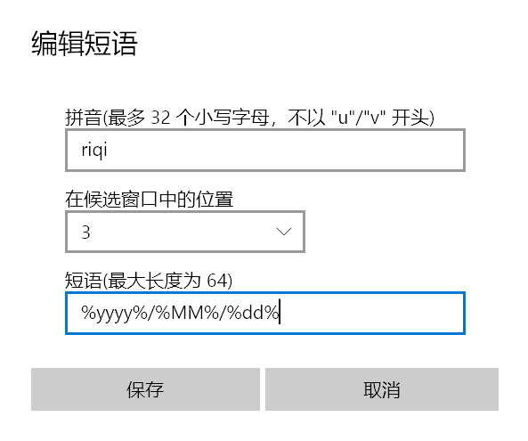
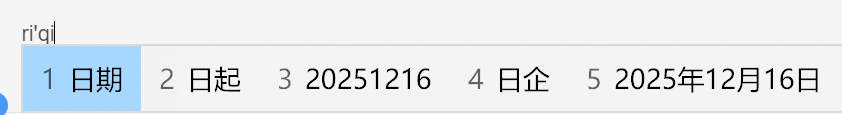
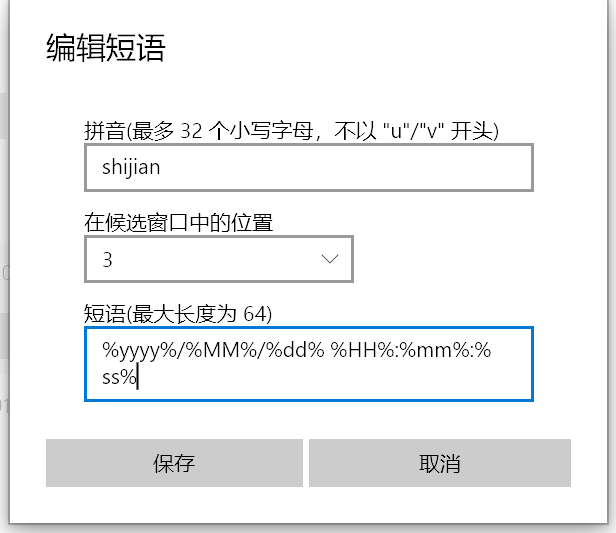
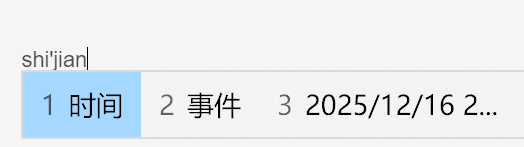

> 原文链接：https://blog.csdn.net/TeleostNaCl/article/details/155988940
> 发布时间：2025-12-16 20:23:09
> 标签：微软、windows、经验分享

---

我们可以在微软输入法中的 `设置` > `词库和自学习` > `用户自定义短语` > `添加或编辑自定义短语` 的设置中，去管理自定义短语，并使用特殊占位符去设置为动态的短语。

比如，我们希望输入 `riqi` 的时候，能够打出形如 `2025年12月16日` 这样的今日日期的候选词，那么我们可以设置为 `%yyyy%/%MM%/%dd%`：  
   
 

---

又比如，我想打 `shijian` 的时候，出现形如 `2025/12/16 20:06:12` 当前时间的候选词，那么我们可以设置为 `%yyyy%/%MM%/%dd% %HH%:%mm%:%ss%`

---

可以看到，微软输入法提供了非常方便的方法，给我们设置动态短语，其基本语法与其它程序的常用习惯相符，总结如下：

- `%yyyy%`: 四位数的年
- `%MM%`: 两位数的月
- `%dd%`: 两位数的日
- `%HH%`: 两位数的时
- `%mm%`: 两位数的分
- `%ss%`: 两位数的秒

---

但是，如果同时添加多个动态自定义短语的时候，在保存完最后一个自定义短语之后，会导致之前定义好的短语直接按内容保存，也即直接把当前时间保存进短语中，而不是保留占位符，这就导致了整个之前的短语都无法使用。

而这个是一个微软多年的一个bug，参考文章：<https://www.zhihu.com/question/410885155> 可知是自定义短语存储文件的保存机制有问题。

而也已经有大佬使用 `Python` 编写了修复代码，作者也将源码放出来了：<https://gist.github.com/scruel/36cb4614665acc5943ff8c563e884081>

可运行以上脚本，通过脚本去添加需要的动态短语即可。
