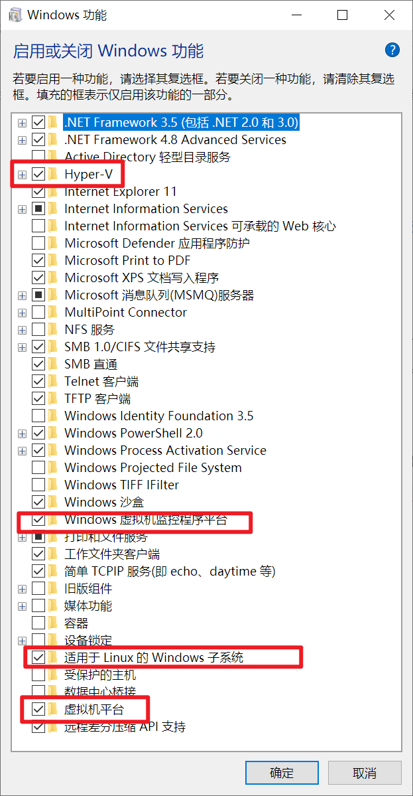
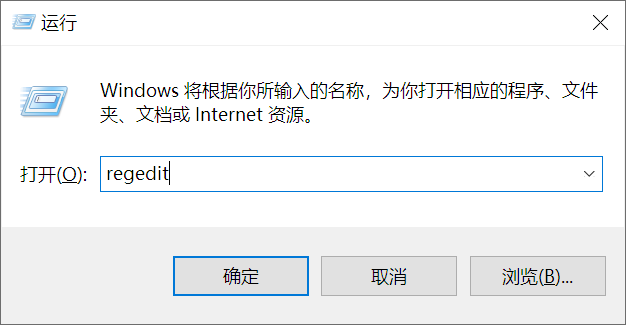
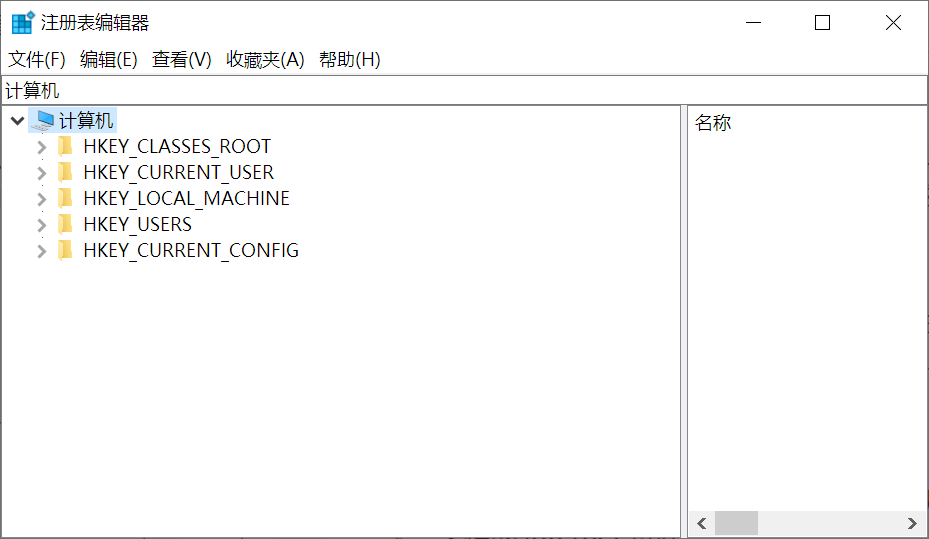
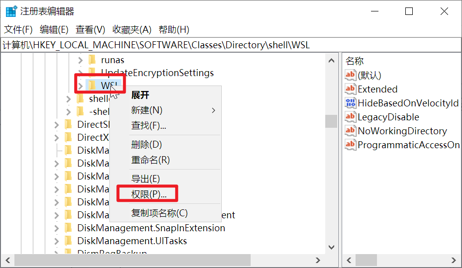
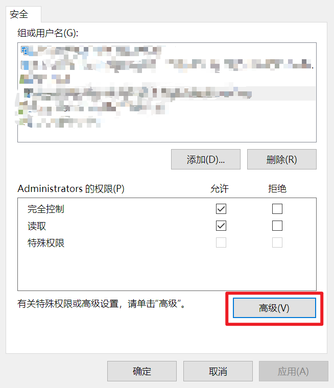
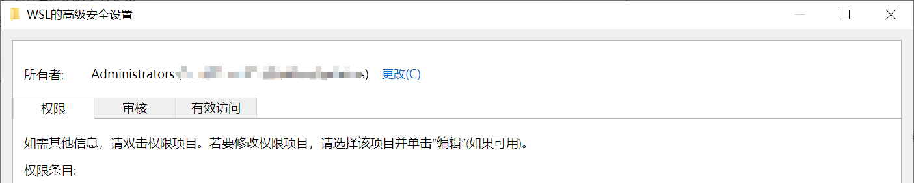
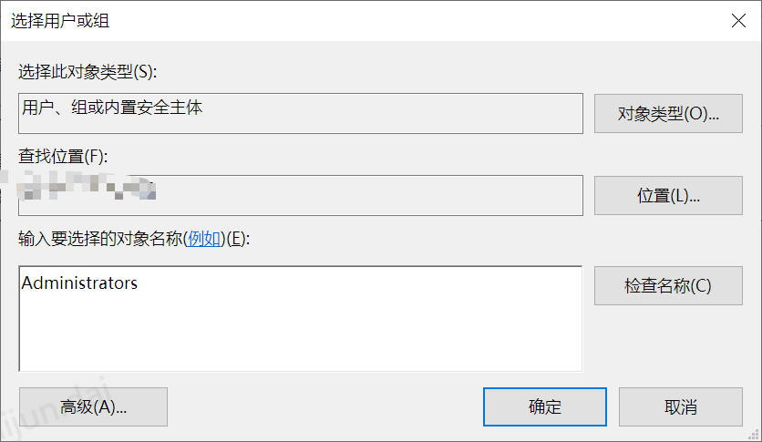
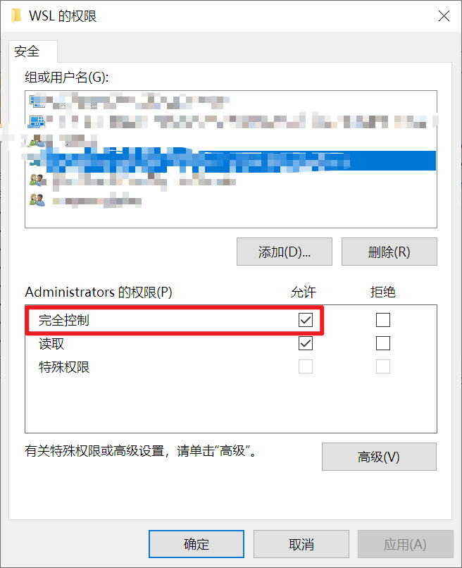

> 原文链接：https://blog.csdn.net/TeleostNaCl/article/details/153339131
> 发布时间：2025-10-16 11:30:42
> 标签：经验分享、windows、linux

---

#### 文章目录

- [问题背景](#_1)
- [方案一 重新启用 WSL 功能（未解决）](#__WSL__6)
- [方案二 更新 WSL](#__WSL_13)
- - [问题1 注册表权限问题](#1__20)
  - - [1. 打开注册表管理器](#1__30)
    - [2. 修改注册表的键的权限](#2__35)
    - [3. 修改顶部的所有者信息](#3__40)
    - [4. 修改 Administrators 权限](#4__Administrators__49)
  - [问题2 修复 WSL 安装似乎已损坏](#2__WSL__52)

## 问题背景

有一段时间未使用 `WSL` 了, 今天再打开 `WSL` 时，报了一个致命性错误 `Error code: Wsl/Service/E_UNEXPECTED`，导致 `WSL` 不能正常运行。

从网上找了几种解决方案，本文将做一个详细的记录。

## 方案一 重新启用 WSL 功能（未解决）

首先，进入 `控制面板` > `程序` > `程序和功能` > `启动或关闭Windows功能`，取消勾选与 `WSL` 相关的功能：`Hyper-V`、`Windows虚拟机监控程序`、`适用于 Linux 的 Windows 子系统`、`虚拟机平台`，随后点击确定并重启电脑，等待更新完成。  
   
 随后，等待电脑重启完成之后，重新勾选以上模块，启用`WSL`，随后重启更新，即可重新启用 WSL 功能。

在我的机器中，使用此方案无法解决问题。

## 方案二 更新 WSL

可以在 `Powshell` 或 `CMD` 终端以管理员方式使用命令更新 `WSL`：

```shell
wsl --update
```

但是在升级过程中出现了几个错误，导致无法正常升级，需要一一进行解决。

### 问题1 注册表权限问题

在执行 `wsl --update` 命令时，报了一个注册表权限的问题：

```shell
wsl --update
正在检查更新。
正在将适用于 Linux 的 Windows 子系统更新到版本： 2.6.1。
Could not write value  to key \SOFTWARE\Classes\Directory\shell\WSL.   Verify that you have sufficient access to that key, or contact your support personnel.
更新失败(退出代码: 1603)。
```

此时报了一个注册表的值 `\SOFTWARE\Classes\Directory\shell\WSL` 无法写入的问题，这是一个权限的问题，需要修改注册表中指定位置的注册表的权限，步骤如下：

#### 1. 打开注册表管理器

使用 `Win` + `R` 打开运行窗口，输入 `regedit` 即可打开注册表管理器

  
 

#### 2. 修改注册表的键的权限

在 `注册表管理器` 中，在输入框中输入 `计算机\HKEY_LOCAL_MACHINE\SOFTWARE\Classes\Directory\shell\WSL`，定位到指定注册表值。

右键 `WSL`，选择 `权限` ，进入 `权限编辑窗口`  
 

#### 3. 修改顶部的所有者信息

首先在 `权限编辑窗口` 点击 `高级` ，进入 `高级安全设置`  
 

此时检查顶部的所有者信息，如果顶部所有者信息非 `当前用户` 或 `Administrators` 组，则无法直接修改权限，需要先修改所有者才可以编辑权限，如下图：  
   
 点击 `更改`，在下面的窗口中输入要选择的对象名称 `Administrators`，再点击检查名称，即可更改用户组。  
 

#### 4. 修改 Administrators 权限

此时回到 `权限编辑窗口`，授予 `Administrators` 的 `完全控制` 权限。  
 

### 问题2 修复 WSL 安装似乎已损坏

当修改完注册表权限之后，再次使用 `wsl --update` 时，报了 `WSL 安装似乎已损坏` 的问题，需要修复 `WSL`，提示如下：

```shell
wsl --update
wsl: WSL 安装似乎已损坏 (错误代码： Wsl/CallMsi/Install/REGDB_E_CLASSNOTREG)。
按任意键修复 WSL，或 CTRL-C 取消。
此提示将在 60 秒后超时。
```

此时只需要再 60秒内输入任意键即可启动修复，修复完成之后就会有如下提示：

```shell
正在更新适用于 Linux 的 Windows 子系统: 2.6.1。
```

但如果超时未输入，则报以下错误：

```shell
没有注册类
错误代码: Wsl/CallMsi/Install/REGDB_E_CLASSNOTREG
```

通过以上方法，修复升级 WSL，即可解决 `WSL` 的 灾难性故障 `Error code: Wsl/Service/E_UNEXPECTED`。

> 另外使用此方法也彻底解决了 WSL 卡死的问题: <https://blog.csdn.net/TeleostNaCl/article/details/151581761>
