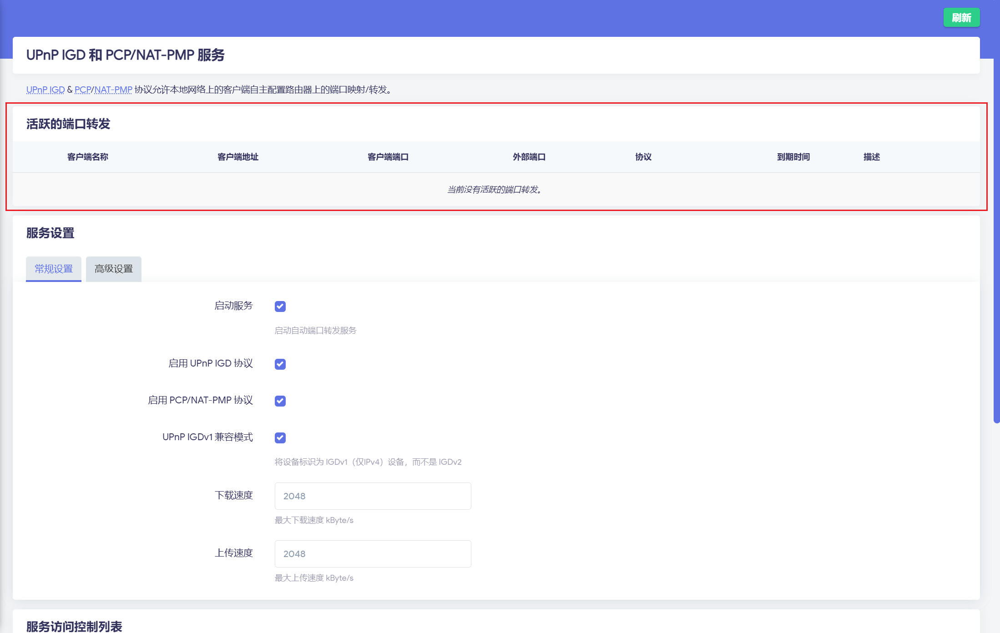
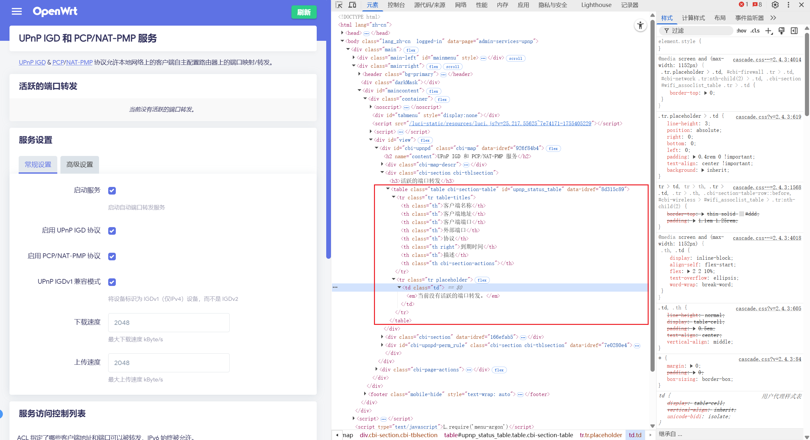
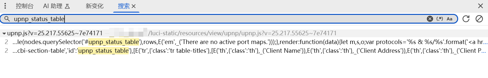

@TOC
## 一、问题背景
不知道从哪个版本开始，在 `OpenWrt` 上使用 `luci-app-upnp` 时，当有客户端建立了 `upnp` 端口转发之后，在活跃的端口转发中不显示任何设备。



本文将详细记录探寻 `luci-app-upnp` 无法显示活跃的端口转发的问题。

## 二、从开发者工具获取数据来源
首先，我们先按 `F12` 键打开浏览器的 `开发者工具` ，查看 `活跃的端口转发` 数据来源。

当我们定位到相关位置时，可以看到这块数据是显示在 `ID` 为 `upnp_status_table` 的 表格 `table` 里面，当前显示为 `当前没有活跃的端口转发。`



因此，我们通过全局搜索，查找 `upnp_status_table` 使用的地方，查询其被赋值的地方。我们按下 `ctrl` + `shift` + `F`，打开全局搜索，输入 `upnp_status_table`，回车，可以看到  `upnp_status_table` 在 `upnp.js` 的脚本中被使用，因此我们定位到此脚本 `luci-static/resources/view/upnp/upnp.js`


在 `upnp.js` 中可以看到核心代码如下：
```js
load: function() {
    return Promise.all([callUpnpGetStatus(), uci.load('upnpd')]);
},
poll_status: function(nodes, data) {
    var rules = Array.isArray(data[0].rules) ? data[0].rules : [];
    var rows = rules.map(function(rule) {
        const padnum = (num, length) => num.toString().padStart(length, "0");
        const expires_sec = rule?.expires || 0;
        const hour = Math.floor(expires_sec / 3600);
        const minute = Math.floor((expires_sec % 3600) / 60);
        const second = Math.floor(expires_sec % 60);
        const expires_str = hour > 0 ? `${hour}h ${padnum(minute, 2)}m ${padnum(second, 2)}s` : minute > 0 ? `${minute}m ${padnum(second, 2)}s` : expires_sec > 0 ? `${second}s` : '';
        return [rule.host_hint || _('Unknown'), rule.intaddr, rule.intport, rule.extport, rule.proto, expires_str, rule.descr, E('button', {
            'class': 'btn cbi-button-remove',
            'click': L.bind(handleDelRule, this, rule.num)
        }, [_('Delete')])];
    });
    cbi_update_table(nodes.querySelector('#upnp_status_table'), rows, E('em', _('There are no active port maps.')));
},
...
return m.render().then(L.bind(function(m, nodes) {
    poll.add(L.bind(function() {
        return Promise.all([callUpnpGetStatus()]).then(L.bind(this.poll_status, this, nodes));
    }, this), 5);
    return nodes;
}, this, m));
```

可以看到，此脚本首先通过`poll.add(..., 5);`定义了间隔 `5s` 的轮询逻辑，通过 `Promise.all([callUpnpGetStatus(), uci.load('upnpd')])` 拿到 `upnp` 端口映射的原始数据，随后通过 `poll_status` 函数解析获取到的数据，分别赋值 `客户端名称`	`客户端地址`	`客户端端口`	`外部端口`	`协议`	`到期时间`	`描述` 的数据，随后调用 `render` 绘制到 `upnp_status_table` 的表格中。

同时，我们在 `poll_status` 方法中的 `var rules = Array.isArray(data[0].rules) ? data[0].rules : [];` 可以看到，其使用的是 `data[0].rules`，并将其转换为数组，而 `data` 即为`callUpnpGetStatus()` 的返回值。而 `callUpnpGetStatus` 函数的定义如下：
```js
const callUpnpGetStatus = rpc.declare({
    object: 'luci.upnp',
    method: 'get_status',
    expect: {}
});
```

从此函数可以知道，使用的是`Remote Procedure Call`（`远程过程调用`），即 `RPC` 调用接口，向 `luci.upnp` 服务请求执行 `get_status` 方法，`rpc.declare` 是 `LuCI` 封装的 高级 `RPC` 声明接口，底层实际通过 `ubus` 通信，因此其对应在 OpenWrt 终端中直接调用 `RPC` 的 `ubus` 代码为 
```bash
ubus call luci.upnp get_status
```

由于其是远程过程调用，因此会有网络请求，我们可以在 `开发者工具` 的网络请求中，查看到 `callUpnpGetStatus()` 的返回值，即 `poll_status` 方法中 的`data` 的值。我们可以在网络中找到以下请求，可以看到，其请求结果的 `result` 为 `[5]`。
```shell
// 请求
POST /ubus/?1755408901151 
[{"jsonrpc":"2.0","id":80,"method":"call","params":["1f74117f924b375f98ed13e8f227af14","luci.upnp","get_status",{}]}]

// 响应
[{"jsonrpc":"2.0","id":80,"result":[5]}]
```

我们前文说到，其使用的是 `data[0].rules`，但是返回值是一个 `5`，且没有 `rules` 这个参数，因此可以推测这里的返回值是有问题的。同时每次请求都返回了 `5`，那么这个返回值代表了什么呢？

## 三、在 OpenWrt 终端调用
由前文知道，获取 `upnp` 的 `活跃的端口转发` 是通过 `RPC` 调用的，最后由 `ubus` 实现调用并返回值，其对应的终端命令为：`ubus call luci.upnp get_status`。我们在终端调用此命令，可以得到如下结果：
```
root@OpenWrt:~# ubus call luci.upnp get_status
Command failed: No response
```
其返回了 `No response` 的提示语。

## 四、UBUS 中的异常码
我们前文已经分析了，最后会通过 `RPC` 远程调用，由 `ubus` 实现调用并返回值，因此我们推测，前文提到的 5 的返回值，是否为 `ubus` 的异常码呢？我们首先查阅 ubus 的异常码。

我们可以查找 `ubus` 的 `github` 仓库，在 `ubusmsg.h`:[https://github.com/openwrt/ubus/blob/master/ubusmsg.h](https://github.com/openwrt/ubus/blob/master/ubusmsg.h) 中，可以找到如下枚举：
```c
enum ubus_msg_status {
	UBUS_STATUS_OK,
	UBUS_STATUS_INVALID_COMMAND,
	UBUS_STATUS_INVALID_ARGUMENT,
	UBUS_STATUS_METHOD_NOT_FOUND,
	UBUS_STATUS_NOT_FOUND,
	UBUS_STATUS_NO_DATA,
	UBUS_STATUS_PERMISSION_DENIED,
	UBUS_STATUS_TIMEOUT,
	UBUS_STATUS_NOT_SUPPORTED,
	UBUS_STATUS_UNKNOWN_ERROR,
	UBUS_STATUS_CONNECTION_FAILED,
	UBUS_STATUS_NO_MEMORY,
	UBUS_STATUS_PARSE_ERROR,
	UBUS_STATUS_SYSTEM_ERROR,
	__UBUS_STATUS_LAST
};
```

同时查看 `libubus.c`: [https://github.com/openwrt/ubus/blob/master/libubus.c](https://github.com/openwrt/ubus/blob/master/libubus.c)，可以知道 `ubus_msg_status` 对应的提示语
```c
const char *__ubus_strerror[__UBUS_STATUS_LAST] = {
	[UBUS_STATUS_OK] = "Success",
	[UBUS_STATUS_INVALID_COMMAND] = "Invalid command",
	[UBUS_STATUS_INVALID_ARGUMENT] = "Invalid argument",
	[UBUS_STATUS_METHOD_NOT_FOUND] = "Method not found",
	[UBUS_STATUS_NOT_FOUND] = "Not found",
	[UBUS_STATUS_NO_DATA] = "No response",
	[UBUS_STATUS_PERMISSION_DENIED] = "Permission denied",
	[UBUS_STATUS_TIMEOUT] = "Request timed out",
	[UBUS_STATUS_NOT_SUPPORTED] = "Operation not supported",
	[UBUS_STATUS_UNKNOWN_ERROR] = "Unknown error",
	[UBUS_STATUS_CONNECTION_FAILED] = "Connection failed",
	[UBUS_STATUS_NO_MEMORY] = "Out of memory",
	[UBUS_STATUS_PARSE_ERROR] = "Parsing message data failed",
	[UBUS_STATUS_SYSTEM_ERROR] = "System error",
};
```

因此，返回的 `5` 对应 `ubus` 中的 `UBUS_STATUS_NO_DATA` 枚举，对应 `No response` 的提示语。

## 五、upnp 的 ucode 代码
通过 `ubus` 调用是需要编写 `ucode` 代码，将代码放在 `ucode` 目录（即 `/usr/share/rpcd/ucode`）下，向 `ubus` 中注册方法。我们可以看到，在 `/usr/share/rpcd/ucode` 目录下有一个文件 `luci.upnp`，此即为 `upnp` 的 `ucode` 代码，其定义了 `get_status` 方法，`get_status` 的关键源码如下：
```lua
get_status: {
	call: function(req) {
		const uci = cursor();

		const rules = [];
		const leases = [];

		const leasefile = open(uci.get('upnpd', 'config', 'upnp_lease_file'), 'r');

		if (leasefile) {
			for (let line = leasefile.read('line'); length(line); line = leasefile.read('line')) {
				const record = split(line, ':', 6);

				if (length(record) == 6) {
					push(leases, {
						proto: uc(record[0]),
						extport: +record[1],
						intaddr: arrtoip(iptoarr(record[2])),
						intport: +record[3],
						expires: record[4] - timelocal(localtime()),
						description: trim(record[5])
					});
				}
			}

			leasefile.close();
		}

		const ipt = popen('iptables --line-numbers -t nat -xnvL MINIUPNPD 2>/dev/null');

		if (ipt) {
			for (let line = ipt.read('line'); length(line); line = ipt.read('line')) {
				let m = match(line, /^([0-9]+)\s+([a-z]+).+dpt:([0-9]+) to:(\S+):([0-9]+)/);

				if (m) {
					push(rules, {
						num: m[1],
						proto: uc(m[2]),
						extport: +m[3],
						intaddr: arrtoip(iptoarr(m[4])),
						intport: +m[5],
						descr: ''
					});
				}
			}

			ipt.close();
		}

		const nft = popen('nft --handle list chain inet fw4 upnp_prerouting 2>/dev/null');

		if (nft) {
			for (let line = nft.read('line'), num = 1; length(line); line = nft.read('line')) {
				let m = match(line, /^\t\tiif ".+" @nh,72,8 (0x6|0x11) th dport ([0-9]+) dnat ip to ([0-9.]+):([0-9]+)/);

				if (m) {
					push(rules, {
						num: `${num}`,
						proto: (m[1] == '0x6') ? 'TCP' : 'UDP',
						extport: +m[2],
						intaddr: arrtoip(iptoarr(m[3])),
						intport: +m[4],
						descr: ''
					});

					num++;
				}
			}

			nft.close();
		}

		return ubus.defer('luci-rpc', 'getHostHints', {}, function(rc, host_hints) {
			for (let rule in rules) {
				for (let lease in leases) {
					if (lease.proto == rule.proto &&
						lease.intaddr == rule.intaddr &&
						lease.intport == rule.intport &&
						lease.extport == rule.extport)
					{
						rule.descr = lease.description;
						rule.expires = lease.expires;
						break;
					}
				}

				for (let mac, hint in host_hints) {
					if (rule.intaddr in hint.ipaddrs) {
						rule.host_hint = hint.name;
						break;
					}
				}
			}

			req.reply({ rules });
		});
	}
},
```

这段代码中有多端逻辑，解析如下：
```lua
if (leasefile) {
	// 从 upnp 的 lease file 中获取 upnp 的转发规则信息
}

// 判断是否支持 iptables
const ipt = popen('iptables --line-numbers -t nat -xnvL MINIUPNPD 2>/dev/null');

if (ipt) {
	// 从 iptables 防火墙规则 检查是否有相关的转发规则信息
}

// 判断是否支持 nftables
const nft = popen('nft --handle list chain inet fw4 upnp_prerouting 2>/dev/null');

if (nft) {
	// 从 nftables 防火墙规则 检查是否有相关的转发规则信息
}

// 通过 ubus.defer 调用 getHostHints 方法 获取 主机信息
return ubus.defer('luci-rpc', 'getHostHints', {}, function(rc, host_hints) {
	// 将主机信息与转发规则信息关联

	// 返回结果
	req.reply({ rules });
});
```

由于我们无法知道具体是哪个地方出现了错误，因此我们需要添加日志辅助我们分析问题，具体查看是哪里出了问题。日志添加方法可以参考：`OpenWrt | 如何在 ucode 脚本中打印日志`: [https://blog.csdn.net/TeleostNaCl/article/details/149887517](https://blog.csdn.net/TeleostNaCl/article/details/149887517)
我们按如下方式添加日志，修改 `/usr/share/rpcd/ucode/luci.upnp`，随后调用 `/etc/init.d/rpcd restart` 重启 `rpcd` 服务。
```lua
log.ulog(log.LOG_INFO, "upnp start");

const leasefile = open(uci.get('upnpd', 'config', 'upnp_lease_file'), 'r');

log.ulog(log.LOG_INFO, "upnp open leasefile");

if (leasefile) {
}

log.ulog(log.LOG_INFO, "upnp open leasefile finish");

const ipt = popen('iptables --line-numbers -t nat -xnvL MINIUPNPD 2>/dev/null');

log.ulog(log.LOG_INFO, "upnp open ipt");

if (ipt) {
}

log.ulog(log.LOG_INFO, "upnp open ipt finish");

const nft = popen('nft --handle list chain inet fw4 upnp_prerouting 2>/dev/null');

log.ulog(log.LOG_INFO, "upnp open nft");

if (nft) {
}

log.ulog(log.LOG_INFO, "upnp open nft finish");

log.ulog(log.LOG_INFO, "upnp ubus.defer");

return ubus.defer('luci-rpc', 'getHostHints', {}, function(rc, host_hints) {
	log.ulog(log.LOG_INFO, "upnp ubus.defer get");
	for (let rule in rules) {
	}

	log.ulog(log.LOG_INFO, "upnp req.reply rules = " + { rules });

	req.reply({ rules });

	log.ulog(log.LOG_INFO, "upnp req.reply finish rules = " + { rules });
});
```

我们执行 `ubus call luci.upnp get_status`，可以在 `OpenWrt` 的日志中，查看结果：
```
Sun Aug 17 14:12:50 2025 daemon.info rpcd: upnp start
Sun Aug 17 14:12:50 2025 daemon.info rpcd: upnp open leasefile
Sun Aug 17 14:12:50 2025 daemon.info rpcd: upnp open leasefile finish
Sun Aug 17 14:12:50 2025 daemon.info rpcd: upnp open ipt
Sun Aug 17 14:12:50 2025 daemon.info rpcd: upnp open ipt finish
Sun Aug 17 14:12:50 2025 daemon.info rpcd: upnp open nft
Sun Aug 17 14:12:50 2025 daemon.info rpcd: upnp open nft finish
Sun Aug 17 14:12:50 2025 daemon.info rpcd: upnp ubus.defer
Sun Aug 17 14:12:50 2025 daemon.info rpcd: upnp ubus.defer get
Sun Aug 17 14:12:50 2025 daemon.info rpcd: upnp req.reply rules = { "rules": [ ] }
```
可以看到，最后一句 `log.ulog(log.LOG_INFO, "upnp req.reply finish rules = " + { rules });` 没有打印，证明代码没有走到这一句，问题则出在了 `req.reply({ rules });` 方法中。我们再对此方法添加 `try catch`:
```lua
log.ulog(log.LOG_INFO, "upnp req.reply rules = " + { rules });

try {
	req.reply({ rules });
	log.ulog(log.LOG_INFO, "upnp after req.reply rules = " + { rules }");
} catch (e) {
	log.ulog(log.LOG_ERR, "req.reply failed: " + e);
}

log.ulog(log.LOG_INFO, "upnp req.reply finish rules = " + { rules });
```
再次查看日志：
```
Sun Aug 17 14:17:36 2025 daemon.info rpcd: upnp start
Sun Aug 17 14:17:36 2025 daemon.info rpcd: upnp open leasefile
Sun Aug 17 14:17:36 2025 daemon.info rpcd: upnp open leasefile finish
Sun Aug 17 14:17:36 2025 daemon.info rpcd: upnp open ipt
Sun Aug 17 14:17:36 2025 daemon.info rpcd: upnp open ipt finish
Sun Aug 17 14:17:36 2025 daemon.info rpcd: upnp open nft
Sun Aug 17 14:17:36 2025 daemon.info rpcd: upnp open nft finish
Sun Aug 17 14:17:36 2025 daemon.info rpcd: upnp ubus.defer
Sun Aug 17 14:17:36 2025 daemon.info rpcd: upnp ubus.defer get
Sun Aug 17 14:17:36 2025 daemon.info rpcd: upnp req.reply rules = { "rules": [ ] }
Sun Aug 17 14:17:36 2025 daemon.err rpcd: req.reply failed: Reply has already been sent
Sun Aug 17 14:17:36 2025 daemon.info rpcd: upnp req.reply finish rules = { "rules": [ ] }
```
此时可以看到调用 `req.reply({ rules });` 时，抛出了 `Reply has already been sent` 的异常。

`ubus.defer` 为异步调用方法，避免卡住 `ubus`，并通过其回调方法中，获取 `ubus.defer` 为异步调用的返回值，再调用相关处理返回值的逻辑，然后通过调用 `req.reply();` 将结果返回给调用。

由 `Reply has already been sent` 的异常可以知道，在调用`req.reply({ rules });` 时，已经有值已经被返回了，从而造成了逻辑异常。

## 六、ubus.defer 的示例代码
为了避免因为其他业务逻辑造成混乱，可以使用 `ubus.defer` 的示例代码，继续探寻此问题。搜索 `OpenWrt` 的源码中，可以找到如下代码：`example-plugin.uc`：[https://github.com/openwrt/rpcd/blob/master/examples/ucode/example-plugin.uc](https://github.com/openwrt/rpcd/blob/master/examples/ucode/example-plugin.uc)
```lua
method_3: {
	call: function(request) {
		/*
		 * Process exit codes are automatically translated to ubus
		 * error status codes. Exit code values outside of the
		 * representable status range are converted to
		 * UBUS_STATUS_UNKNOWN_ERROR.
		 */
		if (request.info.acl.user != "root")
			exit(UBUS_STATUS_PERMISSION_DENIED);

		/*
		 * To invoke nested ubus requests without potentially blocking
		 * rpcd's main loop, use the ubus.defer() method to start an
		 * asynchronous request and issue request.reply() from within
		 * the completion callback. It is important to return the deferred
		 * request value produced by ubus.call_async() to instruct rpcd to
		 * await the completion of the nested request.
		 */
		return ubus.defer('example_object_2', 'method_a', { number: 5 },
			function(code, reply) {
				request.reply({
					res: reply,
					req: request.info
				}, UBUS_STATUS_OK);
			});
	}
},
```
我们将 `example-plugin.uc` 代码放到 `/usr/share/rpcd/ucode` 目录下，执行 `ubus call example_object_1 method_3`，此时也得到的相同结果 `No response`：
```
root@OpenWrt:/usr/share/rpcd/ucode# ubus call example_object_1 method_3
Command failed: No response
```

因此，可以推测，这是官方源码的 `bug`，而非 `upnp` 的bug。

## 七、向 OpenWrt 提 issues
从以上分析可以知道，这是来在官方源码的 `bug`，由于本人能力有限，无法再往下分析，因此决定向 `OpenWrt` 提 `issues`：
[https://github.com/openwrt/rpcd/issues/17](https://github.com/openwrt/rpcd/issues/17)
[https://github.com/openwrt/openwrt/issues/19726](https://github.com/openwrt/openwrt/issues/19726)

最后这个问题得到很快的响应，也快速做出了修复，拉取最新源码，重新编译，最后功能正常。

再次调用 `ubus call luci.upnp get_status`，此时可以正常返回 `rules` 了：
```
root@OpenWrt:~# ubus call luci.upnp get_status
{
        "rules": [

        ]
}
```
