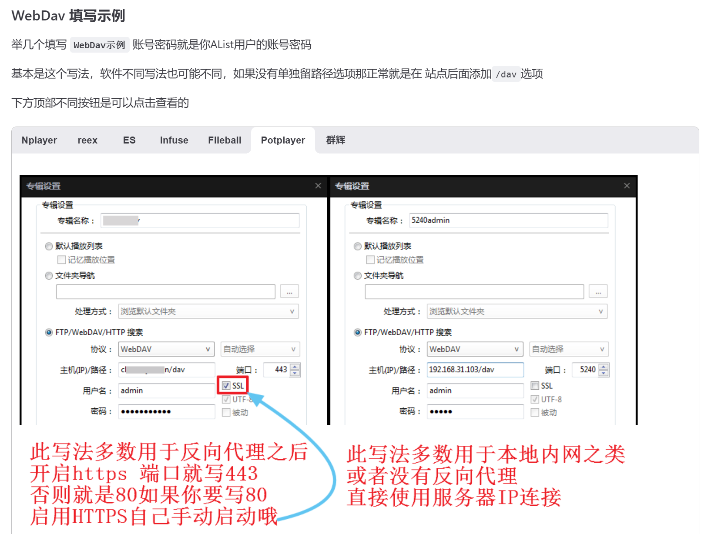
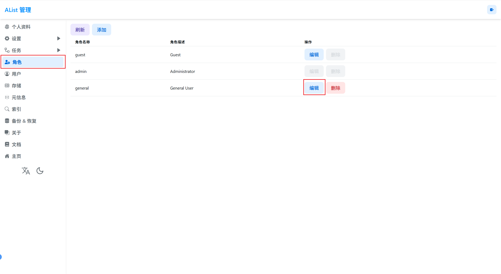
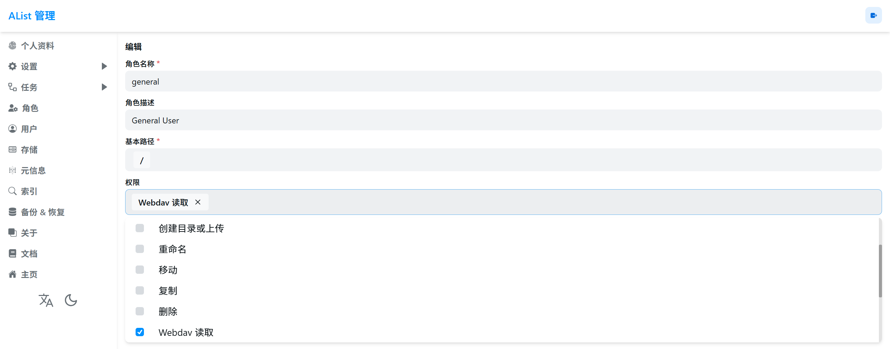
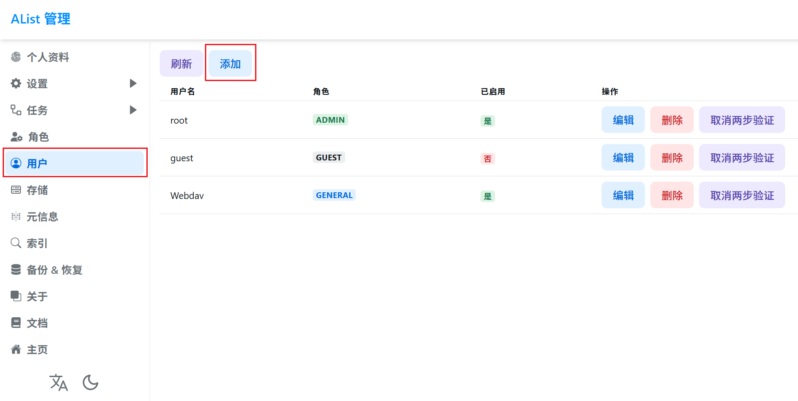
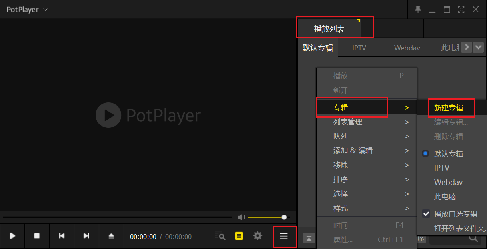
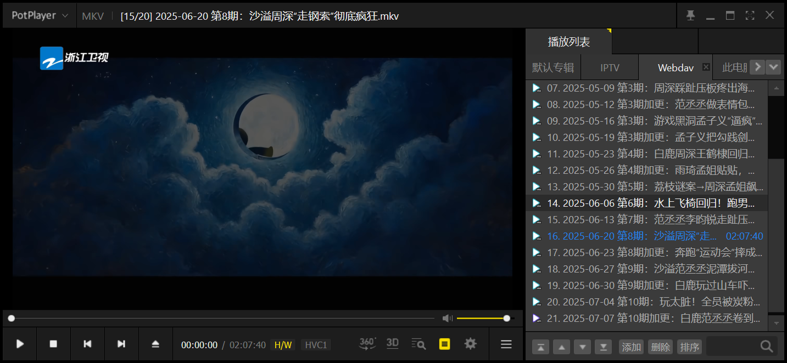

@[TOC]

## 一、Alist 介绍

`AList` 是一种使用 `Gin` 和 `Solidjs` 编写的可以挂载多个网盘的文件列表的开源程序，官方地址为：[https://alistgo.com/zh/](https://alistgo.com/zh/)

`AList` 支持在本地搭建 `WebDav` 服务，可以使局域网内的其他设备访问 `AList` 的文件列表，并播放和使用其中的内容。而 `WebDAV (Web-based Distributed Authoring and Versioning)` 是一种基于 `HTTP` 协议的扩展，它允许用户在网络上协同编辑和管理文件，就像在本地硬盘上操作一样。

而  `PotPlayer` 是 `Windows` 上优秀免费的视频播放器，其具有相当强大和丰富的功能，支持广泛的音视频编码格式。同时，`PotPlayer` 支持挂载 `Webdav` ，因此本文将详细介绍将 `AList` 搭建 `WebDav` 添加到 `PotPlayer` 专辑 的方法，官方教程如下：[https://alistgo.com/guide/webdav.html#webdav-fill-in-example](https://alistgo.com/zh/guide/webdav.html#%E5%8F%AF%E4%BB%A5%E7%94%A8%E6%9D%A5%E6%8C%82%E8%BD%BDwebdav%E7%9A%84%E8%BD%AF%E4%BB%B6)。

## 二、配置 Alist 的 Webdav

首先，`AList` 的 `WebDav` 功能默认是关闭的，我们需要先手动的将它打开。

### （一）进入管理页面

我们进入 `AList` 的 `Web` 端（即 `AListIP:端口`，端口默认为 `5244`），点击页面底下的 `管理` ，进入到 `AList` 的管理页面。

### （二）给 general 角色授予 Wedav 读取 权限

首先在 `AList` 的管理页面，点击 `角色`，点击 `general` 角色的 `编辑` 按钮，在接下来的界面中，编辑权限，勾选 `Wedav 读取` 权限。（也可以新建角色，用于精细化权限控制）

### （三）添加新用户

在 `AList` 的管理页面，点击 `用户` ，随后点 `添加`，在添加用户界面，设置用户名和密码，并将角色设置为具有 `Wedav 读取` 权限，即刚刚编辑的 `general` 的角色或添加的角色。

## 三、Potplayer 添加 Wedav 专辑

首先，打开 `播放列表`，在 `播放列表` 空白处右键打开菜单，点击 `专辑`，在点击新建专辑，打开 `专辑设置` 页面。

在 `专辑设置` 页面中，按以下方式进行填写：

- 勾选 `FTP/WebDAV/HTTP 搜索`
- 协议选择 `Webdav` 
- 主机(IP)/路径填写 `AListIP/dav`
- 端口填写 `Alist` 的端口，默认为 `5244`
- 用户名和密码填写之前配置好的

此时，即可播放 `Alist` 挂载的云盘中的视频

