@[toc]
## 一、问题背景
在一次 `Android` 开发中使用 `Seekbar` 时，发现会有一个默认的间距，通过尝试发现，需要设置
```xml
android:paddingStart="0dp"
android:paddingEnd="0dp"
```
之后，才可以将默认的间距才能去掉。而设置以下属性却对默认间距没有作用
```xml
android:paddingHorizontal="0dp"
android:paddingLeft="0dp"
android:paddingRight="0dp"
android:padding="0dp"
```
现象如下：
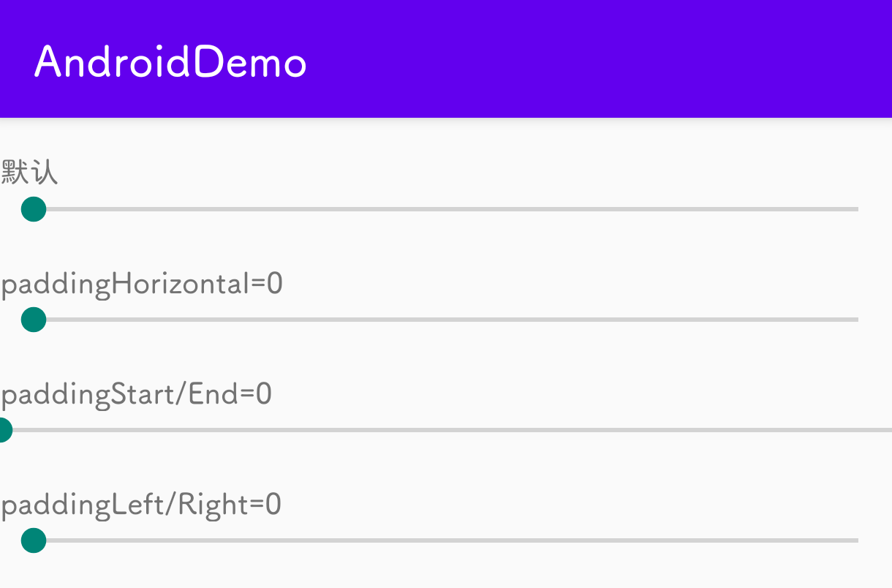

本文将调试Android源码探寻为什么一定需要设置 `paddingStart` 和 `paddingEnd` 才能去掉默认间距的原因。

## 二、问题原因
先直接说原因，**水平方向上的padding的优先级	`paddingStart/paddingEnd` > `paddingHorizontal` > `padding` > `paddingLeft/Right`**。而 `Seekbar` 使用的默认的 `Style` 中，设置了 `paddingStart` 和 `paddingEnd`，因此需要通过设置 `paddingStart/End` 才能去掉默认的间距。

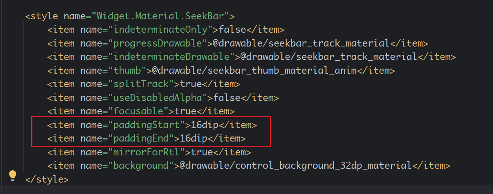

## 三、调试Android源码
以下是如何找到Style的过程：

### （一） 调试 onDraw() 方法
首先根据 `Android` 绘制流程，我们需要先查看 `onDraw()` 的方法，看具体是因为什么有间距。
我们先去看 `Seekbar` 类，发现没有 `onDraw()` 方法，我们继续看它的父类 `AbsAbsSeekBar` 类的 `onDraw()` 
```java
@Override
protected synchronized void onDraw(Canvas canvas) {
    super.onDraw(canvas);
    drawThumb(canvas);
}
```
可以看到，此方法做了两件事情，第一个事情是调用父类的 `onDraw()` 方法，已经调用本类绘制 滑块`thumb` 的方法 `drawThumb()`。`drawThumb()` 方法如下
```java
/**
 * Draw the thumb.
 */
@UnsupportedAppUsage(maxTargetSdk = Build.VERSION_CODES.R, trackingBug = 170729553)
void drawThumb(Canvas canvas) {
    if (mThumb != null) {
        final int saveCount = canvas.save();
        // Translate the padding. For the x, we need to allow the thumb to
        // draw in its extra space
        canvas.translate(mPaddingLeft - mThumbOffset, mPaddingTop);
        mThumb.draw(canvas);
        canvas.restoreToCount(saveCount);
    }
}
```
此段代码就是将画布先平移到指定位置，将 滑块`thumb` 的 `Drawable` 绘制出来。此指定位置是 `View` 的 `paddingLeft` 和 `paddingTop`，我们可以在这行代码添加一个断点，查看一下 `paddingLeft` 的值。

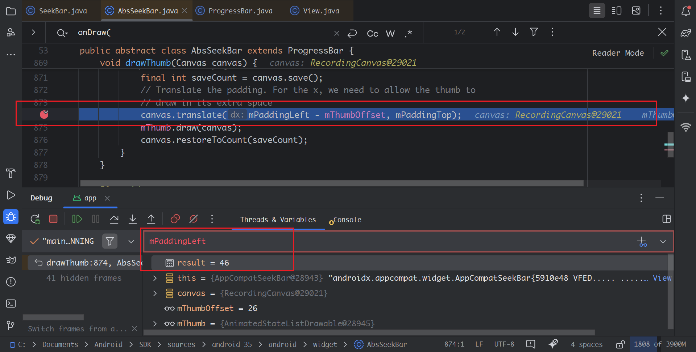

按调试的步骤之后，达到到此处的时候发现，`mPaddingLeft = 46`，因此在这之前是有地方设置了 `mPaddingLeft` 的值，导致了 滑块`thumb` 的位置从默认间距之后的位置开始绘制。

再往其父类 `ProgressBar` 的 `onDraw()` 的方法
```java
@Override
protected synchronized void onDraw(Canvas canvas) {
    super.onDraw(canvas);

    drawTrack(canvas);
}
```
可以看到这段代码是为了绘制 `Seekbar` 轨道 `track` 的方法，`drawTrack()` 的方法被 `AbsAbsSeekBar` 覆写了，因此直接看 `AbsAbsSeekBar` 的 `drawTrack()` 方法
```java
@Override
void drawTrack(Canvas canvas) {
    final Drawable thumbDrawable = mThumb;
    if (thumbDrawable != null && mSplitTrack) {
        final Insets insets = thumbDrawable.getOpticalInsets();
        final Rect tempRect = mTempRect;
        thumbDrawable.copyBounds(tempRect);
        tempRect.offset(mPaddingLeft - mThumbOffset, mPaddingTop);
        tempRect.left += insets.left;
        tempRect.right -= insets.right;

        final int saveCount = canvas.save();
        canvas.clipRect(tempRect, Op.DIFFERENCE);
        super.drawTrack(canvas);
        drawTickMarks(canvas);
        canvas.restoreToCount(saveCount);
    } else {
        super.drawTrack(canvas);
        drawTickMarks(canvas);
    }
}
```
由于此代码中 调用了 `super.drawTrack(canvas)` 方法，因此也需要看 `Seekbar` 的  `drawTrack()` 
```java
/**
 * Draws the progress bar track.
 */
void drawTrack(Canvas canvas) {
    final Drawable d = mCurrentDrawable;
    if (d != null) {
        // Translate canvas so a indeterminate circular progress bar with padding
        // rotates properly in its animation
        final int saveCount = canvas.save();

        if (isLayoutRtl() && mMirrorForRtl) {
            canvas.translate(getWidth() - mPaddingRight, mPaddingTop);
            canvas.scale(-1.0f, 1.0f);
        } else {
            canvas.translate(mPaddingLeft, mPaddingTop);
        }

        final long time = getDrawingTime();
        if (mHasAnimation) {
            mAnimation.getTransformation(time, mTransformation);
            final float scale = mTransformation.getAlpha();
            try {
                mInDrawing = true;
                d.setLevel((int) (scale * MAX_LEVEL));
            } finally {
                mInDrawing = false;
            }
            postInvalidateOnAnimation();
        }

        d.draw(canvas);
        canvas.restoreToCount(saveCount);

        if (mShouldStartAnimationDrawable && d instanceof Animatable) {
            ((Animatable) d).start();
            mShouldStartAnimationDrawable = false;
        }
    }
}
```
这两段代码中，也是设置了画布的位置，在指定地方开始绘制轨道 `Track` 和 `TickeMark`，这里有两句是与 `padding` 有关的
`tempRect.offset(mPaddingLeft - mThumbOffset, mPaddingTop);`
`canvas.translate(mPaddingLeft, mPaddingTop);`

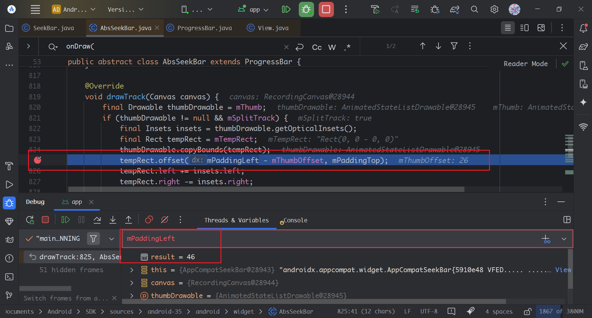
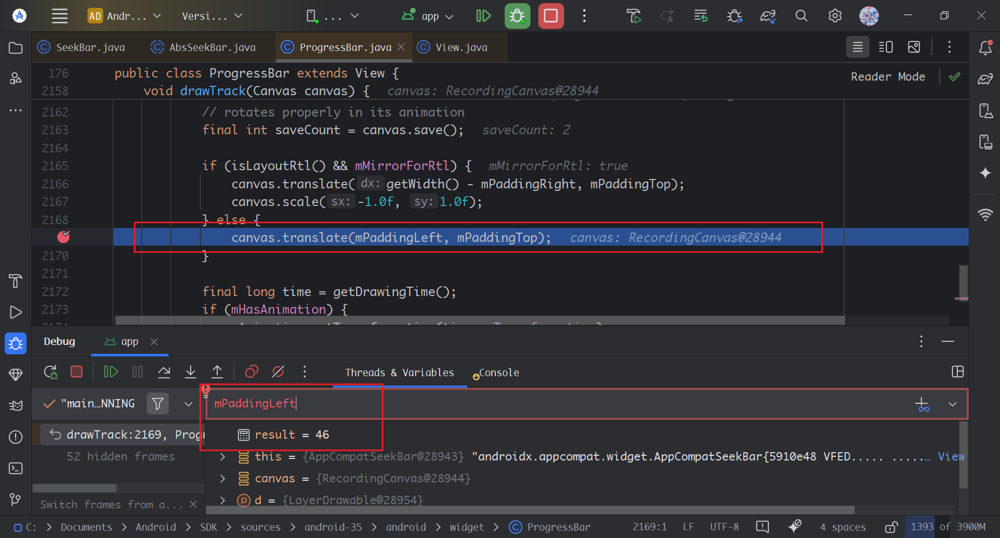

因此从以上的分析中，需要分析 `mPaddingLeft ` 是从什么时候被赋值成了 `46`

### （二） 调试 mPaddingLeft 赋值的地方
在 `SeekBar`、`AbsSeekBar`、`ProgressBar` 的源码中搜索 `mPaddingLeft  =` 寻找 `mPaddingLeft` 赋值的地方，但是可以发现， `SeekBar`、`AbsSeekBar`、`ProgressBar` 这三个类中没有进行赋值，因此需要从其的基类 `View` 中寻找 `mPaddingLeft ` 赋值的地方。

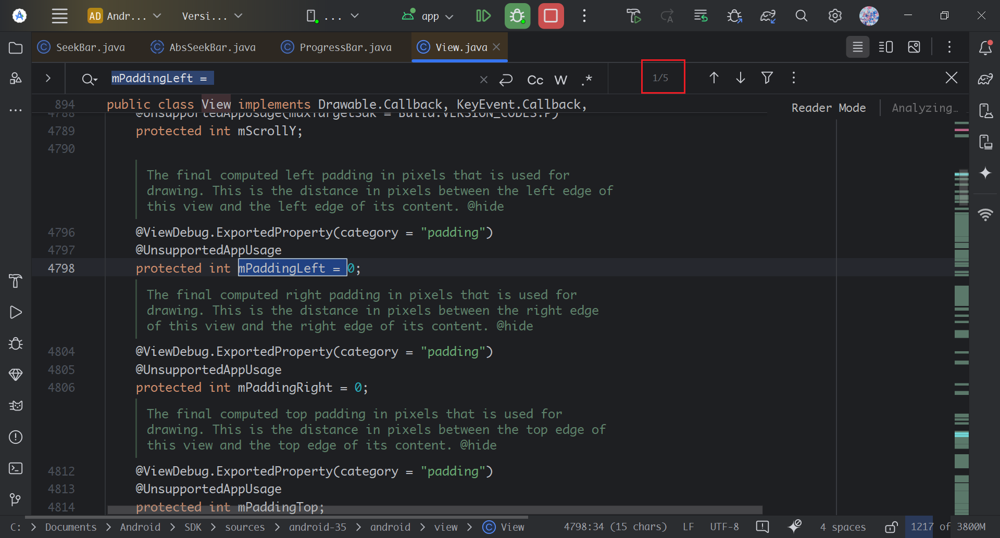
搜索源码发现有五个调用，除开初始化的地方，总共有四个赋值的地方，因此需要调试这四个赋值的地方。
第一个赋值的地方在 `internalSetPadding()` 方法
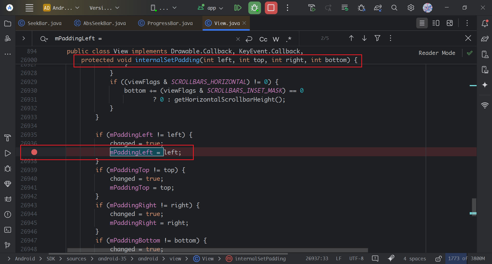

另外三个赋值在`resetPaddingToInitialValues()`方法中
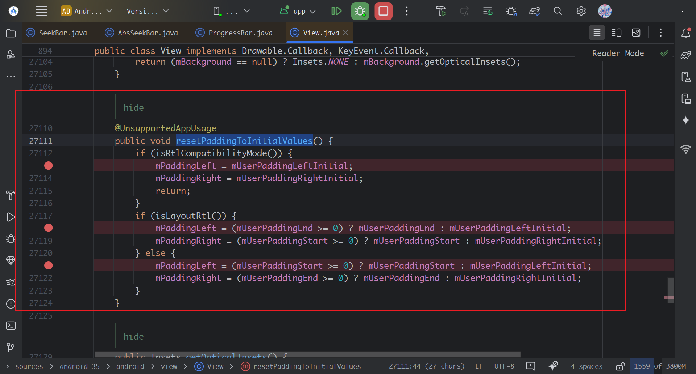
由于所有`View`都是继承自`View`类，所以如果调试View类的时候，所有 `View` 都会被打断，因此在调试的需要加上条件，只有是 `Seekbar` 类时才停下来进行分析。
右键断点可以在 `Condition` 中添加 `this instanceof SeekBar`，实现只有是 `Seekbar` 类才断点。
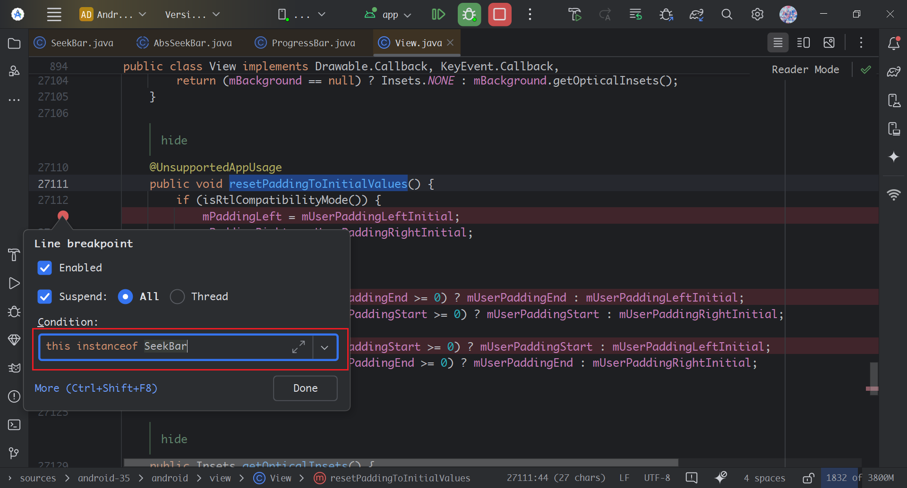

可以发现，第一次 `mPaddingLeft` 第一次赋值的地方是在 `resetPaddingInitalValue`，语句是 `mPaddingLeft = (mUserPaddingEnd >= 0) ? mUserPaddingEnd : mUserPaddingLeftInitial;`, 也就是说，如果`mUserPaddingEnd` >=0 的时候，使用`mUserPaddingEnd`，< 0 的时候，使用 `mUserPaddingLeftInitial`
在调试过程中发现，`mUserPaddingEnd = 46, mUserPaddingStart = 46, mUserPaddingLeftInitial = 0`。
需要往上分析第一次调用`resetPaddingInitalValue`的地方，以及 `mUserPaddingEnd, mUserPaddingStart` 赋值的地方。
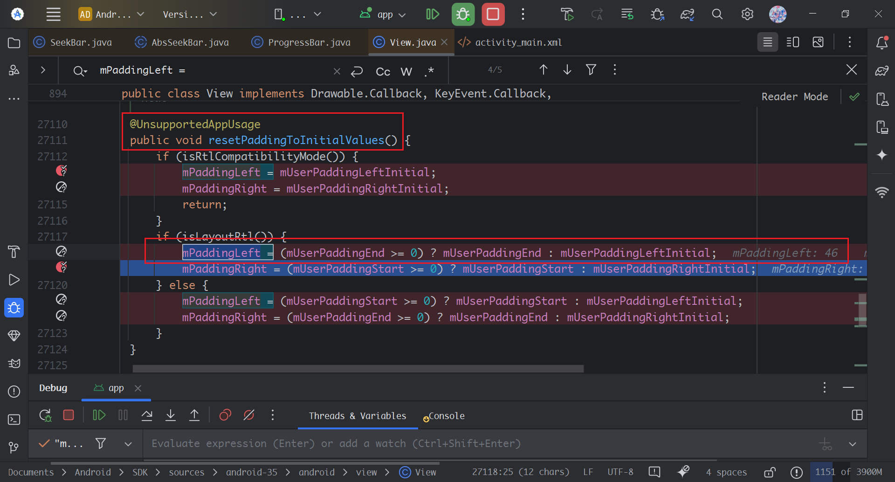
但是从代码中没有直接找到调用 `resetPaddingInitalValue` 的地方，从方法名中可以知道是将Padding reset 回初始值。因此调用此方法之后，会设置padding，因此需要分析 `mUserPaddingEnd, mUserPaddingStart` 赋值的地方。

### （三）分析 mUserPaddingStart mUserPaddingEnd 赋值的地方
在View中搜索 `mUserPaddingStart = `，寻找 `mUserPaddingStart` 和 `mUserPaddingEnd`赋值的地方。（从以上分析 `mUserPaddingStart` 与 `mUserPaddingEnd` 是相同的，只要分析其中一个就可以了）
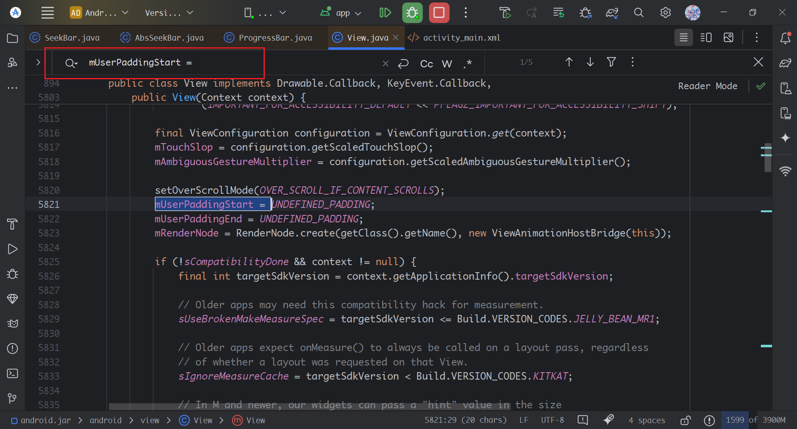
总共搜索出五个地方赋值，与前面一样添加断点，并添加条件，只有是 `Seekbar` 类才断点。

第一次赋值是在View的构造方法中， `mUserPaddingStart = UNDEFINED_PADDING`，先将 `mUserPaddingStart` 赋值为初始化，这个值是 `Integer.MIN_VALUE`。
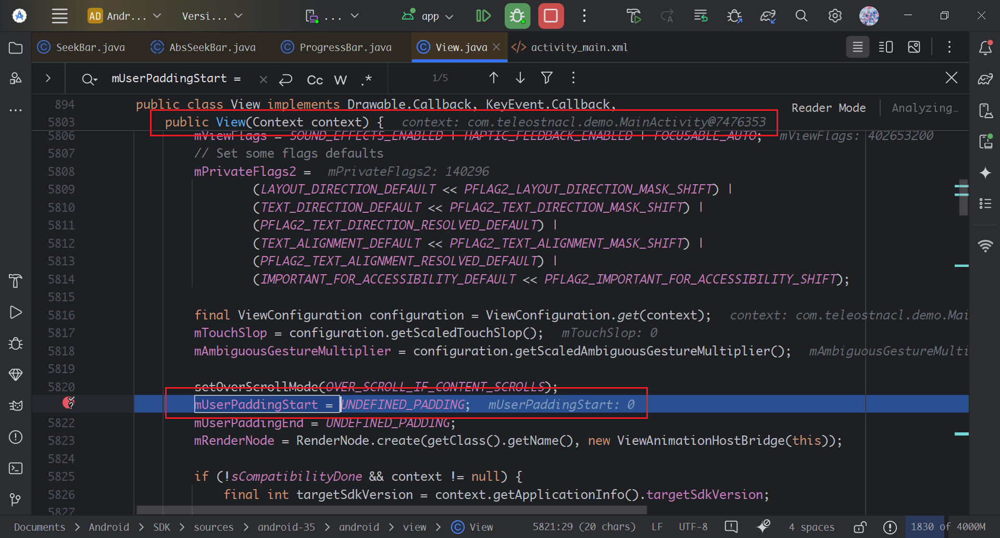
到这一步之后，我们可以看构造方法，`mUserPaddingStart` 的赋值过程。
第二个赋值语句是这句 `mUserPaddingStart = startPadding;`，在` public View(Context context, @Nullable AttributeSet attrs, int defStyleAttr, int defStyleRes)` 的构造方法中。对该赋值语句往上分析，寻找 `startPadding` 赋值的地方。
```java
final int N = a.getIndexCount();
for (int i = 0; i < N; i++) {
    int attr = a.getIndex(i);
    switch (attr) {
    	...
        case com.android.internal.R.styleable.View_padding:
            padding = a.getDimensionPixelSize(attr, -1);
            mUserPaddingLeftInitial = padding;
            mUserPaddingRightInitial = padding;
            leftPaddingDefined = true;
            rightPaddingDefined = true;
            break;
        case com.android.internal.R.styleable.View_paddingHorizontal:
            paddingHorizontal = a.getDimensionPixelSize(attr, -1);
            mUserPaddingLeftInitial = paddingHorizontal;
            mUserPaddingRightInitial = paddingHorizontal;
            leftPaddingDefined = true;
            rightPaddingDefined = true;
            break;
        ...
        case com.android.internal.R.styleable.View_paddingLeft:
            leftPadding = a.getDimensionPixelSize(attr, -1);
            mUserPaddingLeftInitial = leftPadding;
            leftPaddingDefined = true;
            break;
        case com.android.internal.R.styleable.View_paddingTop:
            topPadding = a.getDimensionPixelSize(attr, -1);
            break;
        case com.android.internal.R.styleable.View_paddingRight:
            rightPadding = a.getDimensionPixelSize(attr, -1);
            mUserPaddingRightInitial = rightPadding;
            rightPaddingDefined = true;
            break;
        case com.android.internal.R.styleable.View_paddingBottom:
            bottomPadding = a.getDimensionPixelSize(attr, -1);
            break;
        case com.android.internal.R.styleable.View_paddingStart:
            startPadding = a.getDimensionPixelSize(attr, UNDEFINED_PADDING);
            startPaddingDefined = (startPadding != UNDEFINED_PADDING);
            break;
        case com.android.internal.R.styleable.View_paddingEnd:
            endPadding = a.getDimensionPixelSize(attr, UNDEFINED_PADDING);
            endPaddingDefined = (endPadding != UNDEFINED_PADDING);
            break;
        ...
    }
}
```
因此，从这段取 `attr` 的语句中，可以清晰的看到取各个padding的过程。
如果指定了 `padding` / `paddingHorizontal` / `paddingLeft` / `paddingRight` 属性的时候，`mUserPaddingLeftInitial` 和 `mUserPaddingRightInitial` 将被赋值，并置 `leftPaddingDefined` 和 `rightPaddingDefined` 标记为true，则表示设置了左右的 `padding`
而设置了 `paddingStart` 和 `paddingEnd` 的时候，`startPadding` 和 `endPadding` 将被赋值，并置`startPaddingDefined` 和 `endPaddingDefined` 标记为true，则表示设置了 `start` 和 `end` 的 `padding`

继续往下走，可以看到padding的分发：
```java
// Cache start/end user padding as we cannot fully resolve padding here (we don't have yet
// the resolved layout direction). Those cached values will be used later during padding
// resolution.
mUserPaddingStart = startPadding;
mUserPaddingEnd = endPadding;
...
// setBackground above will record that padding is currently provided by the background.
// If we have padding specified via xml, record that here instead and use it.
mLeftPaddingDefined = leftPaddingDefined;
mRightPaddingDefined = rightPaddingDefined;

// Valid paddingHorizontal/paddingVertical beats leftPadding, rightPadding, topPadding,
// bottomPadding, and padding set by background.  Valid padding beats everything.
if (padding >= 0) {
    leftPadding = padding;
    topPadding = padding;
    rightPadding = padding;
    bottomPadding = padding;
    mUserPaddingLeftInitial = padding;
    mUserPaddingRightInitial = padding;
} else {
    if (paddingHorizontal >= 0) {
        leftPadding = paddingHorizontal;
        rightPadding = paddingHorizontal;
        mUserPaddingLeftInitial = paddingHorizontal;
        mUserPaddingRightInitial = paddingHorizontal;
    }
    if (paddingVertical >= 0) {
        topPadding = paddingVertical;
        bottomPadding = paddingVertical;
    }
}

if (isRtlCompatibilityMode()) {
    // RTL compatibility mode: pre Jelly Bean MR1 case OR no RTL support case.
    // left / right padding are used if defined (meaning here nothing to do). If they are not
    // defined and start / end padding are defined (e.g. in Frameworks resources), then we use
    // start / end and resolve them as left / right (layout direction is not taken into account).
    // Padding from the background drawable is stored at this point in mUserPaddingLeftInitial
    // and mUserPaddingRightInitial) so drawable padding will be used as ultimate default if
    // defined.
    if (!mLeftPaddingDefined && startPaddingDefined) {
        leftPadding = startPadding;
    }
    mUserPaddingLeftInitial = (leftPadding >= 0) ? leftPadding : mUserPaddingLeftInitial;
    if (!mRightPaddingDefined && endPaddingDefined) {
        rightPadding = endPadding;
    }
    mUserPaddingRightInitial = (rightPadding >= 0) ? rightPadding : mUserPaddingRightInitial;
} else {
    // Jelly Bean MR1 and after case: if start/end defined, they will override any left/right
    // values defined. Otherwise, left /right values are used.
    // Padding from the background drawable is stored at this point in mUserPaddingLeftInitial
    // and mUserPaddingRightInitial) so drawable padding will be used as ultimate default if
    // defined.
    final boolean hasRelativePadding = startPaddingDefined || endPaddingDefined;

    if (mLeftPaddingDefined && !hasRelativePadding) {
        mUserPaddingLeftInitial = leftPadding;
    }
    if (mRightPaddingDefined && !hasRelativePadding) {
        mUserPaddingRightInitial = rightPadding;
    }
}

// mPaddingTop and mPaddingBottom may have been set by setBackground(Drawable) so must pass
// them on if topPadding or bottomPadding are not valid.
internalSetPadding(
        mUserPaddingLeftInitial,
        topPadding >= 0 ? topPadding : mPaddingTop,
        mUserPaddingRightInitial,
        bottomPadding >= 0 ? bottomPadding : mPaddingBottom);
```

第一段，如果设置了 `padding` 的时候，所有方向的padding都将赋值这个。
```java
if (padding >= 0) {
    leftPadding = padding;
    topPadding = padding;
    rightPadding = padding;
    bottomPadding = padding;
    mUserPaddingLeftInitial = padding;
    mUserPaddingRightInitial = padding;
} 
```

第二段，没有设置 `padding` 的时候，如果设置了 `paddingHorizontal`，则将 `mUserPaddingLeftInitial` 和 `mUserPaddingRightInitial`，指定了左右 `padding`
```java
else {
    if (paddingHorizontal >= 0) {
        leftPadding = paddingHorizontal;
        rightPadding = paddingHorizontal;
        mUserPaddingLeftInitial = paddingHorizontal;
        mUserPaddingRightInitial = paddingHorizontal;
    }
    if (paddingVertical >= 0) {
        topPadding = paddingVertical;
        bottomPadding = paddingVertical;
    }
}
```

下一段逻辑是处理RTL适配的情况，即如果RTL下，将左右padding置反。如果设置了 `paddingStart` 和 `paddingEnd`，则将 `leftPadding` 和 `rightPadding` 置为 `paddingStart` 和 `paddingEnd`，且会覆盖之前的设置的。
```java
if (isRtlCompatibilityMode()) {
    // RTL compatibility mode: pre Jelly Bean MR1 case OR no RTL support case.
    // left / right padding are used if defined (meaning here nothing to do). If they are not
    // defined and start / end padding are defined (e.g. in Frameworks resources), then we use
    // start / end and resolve them as left / right (layout direction is not taken into account).
    // Padding from the background drawable is stored at this point in mUserPaddingLeftInitial
    // and mUserPaddingRightInitial) so drawable padding will be used as ultimate default if
    // defined.
    if (!mLeftPaddingDefined && startPaddingDefined) {
        leftPadding = startPadding;
    }
    mUserPaddingLeftInitial = (leftPadding >= 0) ? leftPadding : mUserPaddingLeftInitial;
    if (!mRightPaddingDefined && endPaddingDefined) {
        rightPadding = endPadding;
    }
    mUserPaddingRightInitial = (rightPadding >= 0) ? rightPadding : mUserPaddingRightInitial;
} else {
    // Jelly Bean MR1 and after case: if start/end defined, they will override any left/right
    // values defined. Otherwise, left /right values are used.
    // Padding from the background drawable is stored at this point in mUserPaddingLeftInitial
    // and mUserPaddingRightInitial) so drawable padding will be used as ultimate default if
    // defined.
    final boolean hasRelativePadding = startPaddingDefined || endPaddingDefined;

    if (mLeftPaddingDefined && !hasRelativePadding) {
        mUserPaddingLeftInitial = leftPadding;
    }
    if (mRightPaddingDefined && !hasRelativePadding) {
        mUserPaddingRightInitial = rightPadding;
    }
}
```

最后一段逻辑是调用 `internalSetPadding()`方法设置 `padding`，方法中会赋值 `mPaddingLeft` 和 `mPaddingRight`
```java
/**
 * @hide
 */
@UnsupportedAppUsage(maxTargetSdk = Build.VERSION_CODES.P, trackingBug = 123768420)
protected void internalSetPadding(int left, int top, int right, int bottom) {
    mUserPaddingLeft = left;
    mUserPaddingRight = right;
    mUserPaddingBottom = bottom;

    final int viewFlags = mViewFlags;
    boolean changed = false;

    // Common case is there are no scroll bars.
    if ((viewFlags & (SCROLLBARS_VERTICAL|SCROLLBARS_HORIZONTAL)) != 0) {
        if ((viewFlags & SCROLLBARS_VERTICAL) != 0) {
            final int offset = (viewFlags & SCROLLBARS_INSET_MASK) == 0
                    ? 0 : getVerticalScrollbarWidth();
            switch (mVerticalScrollbarPosition) {
                case SCROLLBAR_POSITION_DEFAULT:
                    if (isLayoutRtl()) {
                        left += offset;
                    } else {
                        right += offset;
                    }
                    break;
                case SCROLLBAR_POSITION_RIGHT:
                    right += offset;
                    break;
                case SCROLLBAR_POSITION_LEFT:
                    left += offset;
                    break;
            }
        }
        if ((viewFlags & SCROLLBARS_HORIZONTAL) != 0) {
            bottom += (viewFlags & SCROLLBARS_INSET_MASK) == 0
                    ? 0 : getHorizontalScrollbarHeight();
        }
    }

    if (mPaddingLeft != left) {
        changed = true;
        mPaddingLeft = left;
    }
    if (mPaddingTop != top) {
        changed = true;
        mPaddingTop = top;
    }
    if (mPaddingRight != right) {
        changed = true;
        mPaddingRight = right;
    }
    if (mPaddingBottom != bottom) {
        changed = true;
        mPaddingBottom = bottom;
    }

    if (changed) {
        requestLayout();
        invalidateOutline();
    }
}
```

所以结合之前的语句，`mPaddingLeft = (mUserPaddingEnd >= 0) ? mUserPaddingEnd : mUserPaddingLeftInitial;`, 也就是说，如果`mUserPaddingEnd` >=0 的时候，使用`mUserPaddingEnd`，< 0 的时候，使用 `mUserPaddingLeftInitial`，因此

**水平方向上的padding的优先级	`paddingStart/paddingEnd` > `paddingHorizontal` > `padding` > `paddingLeft/Right`**。**因此这个优先级就可以解释了为什么一定需要设置 `paddingStart` 和 `paddingEnd` 才能去掉默认间距的原因**

### （四）Seekbar的默认Style
以上分析可以知道是由于有 `paddingStart` 和 `paddindEnd` 导致的，因此需要从`Seekbar`默认`Style`去分析，从`Seekbar`的构造源码知道style名称为`seekBarStyle`
```java
public SeekBar(Context context, AttributeSet attrs) {
    this(context, attrs, com.android.internal.R.attr.seekBarStyle);
}
```

全局搜索 `seekBarStyle`，并一层一层往下跳，找到最底层的`style`
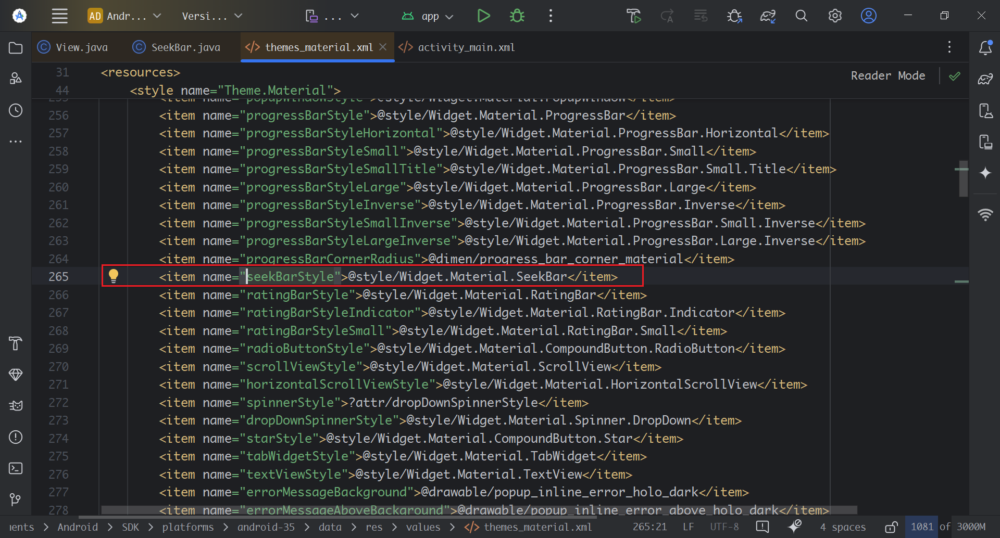
得到如下style
```xml
<style name="Widget.Material.SeekBar">
    <item name="indeterminateOnly">false</item>
    <item name="progressDrawable">@drawable/seekbar_track_material</item>
    <item name="indeterminateDrawable">@drawable/seekbar_track_material</item>
    <item name="thumb">@drawable/seekbar_thumb_material_anim</item>
    <item name="splitTrack">true</item>
    <item name="useDisabledAlpha">false</item>
    <item name="focusable">true</item>
    <item name="paddingStart">16dip</item>
    <item name="paddingEnd">16dip</item>
    <item name="mirrorForRtl">true</item>
    <item name="background">@drawable/control_background_32dp_material</item>
</style>
```

从这个Style中可以得到
```xml
<item name="paddingStart">16dip</item>
<item name="paddingEnd">16dip</item>
```

至此可以得到问题的原因：即是在默认的`Style`中就是定义了 `paddingStart` 和 `paddingEnd`

害 也不明白谷歌为什么要这样设计！
