> 原文链接：https://blog.csdn.net/TeleostNaCl/article/details/155825641
> 发布时间：2025-12-11 22:52:01
> 标签：经验分享、职场和发展、笔记

---

#### 文章目录

- [一、软考介绍](#_1)
- [二、考试内容](#_17)
- [三、考试形式](#_34)
- - [1. 考试报名](#1__63)
  - [2. 打印准考证](#2__85)
  - [3. 参加考试](#3__88)
  - [4. 成绩查询](#4__94)
  - [5. 领取证书](#5__96)
- [四、参考资料](#_99)
- - [1. 参考书籍](#1__100)
  - [2. 软考视频](#2__127)
  - [3. 速记笔记](#3__132)
- [五、备考指南](#_134)
- - [第一阶段 基础阶段（考前四个月 - 考前一个月）](#____142)
  - [第二阶段 强化阶段（考前四周 - 考前两周）](#____152)
  - [第三阶段 真题阶段 （考前两周）](#___157)
- [六、考试技巧](#_162)
- [七、结语](#_173)

## 一、软考介绍

<https://www.ruankao.org.cn/introduction/main.html>

软考的全称为 计算机技术与软件专业技术资格（水平）考试，是获得全国专业技术人员职业资格证书的一类考试，其分为 **初级、中级、高级** 三类证书，分别对应计算机行业的不同岗位需要。  
 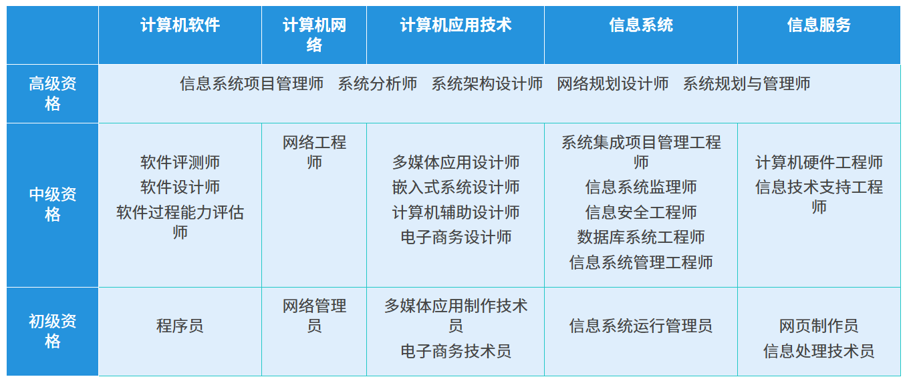

其报考流程一般如下：  
 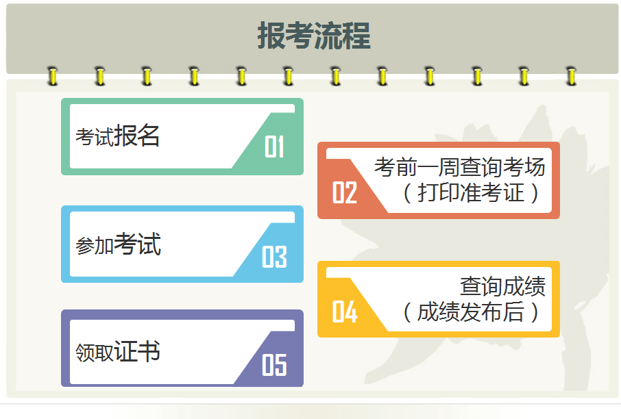

而本文介绍的 **软件设计师** 属于软考中级的一个类型，其对程序员来说具有较高的认可度，难度也是适中的一门考试。

对于我们工作了几年之后，有些知识已经有所遗漏，通过参加软考的考试也有助于重新学习计算机相关知识，也会在工作中带来有所帮助。

同时，软考证书是职业资格证书，可以在用于取得证书的当年进行抵扣个税，也算是一笔小钱钱了。

## 二、考试内容

参考软件设计师考试说明：<https://www.ruankao.org.cn/article/content/bkzn/02_15.html>

总结有以下的考点，基本涵盖大学计软相关专业的所有的与计算机有关的科目

1. 掌握数据表示、算术和逻辑运算；
2. 掌握相关的应用数学、离散数学的基础知识；
3. 掌握计算机体系结构以及各主要部件的性能和基本工作原理；
4. 掌握操作系统、程序设计语言的基础知识，了解编译程序的基本知识；
5. 熟练掌握常用数据结构和常用算法；
6. 熟悉数据库、网络和多媒体的基础知识；
7. 掌握C程序设计语言，以及C++、Java、Visual Basic、Visual C++中的一种程序设计语言；
8. 熟悉软件工程、软件过程改进和软件开发项目管理的基础知识；
9. 熟练掌握软件设计的方法和技术；
10. 掌握常用信息技术标准、安全性，以及有关法律、法规的基本知识；
11. 了解信息化、计算机应用的基础知识；
12. 正确阅读和理解计算机领域的英文资料。

## 三、考试形式

<https://rsks.gd.gov.cn/zwgk/gzdt/content/post_4682987.html>

1. 软考每年分为上半年、下半年的考试，每次考试的科目各不相同。但 软考中级-软件设计师 的考试每次都有。  
    一般上半年在 3 月份报名，在 5 月分考试；下半年在 8 月报名，在 11 月份考试。  
    可参考 2025 年的安排：  
    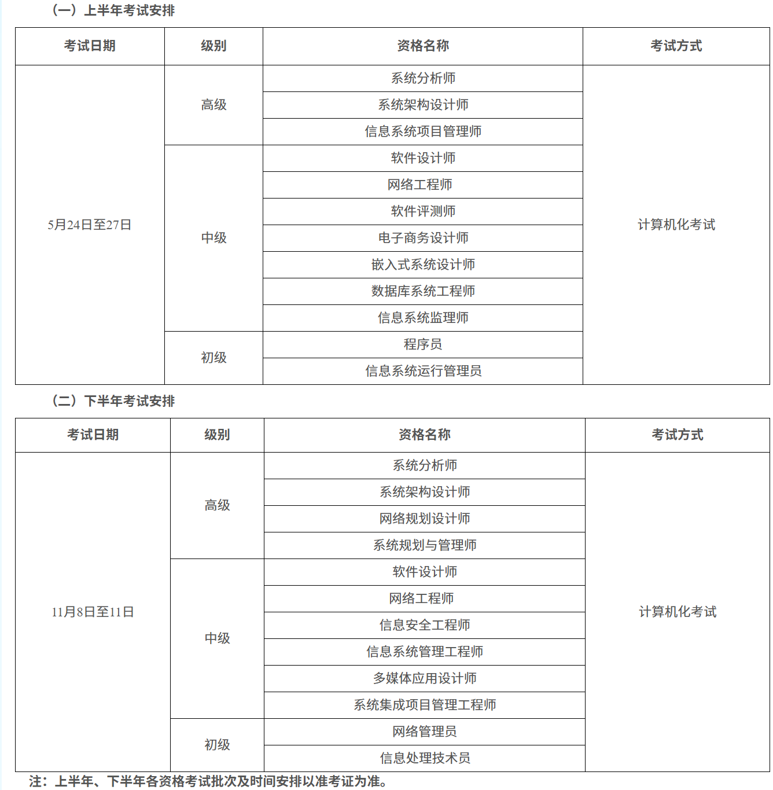  
    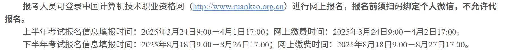
2. 现阶段，软考采用无纸化**机考**模式，全程在电脑上答题。  
    软件设计师考试分为 **基础知识** 和 **应用技术** 两个科目，每个科目可用时长为 **2** 个小时，且两科目**连考**，每科允许提前半小时交卷，当前科目交卷之后，才能考下一门科目。考试总时长为 **240** 分钟（**4** 个小时，**14:30 - 18:30**），中间无休息。  
    各科目总分都为 **75** 分，需要各科目的成绩达到 **45** 分以上，方可通过考试，取得 软件设计师 的证书。
3. 软件设计师 基础知识 考试形式为 **75** 道选择题，每题 **1** 分，其中:  
    **67** 道选择题为 软件设计师教程 中的知识点  
    **3** 道选择题为 Python 相关的基础知识  
    **5** 道与计算机相关的英语完型填空题
4. 软件设计师 应用技术 考试形式为 **4** 道简答题 + **1** 道二选一的简答题，每题 **15** 分，其中:  
    第一题为考察 **数据流图（DFD）** 的相关知识  
    第二题为考察 **数据库** 的相关知识  
    第三题为考察 **面向对象设计（UML）** 的相关知识  
    第四题为考察 **算法** 的相关知识  
    二选一的选做题为考察 **面向对象语言**，题目为补全代码的形式，题干完全一致，只是分别是用 **C++** 或 **Java** 语言进行作答。

四、报考流程

### 1. 考试报名

首先，认准软考的官网：<https://www.ruankao.org.cn/index.html>，在其官网的页面，会有一个 工作动态的栏目，这里面有所有关于软考的第一手资料，仔细阅读上面的资料，可以迅速掌握当年考试的安排以及相关报名流程。  
 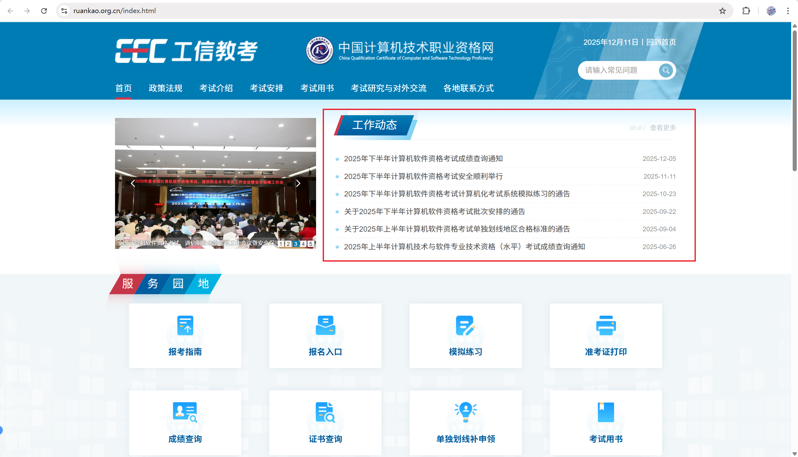

例如，从 2025 年的考试报考须知 <https://rsks.gd.gov.cn/zwgk/gzdt/content/post_4682987.html> 我们可以知道，

上半年考试报名信息填报时间：**2025年3月24日9:00－4月1日17:00**；网上缴费时间：**2025年3月24日9:00－4月2日17:00**；考试时间是 **5月24日至27日**

下半年考试报名信息填报时间：**2025年8月18日9:00－8月26日17:00**；网上缴费时间：**2025年8月18日9:00－8月27日17:00**，考试时间是 **11月8日至11日**

知道以上信息之后，我们就可以在规定报名时间，点击报名入口，跳转到报名的网页：<https://bm.ruankao.org.cn/sign/welcome>，随后选择所在省份进行报名。  
 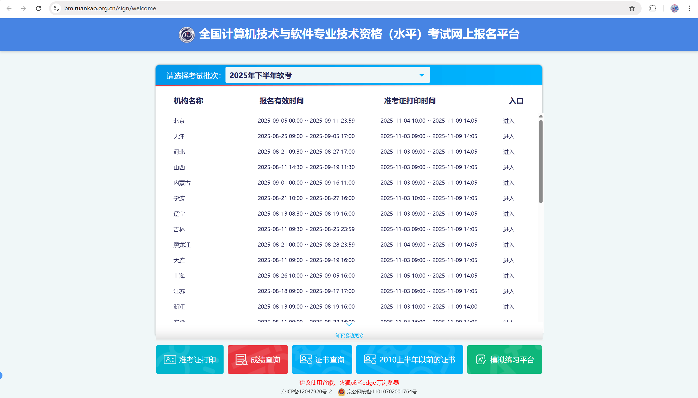

随后，首次进行登录注册，需要 使用 **国家网络身份认证APP** 进行认证登录，如果是首次使用 使用 国家网络身份认证APP 则需要一台支持 **NFC** 的手机申领网络身份认证。  
 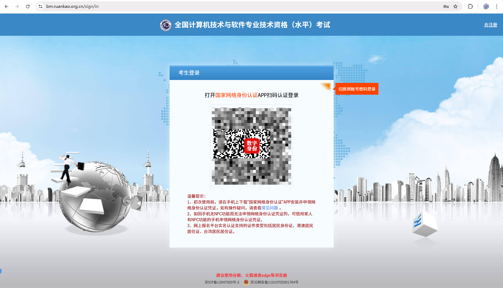

当登录成功之后，就可以进行报名并如实填写相关的信息。请注意选择正确的 报考级别 和 报考资格，同时通讯地址可能会作为考场分配的依据，如实填写可以分配到较近的考场。

> 广东这边每科目 **73** 元，考试费用是总共 **146** 元。

### 2. 打印准考证

当在考试前一周的时候，系统将开放 **打印准考证**：<https://bm.ruankao.org.cn/report/print>，此时可以知道自己具体考场和座位号以及详细的考试时间，此时需要及时打印准考证，避免错过了时间。

### 3. 参加考试

考试当天到达指定地点参加考试，遵循各考场的规则进入考场即可，一般考场会设立在职校中。

同时请注意，考场只允许携带 **一支笔** 和 **准考证** 和 **身份证** 进入考场，也允许携带**一瓶水**，其它物品不允许带入考场。

考试期间会发放草稿纸，准考证上**不允许有任何标记**，在考完试后，监考老师还会再次检查准考证。

### 4. 成绩查询

一般在考试结束后的一个月会发放成绩，可以登录到系统中查询成绩：<https://bm.ruankao.org.cn/report/query>，各科目成绩在45分以上即为合格。

### 5. 领取证书

一般在成绩公布的一个月后，可以领取相关证书以及下载电子证书，可在中国人事考试网（<http://www.cpta.com.cn/>）的 “**证书查询验证**” 栏目查询资格证书办理进度及验证证书信息。  
 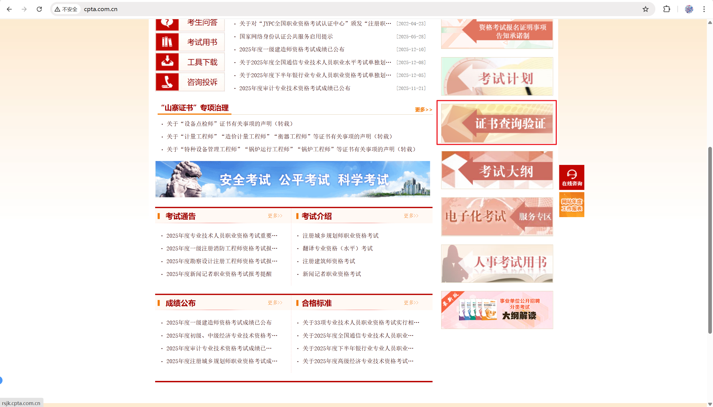

## 四、参考资料

### 1. 参考书籍

软考设计师（软考中级）参考资料：  
 链接: <https://pan.baidu.com/s/53XxMfKtAZd2BATskQyN4yw>

包括以下书籍的：

- `软件设计师考试同步辅导 (上午科目)(第四版) (王华).pdf`
- `软件设计师考试同步辅导(下午科目)(第四版) (谢瑜,周胜)pdf`
- `软件设计师考试同步辅导——考点串讲、真题详解与强化训练.pdf`
- `软件设计师教程（第5版） (褚华、霍秋艳) pdf`
- `软件设计师考试32小时通关 (薛大龙).pdf`
- `软件设计师考试冲刺 习题与解答Software Arc.pdf`
- `软件设计师考试大纲 (2018) (全国计算机专业技术).pdf`

---

推荐在闲鱼买实体书

- `软件设计师教程（第5版） (褚华、霍秋艳)`  
   备考必备书籍, 通读一遍之后, 基本可以掌握所有的知识考点  
   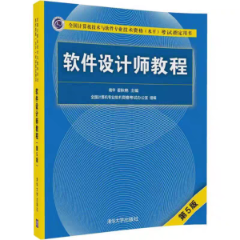
- `软件设计师 真题解析与命题密卷`  
   近5年的软考真题汇总 用来练习手感 掌握出题的方向 总共有10套真题, 1道押题卷. 建议放到备考后期冲刺使用, 毕竟 真题做一题就少一题  
   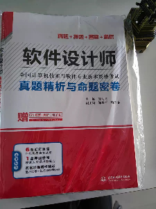
- `软件设计师5天修炼`、`软件设计师32小时通关`  
   这两本质量欠佳, 但可以作为读完一遍软件设计师教程之后, 及时的复习一遍.  
   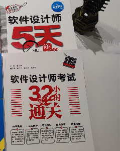

### 2. 软考视频

- 【【2025软考中级-软件设计师】基础阶段|考点理论精讲【已完结】-哔哩哔哩】 <https://b23.tv/OTMdkYd>
- 【【2025软考中级-软件设计师备考】强化阶段 | 题型详解-哔哩哔哩】 <https://b23.tv/zq0kiGS>

第一个考点理论精讲视频适合在备考前期看, 并辅以阅读软件设计师教程, 第二个题型详解适合在备考后期看.

### 3. 速记笔记

软件设计师（软考中级）公式速记笔记：<https://blog.csdn.net/TeleostNaCl/article/details/154876437>

## 五、备考指南

软件设计师在软考中级考试里面是难度较大的一个考试，原因是其涉及面很广，考的知识点多而散，几乎涉及到了计软专业全部科目。

但是既然其考的很广，那么其考的就不会很深，基本上考的也只是一些基本常规的知识点，并且也是在工作中会经常用到的内容。

因此，只要备考充分，对于程序员来说还是比较轻松地获得这个证书的。以下是我的备考经验。

可以将备考分为三个阶段：

### 第一阶段 基础阶段（考前四个月 - 考前一个月）

第一阶段是打基础的阶段，这个时候主要以 软件设计师教程 的课本为主，辅以 考点理论精讲 的视频，以及 软件设计师5天修炼 和 软件设计师32小时通关 的配合，这个阶段就是啃书，把书上讲的知识点慢慢吃透。

软件设计师教程全书总共有 **12** 个章节，可分为 **12** 周逐一击破，刚好三个月可以读完这本书籍。

我采用的策略是，首先读一遍 **软件设计师教程** 的一个章节，然后再读一遍 软件设计师5天修炼 和 软件设计师32小时通关相关的章节，起到一个复习的作用，最后再看 考点理论精讲 中相关章节的视频，这样一套下来，基本上对这个章节有了 **70%** 的掌握。

这个阶段耗时相对较长，而且几乎需要每晚都要花上时间去静下心来阅读章节，有时候也会堆到周末才能补完。因此，如果每天的时间不够充裕，则可以提前一两个月进行备考。

同时，因为考试中增加了 Python 相关的内容，在这个阶段也可以提前了解一些 Python 的基础知识。（我在这里是比较吃亏，Python 的三道题都没有把握选出来）

### 第二阶段 强化阶段（考前四周 - 考前两周）

当第一阶段看完教程之后，此时距离备考也比较近了，这个时候时间比较紧张，需要以刷题为主了，因此在这个阶段会先看完 题型详解 的视频，了解每一章节的出题规律和掌握每种题型的做题技巧。

但是 题型详解 的视频只有选择题和部分大题，没有所有大题的答题方法，因此，如果觉得不够看的话，可以再去找一些视频来观看，以提高自己的准确率。

### 第三阶段 真题阶段 （考前两周）

当第二阶段看完视频之后，已经对题型和做题技巧有了了解，但是光说不练是假把戏，因此我们这个阶段就要进入实战环节。

我采用的方法就是先做模拟卷，再做真题。还是那句话，真题做一题少一题，因此第一套练手的应该是用模拟卷。然后一套真题分两次来做，一次是选择题，一次是大题，但每一次做完也还是相当耗费脑力和精力的，因此尽量合理的安排时间，计划好每天做哪套题目。

## 六、考试技巧

正如前文所说，由于软考的范围相对较广，全部掌握难度是比较高的，而且软考考试是通过性考试，只要取得一定的分数即可通过考试，那么我们在考试的时候就会有一些技巧了。

在选择题方面，最后5道完型填空是纯英语，如果对自己的英语没有很大把握，或者已经做到最后了，在前面的题目已经有信心拿到 **45** 分以上，那么最后五道题全部蒙一个选项，至少大概率也还可以对一题，甚至可以对两题。而且由于是考的计算机相关的，有些时候可能会完全看不懂文章的意思，所以有时候自己做的准确率甚至不如蒙的高。

而在大题方面，算法这题每年的出题难度是不定的，或者说有时候出的题目算法恰好知道了解就会做（例如，2025下半年的算法考了 **N皇后问题** 的回溯法 相对来说是简单的一道算法题），所以算法这道题是不太容易拿分的一题，这道题可以放到最后慢慢来做，甚至如果时间足够长，足够耐心，有些时候可以在草稿纸上慢慢算出一个答案来。

而对于 面向对象语言这一题，这个是我们经常使用的语言挖空，因此只要细心的话，基本上都可以拿满分，而对于 **数据流图（DFD）** 、**数据库**、\*\*面向对象设计（UML）\*\*的题目，基本上我们只要知道做题的套路，都是每题有信心拿到 **10** 分左右。

因此对于拿到 **45** 分来说，还是比较容易的。

## 七、结语

软件设计师虽然说有点难考，但是只要准备充分，对于程序员来说的我们，还是有很大把握取得这个证书的。也正是因为这个证书难考，所以才能显得这个证书具有较高的含金量。而且备考的时候，也可以让我们重新捡回计算机相关的基础知识，也是一份不错的收获，让我们 **冲冲冲冲冲冲冲冲冲冲冲冲冲冲冲冲冲冲冲冲冲**！！！
