> 原文链接：https://blog.csdn.net/TeleostNaCl/article/details/154876437
> 发布时间：2025-11-15 15:46:34
> 标签：笔记、经验分享、课程设计

---

#### 文章目录

- [计算机系统知识](#_1)
- - [数据表示](#_2)
  - [校验码](#_10)
  - [计算机体系结构](#_13)
- [程序设计语言基础知识](#_34)
- - [编译器的工作阶段示意图](#_35)
  - [文法分类](#_37)
- [数据结构](#_39)
- - [邻接表](#_40)
  - [二叉树](#_43)
  - - [最优二叉树](#_46)
    - [二叉排序树](#_49)
  - [排序](#_51)
- [软件工程基础知识](#_53)
- - [McCabe环路复杂度](#McCabe_54)
- [结构化开发方法](#_56)
- - [耦合性](#_57)
  - [内聚性](#_59)
- [数据库](#_61)
- - [关系代数运算符](#_62)
  - [关系表达式查询优化](#_64)
  - [规范化](#_66)
- [网络与信息安全基础知识](#_71)
- - [OSI参考模型](#OSI_72)
- [TCP 模型](#TCP__75)
- [IP地址](#IP_77)

## 计算机系统知识

### 数据表示

机器字长为n时各种码制表示的带符号数的范围  
 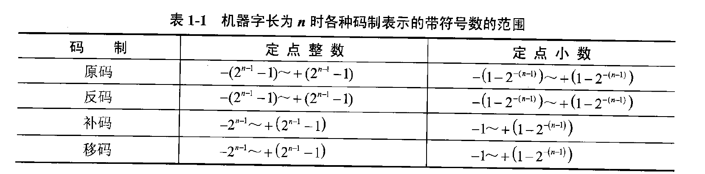

一个二进制数N可以表示为更一般的形式 
N
=
2
E
×
F
N=2^E×F
N=2E×F，其中E称为阶码，F称为尾数。用阶码和尾数表示的数称为浮点数，这种表示数的方法称为浮点表示法。  
 

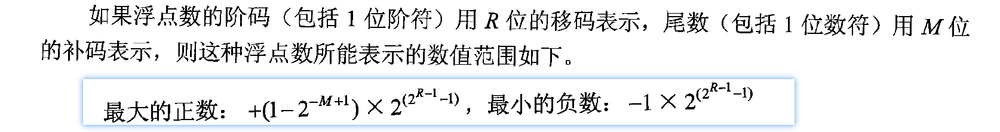

### 校验码

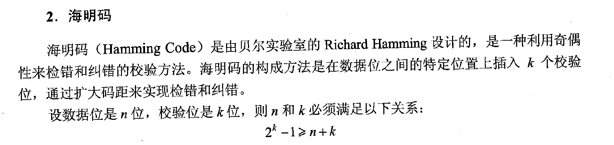

### 计算机体系结构

- 单指令流、单数据流：`SISD`
- 单指令流、多数据流：`SIMD`
- 多指令流、单数据流：`MISD`
- 多指令流、多数据流：`MIMD`
- 字串行位串行：`WSBS`
- 字并行位串行：`WPBS`
- 字串行位并行：`WSBP`
- 字并行位并行：`WPBP`
- 单指令流单执行流：`SISE`
- 单指令流多执行流：`SIME`
- 多指令流单执行流：`MISE`
- 多指令流多执行流：`MIME`
- 复杂指令集计算机：`CISC`
- 精简指令集计算机：`RISC`
- 超长指令字：`VLIW`

## 程序设计语言基础知识

### 编译器的工作阶段示意图

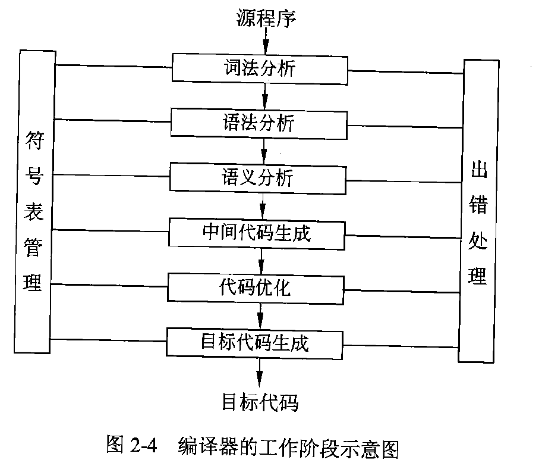

### 文法分类

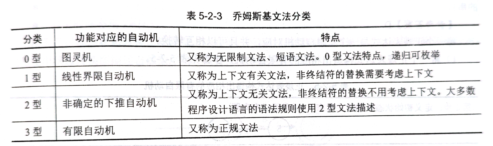

## 数据结构

### 邻接表

对于有 `n` 个顶点、`e` 条边的无向图来说，其邻接链表需用 `n` 个头结点和 `2e` 个表结点，每条弧都对应矩阵的一个非零元素。

### 二叉树

对于任何一棵二叉树，若其终端结点数为 
n
0
n\_0
n0​，度为 2 的结点数为 
n
2
n\_2
n2​，则 
n
0
=
n
2
+
1
n\_0=n\_2+1
n0​=n2​+1

#### 最优二叉树

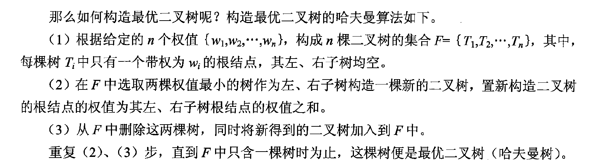

#### 二叉排序树

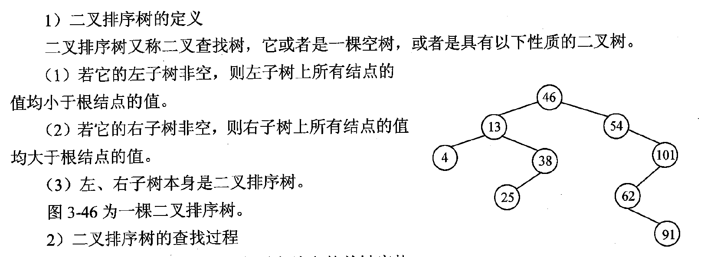

### 排序

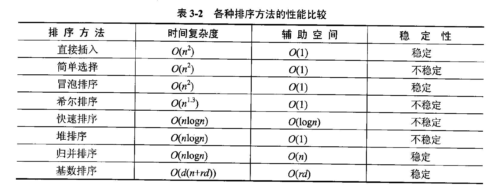

## 软件工程基础知识

### McCabe环路复杂度

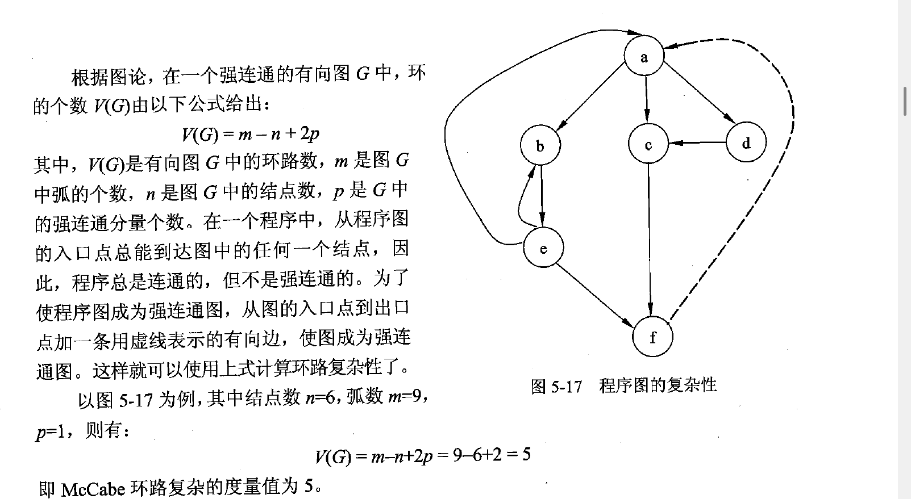

## 结构化开发方法

### 耦合性

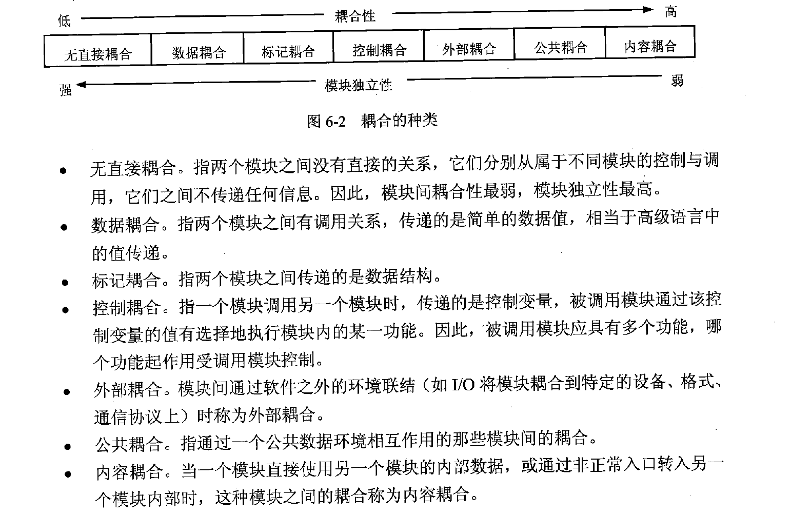

### 内聚性

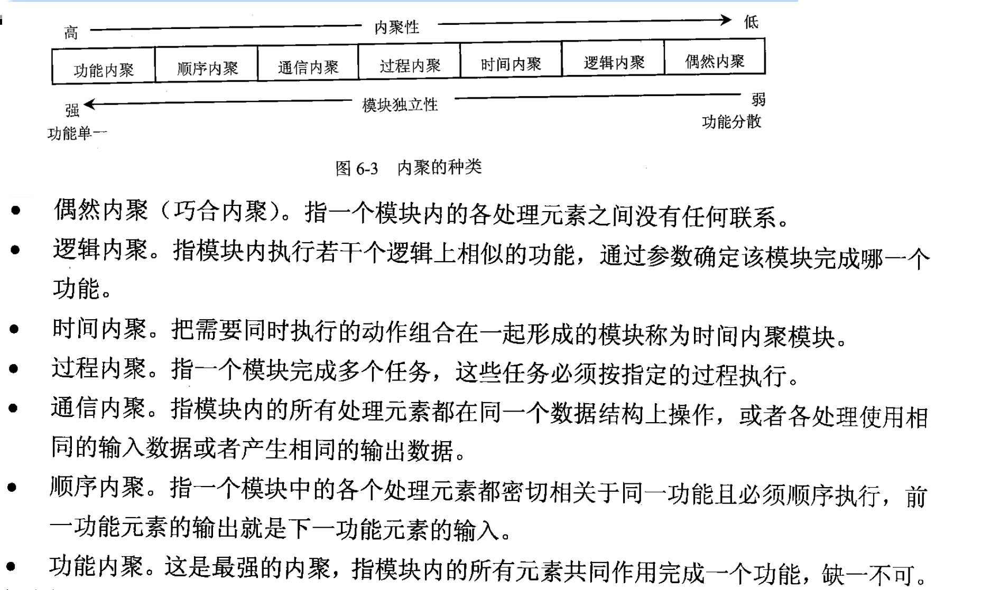

## 数据库

### 关系代数运算符

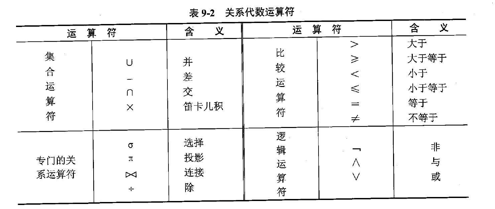

### 关系表达式查询优化

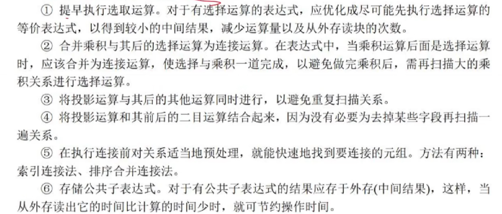

### 规范化

1NF：每个分量（属性）不可分割。  
 2NF：满足1NF，而且消除非主属性对候选键的部分依赖。  
 3NF：满足2NF，而且消除非主属性对候选键的传递依赖。

## 网络与信息安全基础知识

### OSI参考模型

速记口诀：“**巫术忘传会飙鹰**”  
 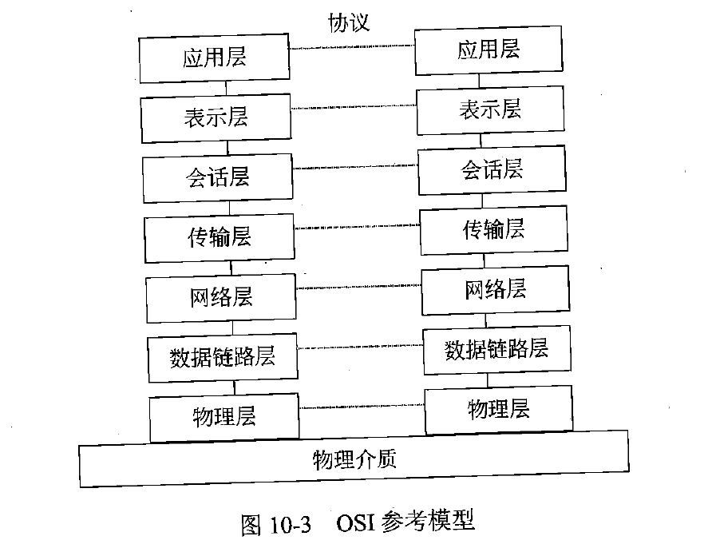

## TCP 模型

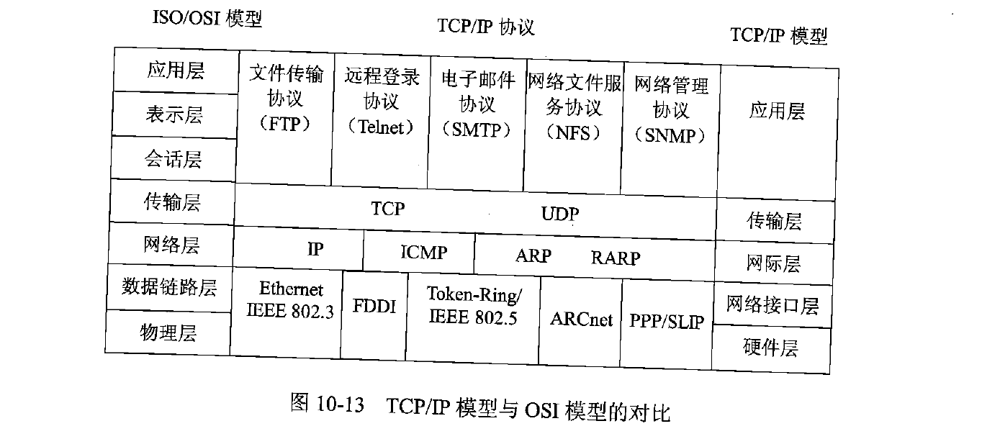

## IP地址

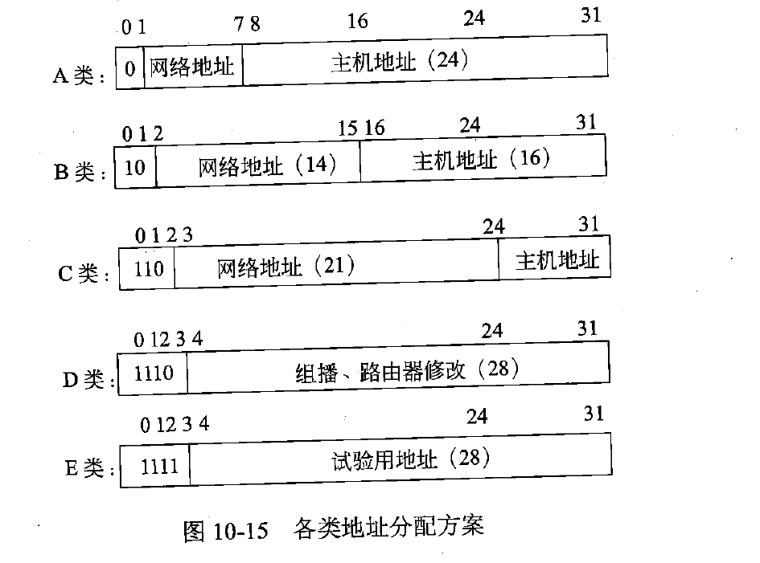  
 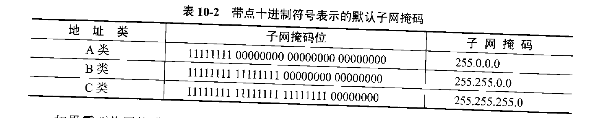
